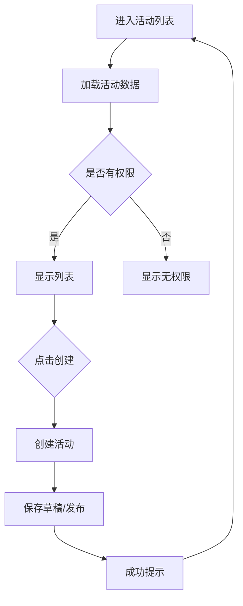

# 校园活动 PRD 示例（详细 - 改造类型）

## 梳理阶段确认清单

```markdown
确认清单：
1. 本次需求：小程序端 + 后台调整
2. PRD 类型：详细 - 改造（5 页+，后台逻辑已存在）
3. 页面结构：
   - 小程序端：
     - 校园活动列表
     - 创建/编辑活动
     - 活动详情
     - 排行榜（含过滤标签逻辑）
   - 后台调整：
     - 活动规则设置（权限控制）
     - 创建学校页面（支持班级限制）
4. 关键逻辑：
   - 活动状态：草稿、已发布、已取消
   - 活动进度：未开始、进行中、已结束
   - 权限：超管/学校管理员/有权限的老师可操作
   - 排行榜过滤：跳绳→过滤无绳空跳；引体向上→过滤疑似作弊
5. 模糊点：
   - 有权限的老师可以编辑/结束别人创建的活动？→ 是
   - 删除权限？→ 超管/学校管理员/有权限的老师，仅限草稿状态

等待用户确认...
```

---

## PRD 结构

```markdown
# 校体云 K12 教师端 - 校园活动-PRD-v2.md

**文档版本**：v2.0  
**创建日期**：2026-04-23  
**负责人**：产品经理  
**状态**：待评审

---

## 版本更新记录

| 版本 | 时间 | 修改内容 | 修改人 |
|------|------|---------|--------|
| 2.0.0 | 2026-04-23 | 改造版本：新增排行榜过滤标签、权限控制 | 产品经理 |
| 1.0.0 | 2026-04-20 | 初始版本 | 产品经理 |

---

## 1. 需求背景

### 1.1 功能定位
校园活动功能用于学校组织各类运动比赛和活动，支持创建、发布、管理和查看活动数据。

### 1.2 目标用户
- **超管**：管理全校所有活动
- **学校管理员**：管理本校活动
- **有权限的老师**：创建和管理班级活动

### 1.3 核心场景
1. 老师创建跳绳比赛活动，设置参与班级和奖品
2. 学生查看活动详情，了解活动规则和奖励
3. 老师查看活动排行榜，了解学生参与情况

---

## 2. 小程序端

### 2.1 校园活动列表

| 字段 | 类型 | 说明 |
|------|------|------|
| 活动名称 | 展示 | 活动标题 |
| 活动状态 | 展示 | 草稿、已发布、已取消 |
| 活动进度 | 展示 | 未开始、进行中、已结束 |
| 操作按钮 | 操作 | 编辑、删除、结束活动 |

### 2.2 创建/编辑活动

| 字段 | 类型 | 必填 | 说明 |
|------|------|------|------|
| 活动名称 | 输入框 | ✅ | 2-50 字符 |
| 活动类型 | 下拉选择 | ✅ | 选项：比赛、练习、其他 |
| 运动项目 | 下拉选择 | ✅ | 选项：跳绳、引体向上等 |
| 排行榜过滤标签 | 多选 | ❌ | 选项：过滤无绳空跳、过滤疑似作弊 |
| 参与年级/班级 | 选择器 | ✅ | 支持多选 |
| 性别 | 下拉选择 | ❌ | 选项：全部、男生、女生 |
| 活动时间 | 时间选择 | ✅ | 支持日期范围 |
| 活动简介 | 文本框 | ❌ | 最多 200 字 |
| 奖品 | 输入框 | ❌ | 最多 100 字 |
| 保存草稿 | 操作 | - | 保存为草稿状态 |
| 保存并发布 | 操作 | - | 直接发布活动 |

### 2.3 活动详情

| 字段 | 类型 | 说明 |
|------|------|------|
| 活动信息 | 展示 | 活动名称、时间、规则等 |
| 排行榜入口 | 操作 | 点击进入活动排行榜 |

### 2.4 排行榜

| 字段 | 类型 | 说明 |
|------|------|------|
| 排名 | 展示 | 1-10；数字 + 图标 |
| 学生头像 | 展示 | 学生头像 |
| 学生姓名 | 展示 | 学生姓名 |
| 学生班级 | 展示 | 所属班级 |
| 学生成绩 | 展示 | 最佳成绩 |
| 运动时间 | 展示 | 成绩提交时间 |
| 过滤标签说明 | 展示 | 显示已启用的过滤规则 |

**过滤逻辑**：
- 过滤无绳空跳：跳绳项目中，未检测到绳子转动的成绩不计入排名
- 过滤疑似作弊：引体向上中，动作不规范的成绩不计入排名

---

## 3. 后台调整

### 3.1 活动规则设置

| 字段 | 类型 | 说明 |
|------|------|------|
| 是否开启权限控制 | 开关 | 默认关闭 |
| 管理老师设置 | 选择器 | 可设置多个管理老师 |

### 3.2 创建学校页面

**调整内容**：
- 原：只支持限制年级
- 新：支持限制班级（细化到具体班级）

---

## 4. 权限控制

| 角色 | 权限 |
|------|------|
| 超管 | 全部权限：创建、编辑、删除、结束任何活动 |
| 学校管理员 | 全部权限：创建、编辑、删除、结束本校活动 |
| 有权限的老师 | 创建、编辑自己创建的活动；可结束他人创建的活动 |

**删除权限**：
- 仅限草稿状态的活动可删除
- 超管/学校管理员/有权限的老师可删除

---

## 5. 边界场景与异常处理

| 场景 | 处理方式 | 提示文案 |
|------|----------|----------|
| 网络异常 | 显示重试按钮 | "网络异常，请检查网络后重试" |
| 活动已被删除 | 返回列表页 | "活动已被删除" |
| 无权限查看 | 显示无权限提示 | "您暂无权限查看此活动" |
| 数据加载失败 | 显示刷新按钮 | "数据加载失败，请点击刷新" |

---

## 6. 业务流程图



---

## 7. 测试用例

**正向路径**：
- [ ] 创建跳绳活动，设置参与班级和奖品
- [ ] 编辑草稿状态的活动
- [ ] 发布活动后查看排行榜

**反向路径**：
- [ ] 无权限用户无法编辑他人活动
- [ ] 已发布活动不可删除

**边界条件**：
- [ ] 活动时间为空时，提示选择时间
- [ ] 活动名称超出 50 字，拦截并提示

---

**文档完成**
```
