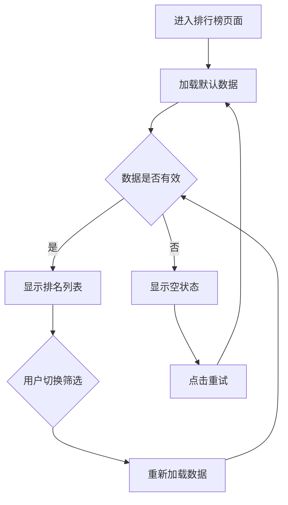

# 排行榜 PRD 示例（适中类型）

## 梳理阶段确认清单

```markdown
确认清单：
1. 本次需求：只有排行榜 PRD
2. PRD 类型：适中（3-5 页）
3. 页面结构：
   - 全局筛选：运动项目、时间、场景
   - 学生排名：Top10、排序规则
   - 班级排名：Top10、统计指标
4. 关键逻辑：
   - 排序：计时项目升序，计数项目降序
   - 参与率：和选择的运动项目、场景都没关系
   - 无数据时显示"--"
5. 模糊点：全部班级无数据时如何排序？→ 按班级名称排序

等待用户确认...
```

---

## PRD 结构

```markdown
# 校体云 K12 教师端 - 排行榜-PRD.md

**文档版本**：v1.0  
**创建日期**：2026-04-23  
**负责人**：产品经理  
**状态**：待评审

---

## 版本更新记录

| 版本 | 时间 | 修改内容 | 修改人 |
|------|------|---------|--------|
| 1.0.0 | 2026-04-23 | 初始版本 | 产品经理 |

---

## 1. 需求背景

### 1.1 功能定位
排行榜功能用于展示学生 and 班级的运动成绩排名，激励学生参与运动，帮助老师了解各班级运动情况。

### 1.2 目标用户
- **体育老师**：查看所负责班级的学生排名和班级排名
- **班主任**：查看本班学生在年级中的排名情况
- **学校管理员**：查看全校各班级整体运动情况

### 1.3 核心场景
1. 老师查看跳绳项目的学生 Top10 排名
2. 老师查看班级参与率排名，了解各班级参与情况
3. 老师切换不同运动项目，对比不同项目的排名情况

---

## 2. 全局筛选

| 字段 | 类型 | 默认值 | 说明 |
|------|------|--------|------|
| 运动项目 | 下拉选择 | 跳绳 | 选项：跳绳、引体向上、仰卧起坐、跑步 |
| 时间范围 | 下拉选择 | 本周 | 选项：本周、本月、本学期 |
| 场景 | 下拉选择 | 全部 | 选项：全部、课内、课外、比赛 |

---

## 3. 学生排名模块

### 3.1 学生排名筛选

| 字段 | 类型 | 默认值 | 说明 |
|------|------|--------|------|
| 范围 | 下拉选择 | 本班 | 选项：本班、本年级、全校 |
| 性别 | 下拉选择 | 全部 | 选项：全部、男生、女生 |

### 3.2 学生排名列表

| 字段 | 类型 | 说明 |
|------|------|------|
| 排名 | 展示 | 1-10；数字 + 图标（金银铜牌） |
| 头像 | 展示 | 学生头像；无头像显示默认图标 |
| 姓名 | 展示 | 学生姓名 |
| 班级 | 展示 | 所属班级 |
| 成绩 | 展示 | 计算逻辑：根据选择的项目取最佳成绩；格式：整数或 1 位小数；无数据时显示"--" |

**列表规则**：
- 排序：计时项目（跑步）升序，计数项目（跳绳、引体向上）降序
- 显示：Top10
- 更新：每天 24 点更新

---

## 4. 班级排名模块

### 4.1 班级排名筛选

| 字段 | 类型 | 默认值 | 说明 |
|------|------|--------|------|
| 范围 | 下拉选择 | 本年级 | 选项：本年级、全校 |

### 4.2 本周流动红旗

| 字段 | 类型 | 说明 |
|------|------|------|
| 流动红旗标识 | 展示 | 显示在排名靠前的班级旁 |

### 4.3 班级排名列表

| 字段 | 类型 | 说明 |
|------|------|------|
| 排名 | 展示 | 1-10；数字 + 图标 |
| 班级名称 | 展示 | 班级全称 |
| 平均成绩 | 展示 | 计算逻辑：班级所有学生成绩总和÷学生数；格式：1 位小数；无数据时显示"--" |
| 参与率 | 展示 | 计算逻辑：有记录学生数÷班级总人数；格式：百分比，0 位小数；和选择的运动项目、场景都没关系；无数据时显示"--" |
| 体测达标率 | 展示 | 计算逻辑：体测达标人数÷班级总人数；格式：百分比，0 位小数；无数据时显示"--" |

**列表规则**：
- 排序：按平均成绩降序排列
- 显示：Top10
- 全部班级无数据时：按班级名称排序

---

## 5. 边界场景与异常处理

| 场景 | 处理方式 | 提示文案 |
|------|----------|----------|
| 网络异常 | 显示重试按钮 | "网络异常，请检查网络后重试" |
| 无数据 | 显示"--" | - |
| 数据加载中 | 显示骨架屏 | - |

---

## 6. 业务流程图



---

## 7. 测试用例

**正向路径**：
- [ ] 选择跳绳项目，显示跳绳排名
- [ ] 切换男生筛选，只显示男生排名
- [ ] 切换本周时间，显示本周数据

**反向路径**：
- [ ] 选择无数据的项目，显示"--"
- [ ] 网络断开，显示重试按钮

**边界条件**：
- [ ] 全部班级无数据，按班级名称排序
- [ ] 参与率分母为 0，显示"--"

---

**文档完成**
```
