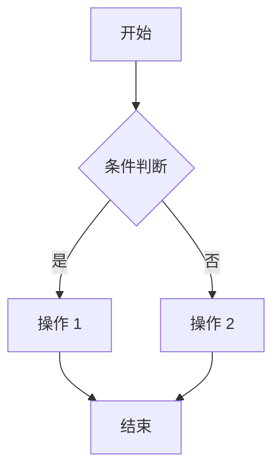

# 详细 - 改造 PRD 模板（5 页+）

**适用**：复杂业务改造，后台逻辑已存在

---

# [产品名]-[页面名]-PRD-v2.md

**文档版本**：v2.0  
**创建日期**：2026-XX-XX  
**更新日期**：2026-XX-XX  
**负责人**：产品经理  
**状态**：待评审

---

## 版本更新记录

| 版本 | 时间 | 修改内容 | 修改人 |
|------|------|---------|--------|
| 2.0.0 | 2026-XX-XX | 改造版本：新增 xxx、调整 xxx | 产品经理 |
| 1.0.0 | 2026-XX-XX | 初始版本 | 产品经理 |

---

## 1. 需求背景

### 1.1 功能定位
### 1.2 目标用户
### 1.3 核心场景

---

## 2. 小程序端

### 2.1 页面 A

| 字段 | 类型 | 说明 |
|------|------|------|
| 字段 1 | 展示 | 说明；与后台交互：调用 xxx 接口 |
| 字段 2 | 操作 | 点击打开页面 B，逻辑参见：2.2 页面 B |

### 2.2 页面 B（独立章节）

| 字段 | 类型 | 必填 | 说明 |
|------|------|------|------|
| 字段 3 | 输入 | ✅ | 校验规则：xxx |
| 字段 4 | 选择 | ❌ | 默认值：xxx |

**提交逻辑**：
1. 校验字段
2. 调用 xxx 接口
3. 成功后返回页面 A 并刷新

---

## 3. 后台调整

### 3.1 功能 A
### 3.2 功能 B

---

## 4. 权限控制（汇总说明）

| 角色 | 权限 |
|------|------|
| 角色 1 | 全部权限 |
| 角色 2 | 仅查看 |

---

## 5. 边界场景与异常处理

| 场景 | 处理方式 | 提示文案 |
|------|----------|----------|
| 网络异常 | 显示重试按钮 | "网络异常，请检查网络后重试" |
| 数据异常 | 联系管理员 | "数据异常，请联系管理员" |

---

## 6. 业务流程图



---

## 7. 与后台交互说明

### 7.1 接口列表

| 接口名 | 方法 | 说明 |
|--------|------|------|
| /api/xxx | POST | 说明 |

### 7.2 数据流向

```
小程序 → 后端服务 → 数据库
```

---

## 8. 测试用例

**正向路径**：
- [用例 1]
- [用例 2]

**反向路径**：
- [用例 1]
- [用例 2]

**边界条件**：
- [用例 1]
- [用例 2]

---

**文档完成**
