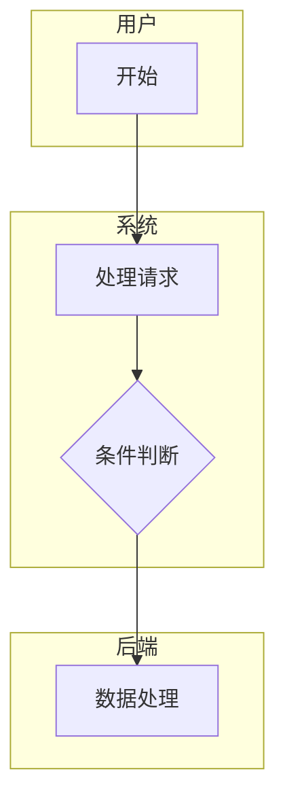
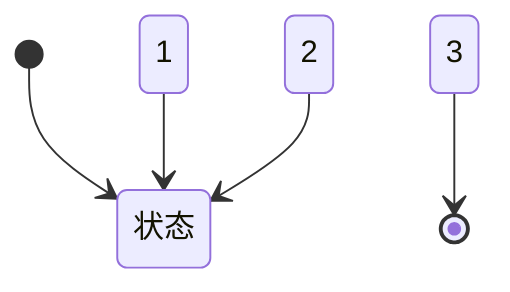

# 详细 - 新建 PRD 模板（5 页+）

**适用**：全新复杂业务，后台逻辑不存在

**写作方式**：
1. 先写《全局业务 PRD》（流程图、状态定义、字段定义）
2. 再写《具体页面 PRD》（按适中模板写每个页面）

---

# 第一部分：全局业务 PRD

# [产品名]-[业务名]-全局业务 PRD.md

**文档版本**：v1.0  
**创建日期**：2026-XX-XX  
**负责人**：产品经理  
**状态**：待评审

---

## 版本更新记录

| 版本 | 时间 | 修改内容 | 修改人 |
|------|------|---------|--------|
| 1.0.0 | 2026-XX-XX | 初始版本 | 产品经理 |

---

## 1. 需求背景

### 1.1 功能定位
### 1.2 目标用户
### 1.3 核心场景

---

## 2. 业务流程图（泳道图）

---

## 3. 状态流转图

---

## 4. 状态定义

| 状态 | 说明 | 允许的操作 |
|------|------|-----------|
| 状态 1 | 说明 | 操作 1、操作 2 |
| 状态 2 | 说明 | 操作 3 |

---

## 5. 字段定义（全局统一）

| 字段名 | 类型 | 说明 | 校验规则 |
|--------|------|------|---------|
| 字段 1 | string | 说明 | 规则 |
| 字段 2 | int | 说明 | 规则 |

---

## 6. 全局规则

### 6.1 权限规则
### 6.2 计算规则
### 6.3 特殊规则

---

# 第二部分：具体页面 PRD

完成全局业务 PRD 后，为每个页面编写详细 PRD：

- [产品名]-[页面 1]-PRD.md
- [产品名]-[页面 2]-PRD.md
- [产品名]-[页面 3]-PRD.md

每个页面 PRD 参考 `moderate.md` 模板编写。

---

**文档完成**
