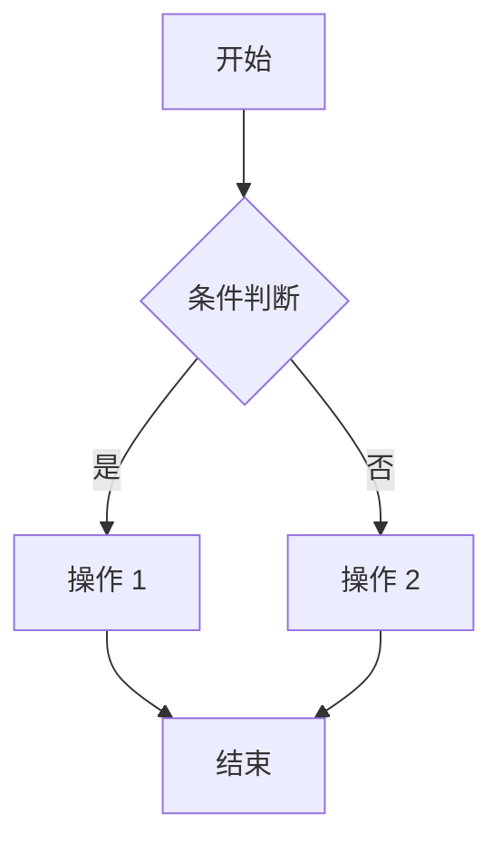

# 适中 PRD 模板（3-5 页）

**适用**：排行榜、运动数据等有计算逻辑的页面

---

# [产品名]-[页面名]-PRD.md

**文档版本**：v1.0  
**创建日期**：2026-XX-XX  
**负责人**：产品经理  
**状态**：待评审

---

## 版本更新记录

| 版本 | 时间 | 修改内容 | 修改人 |
|------|------|---------|--------|
| 1.0.0 | 2026-XX-XX | 初始版本 | 产品经理 |

---

## 1. 需求背景

### 1.1 功能定位
### 1.2 目标用户
### 1.3 核心场景

---

## 2. 全局筛选

| 字段 | 类型 | 默认值 | 说明 |
|------|------|--------|------|
| 筛选 1 | 下拉选择 | 默认值 | 选项：A、B、C |
| 筛选 2 | 时间选择 | 近 30 天 | 范围限制 |

---

## 3. 页面模块

### 3.1 模块 A

| 字段 | 类型 | 说明 |
|------|------|------|
| 字段 1 | 展示 | 计算逻辑：xxx；无数据时显示"--" |
| 字段 2 | 展示 | 计算逻辑：xxx；格式：百分比，0 位小数 |

**列表规则**：
- 排序：xxx
- 显示：Top10
- 更新：每天 24 点

### 3.2 模块 B

| 字段 | 类型 | 说明 |
|------|------|------|
| 字段 3 | 展示 | 说明 |

---

## 4. 边界场景与异常处理

| 场景 | 处理方式 | 提示文案 |
|------|----------|----------|
| 网络异常 | 显示重试按钮 | "网络异常，请检查网络后重试" |
| 无数据 | 显示"--" | - |

---

## 5. 业务流程图

---

## 6. 测试用例

**正向路径**：
- [用例 1]
- [用例 2]

**反向路径**：
- [用例 1]
- [用例 2]

**边界条件**：
- [用例 1]
- [用例 2]

---

**文档完成**
