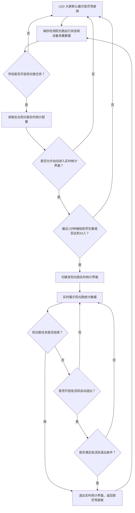

# LED 大屏阳光跑实时统计配置 PRD

**版本：** V1.0  
**日期：** 2026-05-18  
**关联文档：** 《LED 智慧体育大屏驾驶舱 PRD》《校端后台 - 驾驶舱配置 PRD》  

---

## 一、需求背景

当前 LED 大屏默认展示首页驾驶舱。当学校开启"阳光跑"运动后，大屏会每秒检测阳光跑设备采集数据；若最近 1 分钟内有 15 个学生被阳光跑设备拍到，则自动切换至"阳光跑实时统计"界面，并持续展示到阳光跑任务结束后退出。

现有逻辑存在两个问题：

1. 部分学校即使开启阳光跑，也希望 LED 大屏保持首页驾驶舱展示，不自动切换到阳光跑实时统计界面。
2. 部分学校希望保留实时统计界面，但当现场跑步学生较少或无人跑步时，大屏自动退出实时统计界面，回到首页驾驶舱，避免大屏长期停留在低活跃实时页面。

本次需求在校端后台增加阳光跑实时统计展示策略配置，并调整 LED 大屏的进入、退出和回首页逻辑。

---

## 二、需求目标

1. 支持学校在后台配置：开启阳光跑后，LED 是否自动进入阳光跑实时统计界面。
2. 支持学校在后台配置：进入阳光跑实时统计界面后，是否按低活跃检测自动退出。
3. 保持现有默认行为兼容：未修改配置的学校，仍按当前逻辑进入实时统计界面，并在任务结束后退出。
4. LED 大屏可根据后台配置在首页驾驶舱与阳光跑实时统计界面之间自动切换。
5. 配置为学校级别，同一学校所有 LED 大屏共用一套阳光跑实时统计展示策略。

---

## 三、需求核心业务流程图

---

## 四、需求功能清单

| 终端 | 模块 | 功能 | 描述 |
|------|------|------|------|
| 校端后台 | 设备管理 - 驾驶舱设置 | 阳光跑实时统计开关 | 配置学校开启阳光跑后，LED 是否自动进入实时统计界面 |
| 校端后台 | 设备管理 - 驾驶舱设置 | 低活跃自动退出配置 | 配置 LED 进入实时统计界面后，是否在跑步人数较少时自动回到首页驾驶舱 |
| 校端后台后端 | 驾驶舱配置服务 | 配置保存与读取 | 保存阳光跑实时统计展示策略，并向 LED 大屏提供读取接口 |
| LED 大屏 | 首页驾驶舱 | 实时统计进入判断 | 在首页驾驶舱状态下，每秒检测阳光跑状态、配置和最近 1 分钟采集人数 |
| LED 大屏 | 阳光跑实时统计 | 低活跃退出判断 | 在实时统计界面中，根据任务结束或低活跃条件退出至首页驾驶舱 |

---

## 五、需求功能详述

#### 5.1 校端后台——设备管理 - 驾驶舱设置——阳光跑实时统计开关

**原型描述**：  
在"驾驶舱设置"页面新增"阳光跑实时统计设置"配置区，位于现有数据时间范围、业务类型范围、数据过滤规则之后。配置区包含开关项"开启阳光跑实时统计页"，开关右侧展示说明文案："开启后，阳光跑任务运行且现场人数达到条件时，LED 自动进入实时统计页面"。

**用户故事**：
> 作为学校管理员，我想控制 LED 是否自动展示阳光跑实时统计页，以便不同学校按实际展示诉求配置大屏行为。

**前置条件**：
- 用户已登录校端后台。
- 用户具备驾驶舱设置页面访问和保存权限。
- 学校已开通阳光跑业务；未开通时该配置项展示为关闭且不可编辑。

**字段说明**：

| 字段 | 类型 | 默认值 | 必填 | 规则 |
|------|------|--------|------|------|
| 开启阳光跑实时统计页 | 开关 | 开启 | 是 | 开启后允许 LED 自动进入实时统计界面；关闭后 LED 始终停留在首页驾驶舱，除非用户通过其他入口手动进入实时页面 |

**核心逻辑**：
- 默认值为"开启"，兼容现有学校的大屏展示行为。
- 配置关闭后，LED 大屏不执行"最近 1 分钟 15 人"的自动进入逻辑。
- 配置关闭仅影响"自动进入阳光跑实时统计界面"，不影响首页驾驶舱中的阳光跑增强版模块展示。
- 保存成功后，大屏在下一次配置拉取时生效；大屏每分钟请求驾驶舱配置时拉取最新配置。

**边界条件与异常处理**：
- 学校未开通阳光跑：开关置灰，提示"学校未开通阳光跑，暂不支持配置"。
- 保存失败：提示"保存失败，请重试"，保留当前编辑状态。
- LED 读取配置失败：沿用本地最近一次成功读取的配置；无本地配置时按默认值"开启"处理。

**埋点需求**：
- 事件 ID：`LED_SUNRUN_REALTIME_SWITCH_SAVE`
- 触发时机：用户保存驾驶舱设置成功
- 上报参数：`school_id`、`operator_id`、`sunrun_realtime_enabled`

**技术难点分析**：
- 需保证默认值不改变现有线上学校行为。
- 大屏存在长时间运行场景，需保证配置更新后在下一轮配置拉取中生效。

**验收标准 (Acceptance Criteria)**：
- **成功场景**：开关关闭并保存后，学校开启阳光跑且最近 1 分钟达到 15 人，LED 不进入实时统计界面。
- **校验场景**：学校未开通阳光跑时，开关不可编辑。
- **异常场景**：保存接口异常时，页面提示失败并保留表单内容。

**测试用例**：
- 默认开关为开启
- 关闭后不自动进入
- 未开通阳光跑置灰
- 保存失败保留配置

---

#### 5.2 校端后台——设备管理 - 驾驶舱设置——低活跃自动退出配置

**原型描述**：  
在"阳光跑实时统计设置"配置区中，当"开启阳光跑实时统计页"为开启时，展示"低活跃自动退出"开关。开启后展示两个数字输入框："最近 1 分钟被拍到学生数 ≤ X 人"、"持续 Y 分钟后退出"。默认建议值为 X=3、Y=3。

**用户故事**：
> 作为学校管理员，我想在实时统计页面低活跃时自动回到首页驾驶舱，以便 LED 展示更适合现场观看的数据页面。

**前置条件**：
- "开启阳光跑实时统计页"为开启。
- 学校已开通阳光跑业务。

**字段说明**：

| 字段 | 类型 | 默认值 | 必填 | 规则 |
|------|------|--------|------|------|
| 低活跃自动退出 | 开关 | 关闭 | 是 | 关闭时实时统计界面仅在任务结束后退出；开启时按低活跃条件退出 |
| 低活跃人数阈值 | 数字输入 | 3 | 条件必填 | 取值 0-14，表示最近 1 分钟被阳光跑设备拍到的去重学生数小于等于该值 |
| 持续低活跃时长 | 数字输入 | 3 | 条件必填 | 取值 1-30，单位分钟，表示连续满足低活跃人数阈值后退出 |

> 待确认：低活跃人数阈值和持续时长的默认值是否采用 3 人、3 分钟。若评审确认其他阈值，以评审结论为准。

**核心逻辑**：
- "低活跃自动退出"默认关闭，兼容现有"直到任务结束才退出"的行为。
- 关闭"开启阳光跑实时统计页"后，低活跃自动退出配置隐藏且不生效。
- 低活跃人数统计口径为最近 1 分钟内被阳光跑设备拍到的去重学生数。
- 持续低活跃时长从 LED 进入阳光跑实时统计界面后开始计算。
- 任意一次检测到最近 1 分钟去重学生数大于低活跃人数阈值，持续低活跃计时清零。
- 低活跃退出后，LED 返回首页驾驶舱，并继续按首页驾驶舱状态进行阳光跑进入检测；若后续最近 1 分钟人数再次达到 15 人，可再次进入实时统计界面。

**边界条件与异常处理**：
- 低活跃人数阈值大于等于进入人数阈值 15 时，不允许保存，提示"低活跃人数阈值需小于 15 人"。
- 持续低活跃时长为空或小于 1 时，不允许保存，提示"请输入 1-30 分钟的持续时长"。
- LED 实时检测接口异常时，不触发低活跃退出，保留当前实时统计界面，并在下一秒继续检测。

**埋点需求**：
- 事件 ID：`LED_SUNRUN_LOW_ACTIVITY_SAVE`
- 触发时机：用户保存驾驶舱设置成功
- 上报参数：`school_id`、`operator_id`、`low_activity_exit_enabled`、`low_activity_student_threshold`、`low_activity_duration_min`

**技术难点分析**：
- 需避免学生短暂离开镜头导致页面频繁退出，因此采用"人数阈值 + 持续时长"双条件。
- 需避免退出后立即反复进入和退出，因此进入阈值固定为 15 人，退出阈值限制小于 15 人。

**验收标准 (Acceptance Criteria)**：
- **成功场景**：开启低活跃自动退出，配置 X=3、Y=3；实时页面中连续 3 分钟最近 1 分钟去重学生数均小于等于 3 人，LED 返回首页驾驶舱。
- **校验场景**：低活跃人数阈值输入 15 时，保存失败并提示阈值需小于 15 人。
- **异常场景**：检测接口异常时，LED 不退出实时统计界面，下一秒继续检测。

**测试用例**：
- 默认退出开关关闭
- 开启后显示阈值输入
- 阈值 15 保存失败
- 连续低活跃自动退出
- 人数恢复后计时清零

---

#### 5.3 校端后台后端——驾驶舱配置服务——配置保存与读取

**原型描述**：  
无。

**用户故事**：
> 作为 LED 大屏系统，我想读取学校的阳光跑实时统计展示策略，以便按学校配置执行页面切换。

**前置条件**：
- 校端后台已保存驾驶舱配置。
- LED 大屏可访问驾驶舱配置读取接口。

**配置数据结构**：

| 字段 | 类型 | 说明 |
|------|------|------|
| `sunrunRealtimeEnabled` | Boolean | 是否开启阳光跑实时统计页 |
| `lowActivityExitEnabled` | Boolean | 是否开启低活跃自动退出 |
| `lowActivityStudentThreshold` | Number | 低活跃人数阈值 |
| `lowActivityDurationMin` | Number | 持续低活跃时长，单位分钟 |
| `updatedAt` | DateTime | 配置更新时间 |

**核心逻辑**：
- 配置级别为学校级别，同一学校所有 LED 大屏共用。
- 配置保存接口与现有驾驶舱配置保存流程合并，保存时同时校验新增字段。
- 配置读取接口返回现有驾驶舱配置时，增加阳光跑实时统计展示策略字段。
- 存量学校无新增字段时，服务端返回默认值：
  - `sunrunRealtimeEnabled = true`
  - `lowActivityExitEnabled = false`
  - `lowActivityStudentThreshold = 3`
  - `lowActivityDurationMin = 3`

**边界条件与异常处理**：
- 配置读取接口超时：LED 使用本地最近一次成功读取配置。
- 服务端无历史配置：返回默认值。
- 保存时字段缺失：按默认值补齐后保存。

**埋点需求**：
- 无。

**技术难点分析**：
- 新字段需兼容历史配置数据。
- 配置接口需保持对旧版本 LED 客户端的兼容。

**验收标准 (Acceptance Criteria)**：
- **成功场景**：后台保存配置后，LED 下次拉取配置可获取新增字段。
- **校验场景**：存量学校未配置新增字段时，接口返回默认值。
- **异常场景**：读取接口失败时，LED 使用最近一次成功配置，不出现空配置导致的异常切换。

**测试用例**：
- 新配置保存成功
- 读取返回新增字段
- 存量学校返回默认值
- 接口失败使用缓存

---

#### 5.4 LED 大屏——首页驾驶舱——实时统计进入判断

**原型描述**：  
无新增页面。LED 大屏仍默认展示首页驾驶舱，满足配置和人数条件后自动切换到阳光跑实时统计界面。

**用户故事**：
> 作为观看 LED 大屏的师生，我希望学校开展阳光跑且现场参与人数较多时，大屏自动展示实时统计数据。

**前置条件**：
- LED 当前处于首页驾驶舱状态。
- 学校阳光跑任务正在进行中。
- 后台配置"开启阳光跑实时统计页"为开启。

**核心逻辑**：
- LED 在首页驾驶舱状态下每秒检测一次阳光跑任务状态和最近 1 分钟设备采集人数。
- 最近 1 分钟设备采集人数统计口径为被阳光跑设备拍到的去重学生数。
- 同时满足以下条件时，LED 切换到阳光跑实时统计界面：
  1. 学校阳光跑任务进行中。
  2. 后台配置"开启阳光跑实时统计页"为开启。
  3. 最近 1 分钟被阳光跑设备拍到的去重学生数大于等于 15 人。
- 若后台配置关闭，LED 不进入阳光跑实时统计界面。

**边界条件与异常处理**：
- 采集人数为 14 人：不进入实时统计界面。
- 采集人数达到 15 人：进入实时统计界面。
- 检测接口异常：保持首页驾驶舱，下一秒继续检测。
- 配置读取失败且无本地缓存：按默认值允许进入实时统计界面。

**埋点需求**：
- 事件 ID：`LED_SUNRUN_REALTIME_ENTER`
- 触发时机：LED 自动进入阳光跑实时统计界面
- 上报参数：`school_id`、`device_id`、`recent_1min_student_count`、`enter_reason`

**技术难点分析**：
- 每秒检测需控制接口压力，优先复用现有阳光跑任务和设备采集状态检测能力。
- 需明确"15 人"为去重学生数，避免同一学生多次被拍导致误触发。

**验收标准 (Acceptance Criteria)**：
- **成功场景**：配置开启、任务进行中、最近 1 分钟去重人数为 15 人，LED 自动进入实时统计界面。
- **校验场景**：配置关闭、任务进行中、最近 1 分钟去重人数为 20 人，LED 仍展示首页驾驶舱。
- **异常场景**：检测接口异常时，LED 保持首页驾驶舱并继续重试。

**测试用例**：
- 15 人自动进入
- 14 人不进入
- 配置关闭不进入
- 任务未开始不进入
- 接口异常保持首页

---

#### 5.5 LED 大屏——阳光跑实时统计——低活跃退出判断

**原型描述**：  
无新增页面。LED 大屏在阳光跑实时统计界面中持续展示实时数据；满足退出条件后自动回到首页驾驶舱。

**用户故事**：
> 作为学校管理员，我希望阳光跑现场低活跃时大屏自动回到首页驾驶舱，以便大屏持续展示更有价值的内容。

**前置条件**：
- LED 当前处于阳光跑实时统计界面。
- 后台配置"开启阳光跑实时统计页"为开启。

**核心逻辑**：
- LED 在阳光跑实时统计界面中每秒检测一次阳光跑任务状态。
- 阳光跑任务结束时，立即退出实时统计界面，返回首页驾驶舱。
- 若"低活跃自动退出"关闭，则任务未结束前不因人数少退出。
- 若"低活跃自动退出"开启，则每秒检测最近 1 分钟去重学生数：
  - 当最近 1 分钟去重学生数小于等于低活跃人数阈值时，计入连续低活跃时长。
  - 当最近 1 分钟去重学生数大于低活跃人数阈值时，连续低活跃时长清零。
  - 连续低活跃时长达到配置值后，退出实时统计界面，返回首页驾驶舱。

**退出优先级**：

| 优先级 | 退出原因 | 处理方式 |
|--------|----------|----------|
| P0 | 阳光跑任务结束 | 立即退出实时统计界面 |
| P1 | 满足低活跃退出条件 | 返回首页驾驶舱 |
| P2 | 检测接口异常 | 不退出，继续重试 |

**边界条件与异常处理**：
- 任务结束和低活跃条件同时满足：按任务结束原因退出。
- 低活跃计时过程中人数恢复：计时清零。
- 退出后若任务仍在进行，LED 回到首页驾驶舱并继续执行进入判断。
- 检测接口异常：不累计低活跃时长。

**埋点需求**：
- 事件 ID：`LED_SUNRUN_REALTIME_EXIT`
- 触发时机：LED 自动退出阳光跑实时统计界面
- 上报参数：`school_id`、`device_id`、`exit_reason`、`recent_1min_student_count`、`low_activity_duration_sec`

**技术难点分析**：
- 低活跃计时必须基于连续检测结果，不能因单次低人数直接退出。
- 退出后仍需保留再次进入能力，满足现场人数重新增加后的展示需求。

**验收标准 (Acceptance Criteria)**：
- **成功场景**：任务结束时，LED 立即返回首页驾驶舱。
- **校验场景**：低活跃自动退出关闭时，即使最近 1 分钟为 0 人，任务未结束前仍停留实时统计界面。
- **异常场景**：检测接口连续异常时，LED 不触发低活跃退出。

**测试用例**：
- 任务结束立即退出
- 低活跃关闭不退出
- 低活跃达标退出
- 人数恢复计时清零
- 退出后可再次进入

---

## 六、验收标准汇总

| 编号 | 验收项 | 预期结果 |
|------|--------|----------|
| F01 | 后台展示新增配置 | 驾驶舱设置页展示阳光跑实时统计设置区 |
| F02 | 自动进入开关 | 关闭后不再自动进入阳光跑实时统计界面 |
| F03 | 默认兼容 | 存量学校默认允许自动进入，低活跃自动退出默认关闭 |
| F04 | 进入阈值 | 最近 1 分钟去重学生数达到 15 人才进入实时统计界面 |
| F05 | 低活跃配置 | 开启低活跃退出后，可配置人数阈值和持续时长 |
| F06 | 低活跃退出 | 连续满足低活跃条件后，LED 返回首页驾驶舱 |
| F07 | 任务结束退出 | 阳光跑任务结束时，LED 立即返回首页驾驶舱 |
| F08 | 异常处理 | 配置或检测接口异常时，大屏不出现空白页或异常跳转 |

---

## 七、测试用例

| 用例编号 | 测试场景 | 测试步骤 | 预期结果 |
|----------|----------|----------|----------|
| TC01 | 默认配置 | 打开存量学校驾驶舱设置页 | 阳光跑实时统计页开关为开启，低活跃自动退出为关闭 |
| TC02 | 关闭自动进入 | 关闭阳光跑实时统计页开关并保存；模拟阳光跑任务进行且最近 1 分钟 20 人 | LED 保持首页驾驶舱 |
| TC03 | 达到进入阈值 | 开启自动进入；模拟阳光跑任务进行且最近 1 分钟 15 人 | LED 进入阳光跑实时统计界面 |
| TC04 | 未达到进入阈值 | 开启自动进入；模拟阳光跑任务进行且最近 1 分钟 14 人 | LED 保持首页驾驶舱 |
| TC05 | 低活跃退出关闭 | LED 已进入实时统计界面；低活跃退出关闭；最近 1 分钟 0 人 | LED 保持实时统计界面 |
| TC06 | 低活跃退出触发 | 开启低活跃退出，配置 3 人、3 分钟；连续 3 分钟最近 1 分钟人数均小于等于 3 人 | LED 返回首页驾驶舱 |
| TC07 | 低活跃计时清零 | 开启低活跃退出；低活跃计时第 2 分钟时人数大于 3 人 | 连续低活跃计时清零，LED 保持实时统计界面 |
| TC08 | 任务结束退出 | LED 已进入实时统计界面；模拟阳光跑任务结束 | LED 立即返回首页驾驶舱 |
| TC09 | 配置读取失败 | LED 拉取配置失败且存在历史缓存 | 使用历史缓存执行进入和退出逻辑 |
| TC10 | 检测接口异常 | LED 检测阳光跑采集人数接口异常 | 当前页面保持不变，下一秒继续检测 |

---

## 八、待确认事项

| 序号 | 待确认事项 | 建议方案 |
|------|------------|----------|
| 1 | "最近 1 分钟 15 人"是否明确为去重学生数 | 建议按去重学生数计算 |
| 2 | 低活跃默认人数阈值 | 建议默认 3 人 |
| 3 | 低活跃默认持续时长 | 建议默认 3 分钟 |
| 4 | 未开通阳光跑学校是否展示该配置区 | 建议展示置灰，便于管理员理解不可配置原因 |
| 5 | 手动进入实时统计页面是否受开关影响 | 建议本次仅控制自动进入，手动入口保持现有逻辑 |

---

## 九、版本历史

| 版本 | 日期 | 作者 | 变更说明 |
|------|------|------|----------|
| V1.0 | 2026-05-18 | - | 初始版本，新增阳光跑实时统计自动进入开关和低活跃自动退出配置 |
