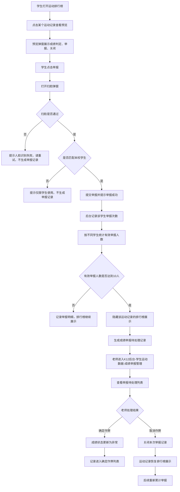

# 成绩举报管理 PRD

## 一、需求背景

当前一体机运动排行榜支持学生查看运动记录和运动视频预览，但缺少学生对疑似作弊成绩的反馈入口。当榜单中出现疑似非本人完成、设备误识别、动作不规范或其他异常成绩时，学生只能线下反馈，学校管理员和老师无法在系统内获得可追溯的举报数据。

本次需求在运动记录预览弹窗中增加“举报”入口，并通过扫脸校验确认举报人为本校学生。举报功能仅限通过本校学生人脸档案匹配的学生使用；未匹配本校学生身份时，统一提示“仅限学生使用”，不生成举报记录。单条运动记录达到 10 名不同学生举报后，在一体机排行榜隐藏该记录，并在校体云 K12 后台“学生运动数据”下新增“成绩举报管理”菜单，供学校管理员和老师查看、判定、取消判定。

**需求口径说明**：
- 本 PRD 采用“达到 10 名不同学生举报即触发隐藏和后台待处理记录”的口径。
- 举报操作仅在一体机“学生排行榜”中展示；教师排行榜、活动排行榜不展示举报入口，不支持举报操作。
- 阳光跑运动不支持举报，一体机阳光跑相关榜单或记录预览不展示“举报”按钮。
- 同一学生对同一条运动记录重复举报时，前端均提示举报成功；后台累计记录该学生对该运动记录的举报次数，但 10 人阈值仍按不同学生去重计算。
- 仅匹配本校学生身份后可提交举报；未匹配本校学生身份时，系统统一提示“仅限学生使用”。
- 老师选择“确定作弊”后，该运动成绩状态更新为“异常”。
- 老师选择“取消作弊”后，该运动记录恢复在运动排行榜展示，举报待处理列表不再展示该记录；后续再次达到 10 名不同学生举报时，重新生成举报待处理记录。

---

## 二、需求目标

1. 为学生提供运动记录举报入口，支持对疑似作弊成绩进行实名校内举报。
2. 通过扫脸校验确保举报人匹配本校学生档案，避免未通过本校学生身份校验的人员干扰成绩处理。
3. 对达到 10 名不同学生举报的运动记录进行榜单隐藏，降低疑似异常成绩对排行榜公平性的影响。
4. 在校体云 K12 后台提供成绩举报管理能力，支持学校管理员、老师查看举报明细并完成“确定作弊”或“取消作弊”处理。
5. 建立举报、隐藏、判定、恢复、异常状态流转闭环，保证一体机和后台数据状态一致。

---

## 三、需求核心业务流程图

---

## 四、需求功能清单

| 终端 | 模块 | 功能 | 描述 |
|------|------|------|------|
| 一体机 | 学生排行榜 | 运动记录预览举报入口 | 在学生排行榜的运动记录预览弹窗中新增“举报”按钮，供学生发起成绩举报；教师排行榜、活动排行榜、阳光跑运动不展示 |
| 一体机 | 学生排行榜 | 扫脸举报校验 | 学生点击“举报”后打开扫脸弹窗，扫脸通过且匹配本校学生身份后生成举报记录；未匹配本校学生身份时提示“仅限学生使用” |
| 一体机 | 学生排行榜 | 举报结果反馈 | 根据扫脸失败、未匹配本校学生身份、举报成功等结果展示明确提示；同一学生重复举报同一记录时仍提示举报成功 |
| 一体机 | 学生排行榜 | 被举报记录隐藏 | 单条运动记录达到 10 名不同学生举报后，在学生排行榜中隐藏 |
| 校体云K12后台 | 学生运动数据 | 成绩举报管理菜单 | 在“学生运动数据”下新增“成绩举报管理”菜单，学校管理员、老师可访问 |
| 校体云K12后台 | 成绩举报管理 | 举报待处理列表 | 展示达到 10 名不同学生举报的运动记录，支持查看举报学生信息和处理 |
| 校体云K12后台 | 成绩举报管理 | 确定作弊操作 | 老师点击“确定作弊”后，将对应运动成绩状态更新为“异常” |
| 校体云K12后台 | 成绩举报管理 | 取消作弊操作 | 老师点击“取消作弊”后，关闭本次举报记录并恢复排行榜展示 |
| 校体云K12后台 | 成绩举报管理 | 确定作弊列表 | 展示已被老师判定为作弊的运动记录 |
| 后端 | 举报服务 | 举报次数记录与阈值计算 | 记录学生对单条运动记录的举报次数，并按不同学生统计有效举报人数，达到 10 人后触发待处理记录 |
| 后端 | 成绩服务 | 成绩状态联动 | 支持运动成绩在正常、举报隐藏、异常状态之间流转，并同步影响排行榜展示 |
| 后端 | 权限与审计 | 角色权限和操作日志 | 控制学校管理员、老师可查看和操作，并记录举报、判定、取消判定日志 |

---

## 五、需求功能详述

#### 5.1 一体机——学生排行榜——运动记录预览举报入口

**原型描述**：
在学生排行榜的运动记录预览弹窗中，视频区域下方展示操作按钮。现有“成绩判定”“关闭”按钮保留，新增“举报”按钮。建议按钮与“成绩判定”“关闭”同级展示，按钮文案为“举报”，颜色使用警示色或高对比色，保证学生在预览弹窗中可识别。教师排行榜、活动排行榜、阳光跑运动的记录预览弹窗不展示“举报”按钮。

**用户故事**：
> 作为一个学生，我想要在查看运动记录预览时举报疑似异常成绩，以便于老师核实排行榜成绩是否公平。

**前置条件**：
- 已进入运动排行榜页面。
- 学生已点击某条运动记录并打开预览弹窗。
- 该运动记录未被判定为异常。

**核心逻辑**：
- 预览弹窗新增“举报”按钮。
- “举报”按钮仅在学生排行榜展示。
- 教师排行榜、活动排行榜不展示“举报”按钮，不进入举报流程。
- 阳光跑运动不展示“举报”按钮，不进入举报流程。
- 点击“举报”后，不直接提交举报，必须先进入扫脸校验流程。
- 当运动记录已处于“异常”状态时，一体机不展示该记录，无法进入举报流程。

**验收标准 (Acceptance Criteria)**：
- 🎯 **成功场景**：学生打开预览弹窗，系统展示“举报”按钮。
- ✔️ **校验场景**：点击“举报”后，系统打开扫脸弹窗，不直接生成举报记录。
- ❌ **异常场景**：网络异常时，系统提示失败并停留在预览弹窗。

**测试用例**：
- 预览弹窗展示举报
- 点击举报打开扫脸
- 网络异常提示失败
- 隐藏记录不可举报

---

#### 5.2 一体机——学生排行榜——扫脸举报校验

**原型描述**：
点击“举报”后展示扫脸弹窗。弹窗包含摄像头取景区域、识别状态提示、取消按钮。扫脸通过后自动提交举报；扫脸失败时提示“人脸识别失败，请重试”并提供重试入口。

**用户故事**：
> 作为一个学生，我想要通过扫脸完成举报身份校验，以便于系统确认举报来自本校真实学生。

**前置条件**：
- 学生点击了运动记录预览弹窗中的“举报”按钮。
- 设备摄像头可用。
- 学校已维护学生人脸信息。

**核心逻辑**：
- 系统调用人脸识别能力，判断当前扫脸人员是否匹配本校学生人脸档案。
- 系统只判断是否匹配本校学生身份，不判断未匹配人员的具体身份类型。
- 匹配本校学生身份后，进入举报次数记录与提交逻辑。
- 未匹配本校学生身份时，统一提示“仅限学生使用”，不生成举报记录。
- 扫脸识别失败时，提示“人脸识别失败，请重试”，不生成举报记录。

**验收标准 (Acceptance Criteria)**：
- 🎯 **成功场景**：本校学生扫脸通过，系统进入举报提交。
- ✔️ **校验场景**：未匹配本校学生身份时，系统提示“仅限学生使用”，不生成举报记录。
- ❌ **异常场景**：人脸识别失败或超时时，系统提示“人脸识别失败，请重试”。

**测试用例**：
- 本校学生通过
- 未匹配身份拦截
- 无档案学生失败
- 识别失败重试

---

#### 5.3 一体机——学生排行榜——举报结果反馈

**原型描述**：
扫脸结束后，在当前弹窗内展示举报结果 Toast 或状态提示。成功时提示“举报成功，老师核实后处理”；同一学生重复举报同一条运动记录时，仍提示“举报成功，老师核实后处理”；失败时展示对应失败原因。

**用户故事**：
> 作为一个学生，我想要在举报后看到明确结果，以便于知道举报是否已经提交。

**前置条件**：
- 扫脸流程已完成。
- 后端返回举报提交结果。

**核心逻辑**：
- 举报成功时，提示“举报成功，老师核实后处理”。
- 同一学生重复举报同一条运动记录时，前端不判断是否已举报，仍提示举报成功。
- 后台记录该学生对该条运动记录的累计举报次数。
- 10 人触发阈值仍按不同学生数计算，同一学生重复举报不增加有效举报人数。
- 举报成功后如有效举报人数达到 10 人，触发排行榜隐藏和后台待处理记录生成。

**验收标准 (Acceptance Criteria)**：
- 🎯 **成功场景**：本校学生举报成功，系统提示“举报成功，老师核实后处理”。
- ✔️ **校验场景**：同一学生重复举报同一记录，系统仍提示举报成功，并累计该学生举报次数。
- ❌ **异常场景**：运动记录不存在时，系统提示不可举报。

**测试用例**：
- 首次举报成功
- 重复举报仍成功
- 重复举报次数累计
- 记录删除拦截
- 接口超时提示

---

#### 5.4 一体机——学生排行榜——被举报记录隐藏

**原型描述**：
学生排行榜列表不展示已达到 10 名不同学生举报且处于待处理状态的运动记录。榜单排名按隐藏后的数据重新展示，不保留空位。

**用户故事**：
> 作为一个学生，我想要排行榜隐藏被多人举报的成绩，以便于榜单在老师处理前减少争议。

**前置条件**：
- 单条运动记录已达到 10 名不同学生有效举报。
- 该记录未被老师取消作弊。

**核心逻辑**：
- 第 10 名不同学生举报成功后，运动记录状态更新为“举报隐藏”。
- 处于“举报隐藏”状态的记录不进入运动排行榜展示。
- 老师选择“取消作弊”后，状态恢复为“正常”，排行榜重新展示该记录。
- 老师选择“确定作弊”后，状态更新为“异常”，排行榜继续不展示该记录。

**验收标准 (Acceptance Criteria)**：
- 🎯 **成功场景**：第 10 名不同学生举报成功后，排行榜隐藏该记录。
- ✔️ **校验场景**：同一学生多次举报会累计举报次数，但不会单独触发隐藏。
- ❌ **异常场景**：并发举报时只生成一条待处理记录。

**测试用例**：
- 十人举报隐藏
- 九人举报不隐藏
- 单人重复举报不隐藏
- 并发只生成一次

---

#### 5.5 校体云K12后台——学生运动数据——成绩举报管理菜单

**原型描述**：
在校体云 K12 后台左侧菜单“学生运动数据”下新增二级菜单“成绩举报管理”。点击后进入成绩举报管理页面，页面顶部为 Tab 切换：“举报待处理”“确定作弊”。

**用户故事**：
> 作为学校管理员或老师，我想要从学生运动数据中进入成绩举报管理，以便于集中处理被举报的运动成绩。

**前置条件**：
- 用户已登录校体云 K12 后台。
- 用户角色为学校管理员或老师。
- 用户拥有当前学校数据权限。

**核心逻辑**：
- 菜单位置：学生运动数据 / 成绩举报管理。
- 学校管理员、老师均可查看和操作。
- 无权限用户不展示菜单，直接访问页面时返回无权限提示。
- 页面默认进入“举报待处理”Tab。

**验收标准 (Acceptance Criteria)**：
- 🎯 **成功场景**：学校管理员和老师可看到并进入菜单。
- ✔️ **校验场景**：无权限用户不展示菜单。
- ❌ **异常场景**：无数据权限时，页面展示空权限提示。

**测试用例**：
- 管理员可进入
- 老师可进入
- 无权限不展示
- 无数据权限提示

---

#### 5.6 校体云K12后台——成绩举报管理——举报待处理列表

**原型描述**：
页面顶部展示两个 Tab：“举报待处理”“确定作弊”。“举报待处理”Tab 以表格展示达到 10 名不同学生举报的运动记录。表格字段包括：学生姓名、学籍号、年级、班级、运动项目、运动开始时间、运动成绩、举报学生信息、操作。举报学生信息展示 10 名举报学生的班级、姓名，支持展开查看完整名单。

**用户故事**：
> 作为学校管理员或老师，我想要查看被 10 名不同学生举报的运动记录和举报人信息，以便于判断该成绩是否作弊。

**前置条件**：
- 已存在达到 10 名不同学生举报的运动记录。
- 该记录处于“举报隐藏”状态。
- 用户拥有当前学校数据权限。

**核心逻辑**：
- 列表只展示处于“举报隐藏/待处理”的运动记录。
- 表格字段：
  - 学生姓名：被举报成绩所属学生姓名。
  - 学籍号：被举报学生学籍号。
  - 年级：被举报学生年级。
  - 班级：被举报学生班级。
  - 运动项目：该成绩所属运动项目。
  - 运动开始时间：该条运动记录开始时间。
  - 运动成绩：该条运动记录成绩。
  - 举报学生信息：展示 10 名有效举报学生的班级、姓名。
  - 操作：确定作弊、取消作弊。
- 支持按学校数据权限查询，默认按达到 10 人举报时间倒序。
- 当有效举报人数超过 10 人时，举报学生信息展示全部有效举报学生，前端默认展示前 10 名并支持展开。

**验收标准 (Acceptance Criteria)**：
- 🎯 **成功场景**：待处理 Tab 展示达到 10 名不同学生举报的记录。
- ✔️ **校验场景**：未达到 10 名不同学生举报的记录不展示。
- ❌ **异常场景**：记录已被他人处理时，操作用户收到已处理提示。

**测试用例**：
- 十人记录展示
- 九人记录不展示
- 展开举报学生
- 已处理刷新列表

---

#### 5.7 校体云K12后台——成绩举报管理——确定作弊操作

**原型描述**：
在“举报待处理”列表操作列点击“确定作弊”后，弹出二次确认弹窗。弹窗文案提示“确定后该运动成绩将标记为异常，并从排行榜中隐藏”。确认后执行操作，成功后列表移除该记录。

**用户故事**：
> 作为老师，我想要将核实为作弊的成绩标记为异常，以便于系统不再把该成绩计入正常排行榜。

**前置条件**：
- 用户为学校管理员或老师。
- 记录处于举报待处理状态。

**核心逻辑**：
- 点击“确定作弊”后必须二次确认。
- 确认后，运动成绩状态更新为“异常”。
- 举报处理状态更新为“已确认作弊”。
- 记录从“举报待处理”列表移除，进入“确定作弊”列表。
- 操作日志记录操作者、操作时间、操作结果、运动记录 ID。

**验收标准 (Acceptance Criteria)**：
- 🎯 **成功场景**：老师确认作弊后，成绩状态更新为异常。
- ✔️ **校验场景**：已处理记录不能重复确定作弊。
- ❌ **异常场景**：接口失败时，系统不改变成绩状态。

**测试用例**：
- 确认作弊成功
- 弹窗取消操作
- 重复操作拦截
- 接口失败回滚

---

#### 5.8 校体云K12后台——成绩举报管理——取消作弊操作

**原型描述**：
在“举报待处理”列表操作列点击“取消作弊”后，弹出二次确认弹窗。弹窗文案提示“取消后该成绩将恢复在排行榜展示，本次举报记录关闭”。确认后执行操作，成功后列表移除该记录。

**用户故事**：
> 作为老师，我想要取消不成立的作弊举报，以便于正常成绩恢复排行榜展示。

**前置条件**：
- 用户为学校管理员或老师。
- 记录处于举报待处理状态。

**核心逻辑**：
- 点击“取消作弊”后必须二次确认。
- 确认后，运动成绩状态从“举报隐藏”恢复为“正常”。
- 本次举报处理状态更新为“已取消作弊”。
- 记录从“举报待处理”列表移除。
- 本次已取消的举报处理记录不再展示在“举报待处理”Tab。
- 后续如同一运动记录再次达到 10 名不同学生举报，重新生成新的举报待处理记录。

**验收标准 (Acceptance Criteria)**：
- 🎯 **成功场景**：老师取消作弊后，记录恢复排行榜展示。
- ✔️ **校验场景**：取消后的举报记录不再出现在待处理列表。
- ❌ **异常场景**：已确定作弊记录不能执行取消作弊。

**测试用例**：
- 取消作弊成功
- 榜单恢复展示
- 待处理移除
- 新周期重新举报

---

#### 5.9 校体云K12后台——成绩举报管理——确定作弊列表

**原型描述**：
“确定作弊”Tab 以表格展示老师已操作为确定作弊的运动记录。表格字段建议包括：学生姓名、学籍号、年级、班级、运动项目、运动开始时间、运动成绩、举报学生信息、处理人、处理时间、成绩状态。

**用户故事**：
> 作为学校管理员或老师，我想要查看已确认作弊的成绩列表，以便于追溯异常成绩处理结果。

**前置条件**：
- 已存在老师确认作弊的记录。
- 用户拥有当前学校数据权限。

**核心逻辑**：
- 列表只展示举报处理状态为“已确认作弊”的记录。
- 默认按处理时间倒序展示。
- 确定作弊列表不提供“确定作弊”“取消作弊”操作。
- 记录展示举报学生信息和处理信息，支持追溯。

**验收标准 (Acceptance Criteria)**：
- 🎯 **成功场景**：确定作弊 Tab 展示已确认作弊记录。
- ✔️ **校验场景**：取消作弊记录不展示在确定作弊 Tab。
- ❌ **异常场景**：无数据时展示空状态。

**测试用例**：
- 确认记录展示
- 取消记录不展示
- 无数据空状态
- 处理人快照展示

---

#### 5.10 后端——举报服务——举报次数记录与阈值计算

**原型描述**：
无。

**用户故事**：
> 作为系统，我想要记录学生对单条运动记录的举报次数，并按不同学生统计有效举报人数，以便于准确判断运动记录是否达到后台处理阈值。

**前置条件**：
- 扫脸通过且匹配本校学生身份。
- 运动记录存在且属于同一学校。

**核心逻辑**：
- 举报维度：`sport_record_id + report_student_id + report_cycle_id`。
- 举报提交接口必须校验举报人是否匹配本校学生身份，未匹配时返回失败结果，提示文案为“仅限学生使用”。
- 同一举报周期内，同一学生对同一运动记录可以多次提交举报，每次提交均记录该学生的累计举报次数。
- 同一举报周期内，同一学生对同一运动记录只贡献 1 个有效举报人数。
- 第一次达到 10 名不同学生举报时，创建举报处理记录。
- 举报处理记录字段建议：
  - `report_id`：举报处理记录 ID。
  - `sport_record_id`：运动记录 ID。
  - `reported_student_id`：被举报学生 ID。
  - `school_id`：学校 ID。
  - `report_count`：有效举报人数。
  - `total_submit_count`：当前周期总举报提交次数，包含同一学生重复举报。
  - `status`：待处理、已确认作弊、已取消作弊。
  - `report_cycle_id`：举报周期 ID。
  - `threshold_reached_time`：达到阈值时间。
  - `operator_id`：处理人 ID。
  - `operate_time`：处理时间。
- 举报明细字段建议：
  - `report_detail_id`：举报明细 ID。
  - `report_id`：举报处理记录 ID，未达到阈值前可为空或关联周期。
  - `sport_record_id`：运动记录 ID。
  - `report_student_id`：举报学生 ID。
  - `report_student_name_snapshot`：举报学生姓名快照。
  - `report_class_name_snapshot`：举报学生班级快照。
  - `student_report_times`：该学生在当前周期内对该运动记录的累计举报次数。
  - `face_verify_result`：扫脸结果。
  - `report_time`：举报时间。

**验收标准 (Acceptance Criteria)**：
- 🎯 **成功场景**：10 名不同学生举报后生成 1 条待处理记录。
- ✔️ **校验场景**：同一学生重复举报会累计举报次数，但不增加有效举报人数。
- ❌ **异常场景**：并发举报不会生成重复待处理记录。

**测试用例**：
- 十人生成记录
- 重复学生次数累计
- 重复学生人数去重
- 并发只生成一条
- 新周期重新累计

---

#### 5.11 后端——成绩服务——成绩状态联动

**原型描述**：
无。

**用户故事**：
> 作为系统，我想要统一管理运动成绩状态，以便于排行榜、后台列表和异常成绩数据保持一致。

**前置条件**：
- 运动成绩已生成。
- 举报服务触发或老师完成处理。

**核心逻辑**：
- 成绩状态建议：
  - `NORMAL`：正常，排行榜展示。
  - `REPORT_HIDDEN`：举报隐藏，排行榜不展示，后台待处理展示。
  - `ABNORMAL`：异常，排行榜不展示，确定作弊列表展示。
- 状态流转：
  - `NORMAL` -> `REPORT_HIDDEN`：达到 10 名不同学生举报。
  - `REPORT_HIDDEN` -> `ABNORMAL`：老师确定作弊。
  - `REPORT_HIDDEN` -> `NORMAL`：老师取消作弊。
- 排行榜只展示 `NORMAL` 状态成绩。
- 成绩详情、后台查询需按业务场景决定是否展示异常记录，不能影响本次举报管理闭环。

**验收标准 (Acceptance Criteria)**：
- 🎯 **成功场景**：举报达到阈值后成绩状态变为举报隐藏。
- ✔️ **校验场景**：取消作弊后成绩状态恢复正常。
- ❌ **异常场景**：非待处理状态不能被后台操作。

**测试用例**：
- 正常转举报隐藏
- 举报隐藏转异常
- 举报隐藏转正常
- 非待处理拦截

---

#### 5.12 后端——权限与审计——角色权限和操作日志

**原型描述**：
无。

**用户故事**：
> 作为学校管理方，我想要控制谁能查看和处理举报，并保留操作日志，以便于后续追责和复盘。

**前置条件**：
- 校体云 K12 后台存在学校管理员、老师角色。
- 系统已有用户权限和日志能力。

**核心逻辑**：
- 学校管理员、老师拥有“成绩举报管理”查看和操作权限。
- 权限粒度建议：
  - `score_report:view`：查看成绩举报管理页面。
  - `score_report:operate`：执行确定作弊、取消作弊操作。
- 操作日志记录：
  - 操作人 ID、姓名、角色。
  - 学校 ID。
  - 运动记录 ID。
  - 被举报学生 ID。
  - 操作类型：确定作弊、取消作弊。
  - 操作前状态、操作后状态。
  - 操作时间。

**验收标准 (Acceptance Criteria)**：
- 🎯 **成功场景**：学校管理员和老师可查看并处理举报。
- ✔️ **校验场景**：无操作权限用户不能调用处理接口。
- ❌ **异常场景**：日志写入失败时，状态不变更。

**测试用例**：
- 管理员处理成功
- 老师处理成功
- 无权限被拦截
- 日志失败回滚

---

## 六、系统改造

### 6.1 一体机改造

| 改造项 | 改造内容 | 影响范围 |
|--------|----------|----------|
| 预览弹窗 | 学生排行榜新增“举报”按钮，点击后进入扫脸弹窗；教师排行榜、活动排行榜、阳光跑运动不展示“举报”按钮 | 学生排行榜、运动记录预览 |
| 扫脸弹窗 | 接入人脸识别，判断是否匹配本校学生身份；未匹配本校学生身份时提示“仅限学生使用” | 摄像头、人脸识别服务 |
| 举报提交 | 扫脸通过后调用举报提交接口 | 举报服务、一体机提示 |
| 榜单展示 | 过滤“举报隐藏”“异常”状态成绩 | 排行榜查询、榜单缓存 |

### 6.2 校体云 K12 后台改造

| 改造项 | 改造内容 | 影响范围 |
|--------|----------|----------|
| 菜单权限 | 在“学生运动数据”下新增“成绩举报管理”菜单 | 后台菜单、角色权限 |
| 举报待处理 Tab | 展示达到 10 名不同学生举报的记录 | 学生运动数据后台 |
| 确定作弊 Tab | 展示已确认作弊记录 | 学生运动数据后台 |
| 处理操作 | 支持确定作弊、取消作弊，并二次确认 | 成绩状态、举报状态、操作日志 |

### 6.3 后端服务改造

| 改造项 | 改造内容 | 影响范围 |
|--------|----------|----------|
| 举报明细 | 新增学生举报明细记录，保留举报人班级、姓名快照 | 举报服务、审计 |
| 举报处理记录 | 达到阈值后生成待处理记录，支持状态流转 | 举报管理后台 |
| 举报次数规则 | 按运动记录、举报学生、举报周期记录学生累计举报次数；按不同学生数计算 10 人阈值 | 举报计数、阈值计算 |
| 成绩状态 | 新增或复用正常、举报隐藏、异常状态 | 排行榜、成绩查询 |
| 操作日志 | 记录老师处理举报的全过程 | 审计、追溯 |

### 6.4 状态流转表

| 触发事件 | 原成绩状态 | 新成绩状态 | 举报处理状态 | 一体机排行榜 |
|----------|------------|------------|--------------|--------------|
| 10 名不同学生举报成功 | 正常 | 举报隐藏 | 待处理 | 隐藏 |
| 老师确定作弊 | 举报隐藏 | 异常 | 已确认作弊 | 隐藏 |
| 老师取消作弊 | 举报隐藏 | 正常 | 已取消作弊 | 展示 |
| 取消作弊后再次达到 10 人举报 | 正常 | 举报隐藏 | 待处理 | 隐藏 |
