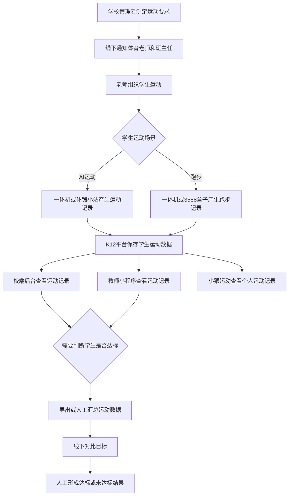
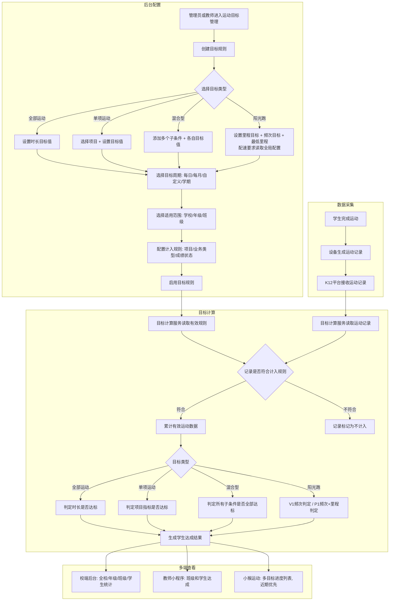
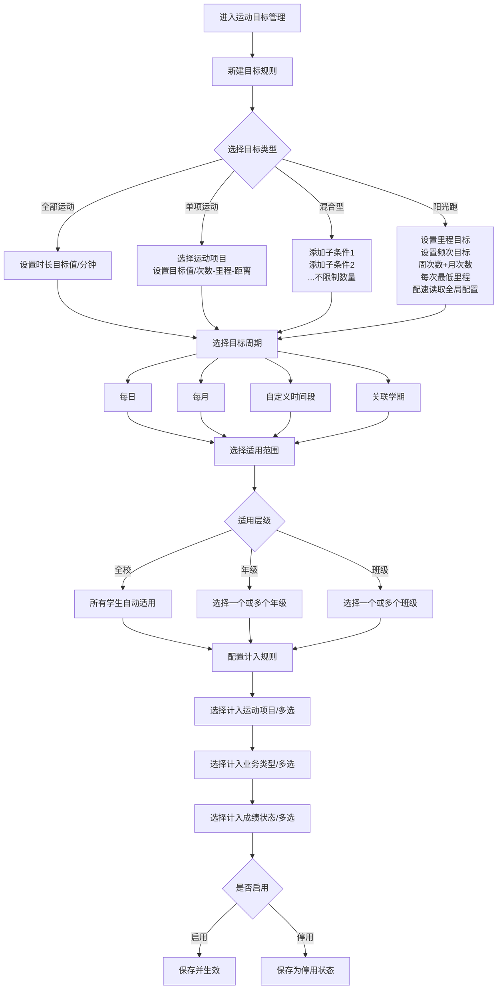
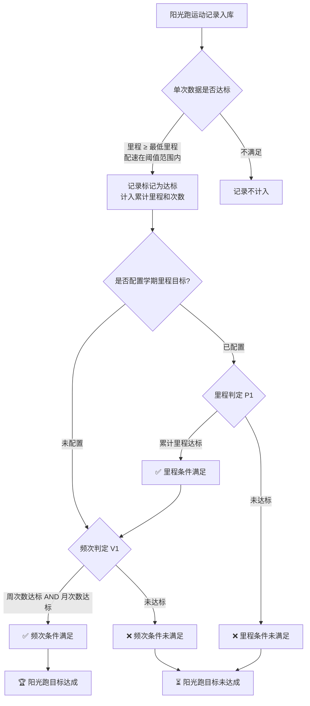
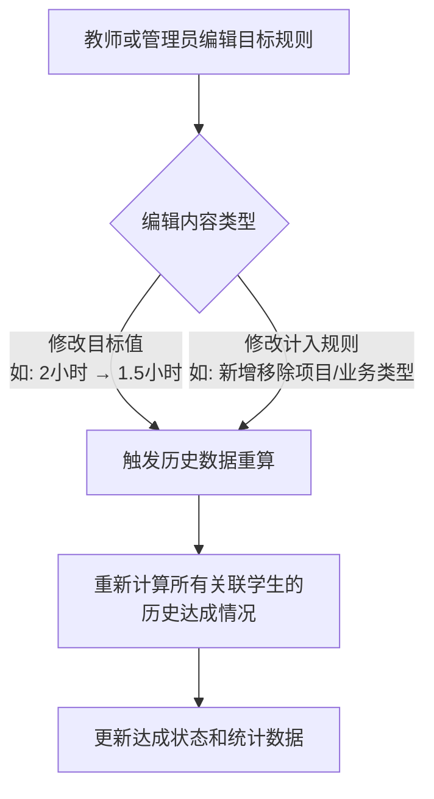

# 运动目标设置 - 需求分析 V3

**版本**：V3.1
**日期**：2026-05-11
**分析人**：AI 产品助手
**面向对象**：中小学生
**涉及终端**：校端后台（K12）、教师小程序（K12）、小猴运动（K12 学生小程序）

---

## 一、需求背景分析

### 1.1 需求来源

学校希望围绕中小学生日常运动建立一套可配置、可统计、可查看的运动目标体系。核心诉求包括：

| 诉求 | 说明 |
|------|------|
| 设置运动目标 | 支持设置每日/每月/自定义周期运动目标，可针对全部运动（时长）或单项运动（次数、里程等） |
| 查看达成情况 | 学校、老师可查看学生、班级、年级的目标完成情况 |
| 配置计入范围 | 学校可设定哪些运动项目、业务类型、成绩状态计入目标统计 |
| 多端闭环 | 后台老师配置目标，教师小程序查看班级情况，小猴运动查看个人进度 |

### 1.2 政策背景

教育部等五部门于 2025 年 11 月发布《关于实施学生体质强健计划的意见》，明确要求：

- 到 2027 年，义务教育阶段学生**每日综合体育活动时间不少于 2 小时**全面高质量落实
- 基础教育阶段统筹课内外、校内外，推进每天综合体育活动时间不低于 2 小时
- 课间活动延长至 15 分钟，鼓励上下午各安排 ≥ 30 分钟大课间
- 义务教育阶段逐步实现每天 1 节体育课

**政策来源**：

| 来源 | 链接 | 关键内容 |
|------|------|---------|
| 中国政府网 | [教育部等五部门关于实施学生体质强健计划的意见](https://www.gov.cn/zhengce/zhengceku/202511/content_7049009.htm) | 2027 年前落实中小学生每天综合体育活动时间不少于 2 小时 |
| 教育部官网 | [体卫艺司负责人答记者问](https://www.moe.gov.cn/jyb_xwfb/s271/202511/t20251119_1420844.html) | 以保证中小学生每天综合体育活动不低于 2 小时为切口推进学校体育改革 |
| 教育部官网 | [中小学生每天综合体育活动时间不低于 2 小时](https://www.moe.gov.cn/fbh/live/2026/77889/mtbd/202602/t20260228_1429557.html) | 全面实施学生体质强健计划 |

政策对学校形成的产品要求：学校不仅要组织学生运动，还要能解释学生每日、每月运动目标是否完成，哪些数据被计入，哪些学生和班级未达标。

### 1.3 系统现状

根据 system-status.md，校体云 K12 已具备运动数据采集、运动记录查看和多终端展示基础，但**缺少运动目标层能力**。

| 终端 | 现有能力 | 与本需求的关系 |
|------|----------|----------------|
| 一体机（1 代 / 2 代） | 自由训练、随堂测试、串班训练、体质测试、阳光跑，产生 AI 运动成绩和运动记录 | 目标达成计算的核心数据来源 |
| 体锻小站 | 跳绳、立定跳远、仰卧起坐、俯卧撑、开合跳、深蹲等项目，产生运动记录 | 目标达成计算的数据来源 |
| 3588 智慧体育盒子 | 长跑、短跑、阳光跑、校园跑，教师小程序远程控制 | 阳光跑/跑步类目标统计的关键设备 |
| 校端后台（K12） | 学生管理、班级管理、学期管理、阳光跑管理、学生运动数据等 | 承接目标配置、达成统计、数据导出 |
| 教师小程序（K12） | 设备控制、运动记录查看、Excel 导出、串班训练详情 | 承接班级目标查看和学生达成查看 |
| 小猴运动（K12 学生小程序） | 运动改善方案、体测报告、AI 运动记录、体能训练记录 | 承接个人目标进度和明细查看 |

**K12 版与高校版阳光跑现状**：
- 高校版已有"阳光跑 - 学期目标管理"和"阳光跑 - 规则设置"模块
- K12 版"阳光跑管理"模块状态为"待完善"，**本次需求一并设计 K12 阳光跑目标功能**

### 1.4 当前业务痛点

| 痛点 | 现状表现 | 影响 |
|------|----------|------|
| 缺少目标配置 | 学校无法在系统中配置每日、每月、自定义周期运动目标 | 目标依赖线下通知，无法形成系统化管理 |
| 缺少达成判定 | 运动记录仅反映学生做过哪些运动，不反映目标是否完成 | 老师无法快速判断哪些学生未达标 |
| 计入口径不可控 | 不同学校对自由训练、随堂测试、阳光跑、体质测试、异常成绩的计入要求不一致 | 同一套统计口径无法适配不同学校管理要求 |
| 多端信息割裂 | 后台、教师端、学生端都有运动记录，但没有统一目标进度 | 学校管理、教师督促、学生自我查看无法闭环 |
| 阳光跑目标缺失 | K12 版暂无阳光跑目标管理能力，学校只能线下管理跑步目标 | 跑步数据有但无法自动判定达标 |

### 1.5 萧山六中阳光跑参考方案

萧山六中已联合校体云制定 AI 阳光跑实施方案，核心诉求如下：

**教师版**：
- 打卡设备：AI 阳光跑设备，自动采集里程、时长、配速
- 达标标准：每周累计跑步 ≥2 次，每次 ≥1 公里，月度累计达标次数 ≥8 次
- 考核激励：教研组学期达标率 ≥70% 获工会奖励

**学生版**：
- 打卡设备：AI 阳光跑设备（自由跑形式）
- 达标标准：每周 ≥2 次，每次 ≥1 公里，月度 ≥8 次
- 激励（V1 暂不纳入）：班级周达标率 ≥80% 流动红旗、月度 36km+ 兑换奖品、学期 100km+ 前 10% 标兵

**对本需求的启示**：阳光跑目标需要**频次+里程双重判定**——V1 仅需满足每周/每月最低次数，P1 还需满足学期累计里程目标。每次最低里程为有效记录筛选条件（非达标条件）。

### 1.6 竞品分析

#### 1.6.1 竞品概况

| 品牌 | 市场覆盖 | 核心产品 | 运动目标能力 |
|------|---------|----------|-------------|
| **一视科技** | 近 50 地市、120 万+ 学生 | AI 智慧操场（教学练测评一体化） | 个性化"运动处方"，体能热力图 |
| **大沩智能** | 33 省、7000+ 校 | AI 运动吧 / 智慧操场 / 体测吧 / 沩星课间站 | "一生一案"个性化方案，20+ 动作数据分析 |
| **融梦科技** | 33 省、4000+ 校、2000 万+ 人次 | AI 锻炼屏 / 教学屏 / 测训一体机 / 数据平台 | 体育垂类大模型，"一人一案"运动建议 |
| **恒鸿达** | 1700+ 校、550 万学生 | AI 智慧操场 / AI 体测室 | 训练处方智能体，覆盖 16 省中考 |
| **科大讯飞** | 上海、浙江等地 | 智慧体育（教学赛练测评考管） | 数据驾驶舱，运动参与率/体质优良率 |

#### 1.6.2 能力维度对标

| 能力维度 | 一视科技 | 大沩 | 融梦 | 恒鸿达 | 科大讯飞 | **校体云现状** |
|----------|:--:|:--:|:--:|:--:|:--:|:--:|
| 运动目标设置 | ✅ 个性化处方 | ✅ 一生一案 | ✅ 一人一案 | ✅ 处方智能体 | ✅ 达标数据 | ❌ 无 |
| 达标统计分析 | ✅ 多维报告 | ✅ 赛事驱动 | ✅ 数据平台 | ⚠️ 需确认 | ✅ 驾驶舱 | ❌ 无 |
| 可配置计入口径 | ⚠️ 不明确 | ⚠️ 不明确 | ⚠️ 不明确 | ⚠️ 不明确 | ⚠️ 不明确 | ❌ 无 |
| 学生端进度查看 | ✅ | ✅ | ✅ | ⚠️ 需确认 | ⚠️ 需确认 | ❌ 无 |
| 教师端数据查看 | ✅ | ✅ | ✅ | ⚠️ 需确认 | ✅ | ⚠️ 仅运动记录 |
| 趣味激励机制 | ✅ 排行榜 | ✅ 赛事排名 | ✅ 积分+跨学科 | ⚠️ 需确认 | ⚠️ 需确认 | ⚠️ 一体机排行榜 |

#### 1.6.3 校体云差异化机会

竞品普遍侧重"AI 视觉识别 + 个性化处方"，但以下方面存在机会：

1. **灵活的目标计入口径配置**：竞品文档中未明确体现可按项目/业务类型/成绩状态灵活过滤，校体云可打造"精细化管理"差异点
2. **与一体机硬件深度融合**：软硬一体化闭环（一体机 → 数据 → 目标统计 → 多端展示），竞品多为独立软件方案
3. **多类型目标体系**：全部运动目标 + 单项运动目标 + 混合型目标 + 阳光跑特殊目标，适配不同学校的管理粒度

### 1.7 不做的影响

| 影响 | 说明 |
|------|------|
| 学校无法形成目标管理闭环 | 每日 2 小时等政策目标无法在系统中配置、执行和复盘 |
| 教师督促效率低 | 老师需要导出运动记录后人工判断学生是否完成目标 |
| 学生缺少自我反馈 | 学生只能看到零散的运动记录，看不到目标和差距 |
| 数据价值不足 | 一体机、体锻小站、阳光跑产生的数据没有转化为管理指标 |
| 竞标表达不足 | 竞品普遍强调智慧体育数据平台，校体云缺少目标达成统计的显性能力 |

---

## 二、需求目标确认

### 2.1 核心目标

| 编号 | 目标 | 衡量指标 |
|------|------|----------|
| O1 | 建立多类型运动目标配置体系 | 校端后台支持配置全部运动目标、单项运动目标、混合型目标、阳光跑目标 |
| O2 | 实现目标达成统计 | 后台支持按全校/年级/班级/学生查看日/月/自定义周期达成率、排名、明细 |
| O3 | 打通教师查看闭环 | 教师小程序支持查看任教班级目标、班级达标率、学生达成列表 |
| O4 | 打通学生自查闭环 | 小猴运动支持学生查看所有适用目标、各目标进度和达成状态 |
| O5 | 形成可解释计入口径 | 后台配置项与统计结果可追溯，老师可解释某条运动记录是否计入目标 |

### 2.2 V1 范围

| 范围 | 说明 |
|------|------|
| **目标类型** | 全部运动目标（时长）、单项运动目标（次数/里程/距离）、混合型目标（多子条件）、阳光跑目标（V1频次判定；P1增加里程判定） |
| **目标周期** | 每日、每月、自定义时间段、关联学期 |
| **适用范围** | 学校、年级、班级；管理员可创建全校目标，教师可创建班级目标 |
| **计入规则** | 运动项目、业务类型、成绩状态 |
| **展示终端** | 校端后台、教师小程序、小猴运动 |
| **统计维度** | 全校、年级、班级、学生 |
| **数据来源** | 一体机（1 代/2 代）、体锻小站、3588 智慧体育盒子已上传到 K12 平台的运动记录 |
| **阳光跑** | 配速为全局设置（所有目标共用）；单次最低里程每个目标可单独设置；支持周/月/学期目标；V1频次判定（周次数+月次数）；P1增加学期里程判定 |

### 2.3 V1 非目标

| 非目标 | 说明 |
|--------|------|
| AI 个性化运动处方 | 不生成一人一案训练建议，不做算法推荐 |
| 阳光跑违规处理与申诉 | 骑行作弊取消成绩、申诉流程 V1 不纳入 |
| 阳光跑激励机制 | 流动红旗、奖品兑换、标兵评选 V1 不纳入 |
| 局端后台同步 | 不在 V1 同步局端统计指标 |
| 一体机端展示 | 不在一体机、体锻小站、LED 大屏展示目标进度 |
| 积分勋章体系 | 不做积分、勋章、连续达标奖励 |
| 消息推送 | 不做小程序订阅消息、短信、公众号模板消息推送 |
| 体育课考勤计入 | 不将体育课考勤记录纳入运动目标计算 |

### 2.4 成功标准

| 标准 | 验收方式 |
|------|----------|
| 学校能配置多种类型目标 | 后台可新建全部运动/单项/混合型/阳光跑目标，学生产生对应目标记录 |
| 老师能看班级达成 | 教师小程序可查看任教班级各目标达标率和学生列表 |
| 学生能看多目标进度 | 小猴运动展示所有适用目标，含达成占比、近期优先排序 |
| 统计口径可解释 | 后台可查看计入明细，说明每条运动记录是否计入 |
| 目标编辑可重算 | 编辑目标值、计入规则后历史达成数据重新计算 |
| 阳光跑双重判定 | V1：周次数 AND 月次数 → 达标；P1：V1 AND 学期里程 → 达标 |

---

## 三、业务流程分析

### 3.1 当前流程（现状）

**输入与输出说明**：

| 节点 | 输入 | 输出 |
|------|------|------|
| 学校管理者制定运动要求 | 学校管理要求、政策要求 | 线下运动目标 |
| 一体机/体锻小站/3588 盒子产生记录 | 学生身份、运动项目、运动成绩、运动时间 | 运动记录 |
| K12 平台保存学生运动数据 | 设备上传记录 | 学生运动数据 |
| 人工汇总运动数据 | 运动记录、线下目标 | 达标/未达标结果 |

**现状问题**：

| 问题 | 说明 |
|------|------|
| 目标离线 | 目标没有进入系统，不能与运动记录自动关联 |
| 统计人工 | 老师需要人工对比目标和实际数据 |
| 结果滞后 | 学生当天是否达标无法及时查看 |
| 口径不清 | 哪些运动计入目标由人工判断，缺少统一规则 |
| 阳光跑无目标 | K12 版跑步数据有但没有目标体系，无法自动判定达标 |

### 3.2 目标流程（改善后）

### 3.3 目标规则配置流程

### 3.4 阳光跑目标频次+里程判定流程（V1/P1）

### 3.5 目标编辑后重算流程

---

## 四、功能拆解清单

### 4.1 功能清单总表

| 终端 | 模块 | 功能 | 功能描述 | 优先级 |
|------|------|------|----------|--------|
| 校端后台 | 运动目标管理 | 目标规则列表 | 展示目标名称、目标类型、目标值、适用范围、计入规则摘要、启停状态、创建人、创建时间 | P0 |
| 校端后台 | 运动目标管理 | 新建目标规则 | 支持四种目标类型：全部运动（时长）、单项运动（次数/里程/距离）、混合型（多子条件）、阳光跑（V1：周/月频次判定；P1：增加学期里程判定） | P0 |
| 校端后台 | 运动目标管理 | 编辑目标规则 | 编辑目标值、计入规则后触发历史重算 | P0 |
| 校端后台 | 运动目标管理 | 启用/停用 | 停用后不再生成新达成结果。目标对应的时间开始后不可删除，只能停止 | P0 |
| 校端后台 | 运动目标管理 | 目标周期配置 | 支持每日、每月、自定义时间段、关联学期 | P0 |
| 校端后台 | 运动目标管理 | 计入运动项目配置 | 多选：跳绳、立定跳远、引体向上、仰卧起坐、俯卧撑、短跑、长跑、阳光跑、球类、趣味运动等 | P0 |
| 校端后台 | 运动目标管理 | 计入业务类型配置 | 多选：自由训练、随堂测试、串班训练、体质测试、阳光跑 | P0 |
| 校端后台 | 运动目标管理 | 计入成绩状态配置 | 多选：正常、异常、违规；默认仅正常 | P0 |
| 校端后台 | 运动目标管理 | 阳光跑专项配置 | 单次最低里程、配速阈值范围、周最低次数、月最低次数 | P0 |
| 校端后台 | 运动目标统计 | 达成概览看板 | 全校达标率、各目标覆盖人数、达标/未达标人数、累计运动时长 | P0 |
| 校端后台 | 运动目标统计 | 年级/班级达成排名 | 按目标切换查看各年级、班级达标率排名 | P0 |
| 校端后台 | 运动目标统计 | 学生达成列表 | 按目标查看学生姓名/班级/目标值/完成值/达成率/达标状态，支持筛选 | P0 |
| 校端后台 | 运动目标统计 | 学生达成排行榜 | 按目标查看学生达成排名，支持按完成值/达成率排序，可按班级筛选 | P1 |
| 校端后台 | 运动目标统计 | 学生达成详情 | 展示单个学生某目标的计入运动记录明细、不计入原因 | P1 |
| 校端后台 | 运动目标统计 | 数据导出 | 导出学生达成列表为 Excel | P0 |
| 校端后台 | 运动目标统计 | 周期报告 | 周报/月报/学期报告，包含达标趋势、班级对比 | P1 |
| 教师小程序 | 运动目标 | 班级目标列表 | 展示任教班级所有生效中的目标规则，含目标类型、目标值、周期 | P0 |
| 教师小程序 | 运动目标 | 班级达标概览 | 按目标查看班级达标率、达标/未达标人数、平均完成值 | P0 |
| 教师小程序 | 运动目标 | 学生达成列表 | 按目标查看学生达成情况，支持达标/未达标筛选，未达标高亮 | P0 |
| 教师小程序 | 运动目标 | 学生达成详情 | 点击学生查看某目标的完成明细、计入运动记录 | P1 |
| 小猴运动 | 运动目标 | 多目标卡片列表 | 展示所有适用目标，每个目标显示完成进度和达成状态，近期优先排序 | P0 |
| 小猴运动 | 运动目标 | 目标数量与占比 | 首页展示"共 N 个目标，已完成 X 个"及达成占比 | P0 |
| 小猴运动 | 运动目标 | 目标详情页 | 展示单个目标的详细进度、计入运动记录明细 | P1 |
| 小猴运动 | 运动目标 | 历史达成记录 | 按日历查看每日/每月历史达成状态 | P1 |

### 4.2 目标类型字段设计

#### 4.2.1 全部运动目标

| 字段 | 说明 | 必填 |
|------|------|:--:|
| 目标名称 | 如"每日运动 2 小时" | ✅ |
| 目标类型 | 全部运动 | ✅ |
| 目标值 | 运动时长（分钟） | ✅ |
| 目标周期 | 每日 / 每月 / 自定义时间段 / 关联学期 | ✅ |
| 适用范围 | 全校 / 指定年级 / 指定班级 | ✅ |
| 计入规则 | 运动项目、业务类型、成绩状态 | ✅ |
| 启停状态 | 启用 / 停用 | ✅ |

#### 4.2.2 单项运动目标

| 字段 | 说明 | 必填 |
|------|------|:--:|
| 目标名称 | 如"每月跳绳 1000 个" | ✅ |
| 目标类型 | 单项运动 | ✅ |
| 运动项目 | 选择具体项目（跳绳/阳光跑/立定跳远/仰卧起坐等） | ✅ |
| 计量单位 | 随项目自动确定（个/公里/米等） | ✅ |
| 目标值 | 项目对应的数值 | ✅ |
| 目标周期 | 每日 / 每月 / 自定义时间段 / 关联学期 | ✅ |
| 适用范围 | 全校 / 指定年级 / 指定班级 | ✅ |
| 计入规则 | 业务类型、成绩状态 | ✅ |
| 启停状态 | 启用 / 停用 | ✅ |

#### 4.2.3 混合型目标

| 字段 | 说明 | 必填 |
|------|------|:--:|
| 目标名称 | 如"每日综合运动" | ✅ |
| 目标类型 | 混合型 | ✅ |
| 子条件列表 | 多个子条件，每个子条件：运动项目 + 目标值 | ✅ |
| 子条件数量 | 不限制 | - |
| 判定逻辑 | 所有子条件全部满足 → 达标 | ✅ |
| 目标周期 | 每日 / 每月 / 自定义时间段 / 关联学期 | ✅ |
| 适用范围 | 全校 / 指定年级 / 指定班级 | ✅ |
| 计入规则 | 业务类型、成绩状态 | ✅ |
| 启停状态 | 启用 / 停用 | ✅ |

#### 4.2.4 阳光跑目标

| 字段 | 说明 | 必填 |
|------|------|:--:|
| 目标名称 | 如"阳光跑学期目标" | ✅ |
| 目标类型 | 阳光跑 | ✅ |
| 每次最低里程 | 单次跑步最低里程（公里），低于此不计入，**每个目标可单独设置** | ✅ |
| 配速要求 | **全局设置**，所有阳光跑目标共用同一配速规则，在后台"阳光跑全局配置"中统一设置 | - |
| 周目标 | 每周最低跑步次数 | ✅ |
| 月目标 | 每月最低跑步次数 | ✅ |
| 学期里程目标 | 学期累计里程目标（公里） | P1 |
| 目标周期 | 关联学期 | ✅ |
| 适用范围 | 全校 / 指定年级 / 指定班级 | ✅ |
| 判定逻辑 | V1：周次数 AND 月次数 → 达标；P1：V1 AND 学期里程 → 达标 | ✅ |
| 启停状态 | 启用 / 停用 | ✅ |

### 4.3 计入规则配置表

| 配置维度 | V1 选项 | 默认值 |
|----------|---------|--------|
| 运动项目 | 跳绳、立定跳远、引体向上、仰卧起坐、俯卧撑、50米跑、100米跑、800米跑、1000米跑、50×8往返跑、实心球、排球垫球、足球绕杆、篮球绕杆、开合跳、深蹲、阳光跑、自定义长跑等 | 默认全选。选择"全部运动"时动态包含当前系统所有可用项目，后续新增项目自动纳入 |
| 业务类型 | 自由训练、随堂测试、串班训练、体质测试、阳光跑 | 默认全选 |
| 成绩状态 | 正常、异常、违规 | 默认仅正常 |
| 统计周期 | 跟随目标周期 | - |
| 时长精度 | 分钟，向上取整（不足 1 分钟按 1 分钟计） | - |

### 4.4 权限模型

| 角色 | 可创建目标范围 | 可查看范围 |
|------|-------------|----------|
| 学校管理员 | 全校目标（可按年级/班级指定适用范围） | 全校所有目标及达成数据 |
| 教师 | 班级目标（为自己任教的班级创建额外目标） | 任教班级的目标及达成数据 |
| 学生 | 无创建权限 | 仅查看个人目标进度（小猴运动） |

- 校级目标 + 班级目标叠加，一个学生可能被多个目标覆盖
- 教师创建班级目标无需审批（系统已有角色权限控制）
- 管理员权限最大，可编辑/停用教师创建的班级目标
- 每个目标规则记录创建人角色，前端可区分"校级目标"和"班级目标"

### 4.5 目标编辑后重算策略

| 编辑内容 | 历史数据是否重算 | 说明 |
|----------|:--:|------|
| 目标值变更（如 2 小时 → 1.5 小时） | ✅ 重算 | 所有关联学生历史达成状态重新计算 |
| 计入规则变更（新增/移除项目、业务类型、成绩状态） | ✅ 重算 | 所有关联学生的历史达成状态按新规则重新计算 |
| 适用范围变更（新增/移除年级或班级） | ✅ 重算 | 新增范围的学生补充计算，移除范围的学生保留历史数据 |
| 阳光跑专项配置变更（最低里程、频次） | ✅ 重算 | 历史跑步记录按新阈值重新判定 |
| 阳光跑全局配速变更 | ✅ 重算 | 全局配速调整后，所有阳光跑目标的历史数据重新判定 |

### 4.6 页面展示建议

| 页面 | 核心内容 |
|------|----------|
| 后台-目标规则列表 | 规则名称、目标类型标签、目标值摘要、适用范围、计入规则摘要、状态、操作 |
| 后台-新建/编辑目标 | 目标类型选择 → 目标值设置 → 周期设置 → 适用范围 → 计入规则 → 启停 |
| 后台-达成概览 | 目标切换 Tab、全校达标率、达标/未达标人数、年级班级排名 |
| 后台-学生达成列表 | 学生信息、目标值、完成值、达成率、达标状态标记、详情入口 |
| 教师小程序-目标列表 | 任教班级生效目标列表，目标类型+周期+当前达标率 |
| 教师小程序-学生列表 | 学生姓名、完成值、达成率、未达标红色高亮 |
| 小猴运动-目标卡片 | "共 N 个目标，已完成 X 个"，目标卡片列表，近期优先，每卡片显示进度条+达成状态 |

### 4.7 "全部运动"动态包含逻辑

当目标规则的计入项目选择"全部运动"（而非逐个勾选具体项目）时，目标计算引擎应**动态拉取当前系统支持的所有运动项目**，而非使用创建时的快照。

| 场景 | 行为 |
|------|------|
| 创建目标时选了"全部运动" | 计算时动态包含当前所有可用项目 |
| 后续学校新增运动项目（如"深蹲跳"） | 新项目自动纳入目标计算，无需手动编辑目标规则 |
| 创建目标时手动勾选了具体项目（如仅勾选跳绳+跑步） | 使用静态项目列表，新增项目不会自动纳入 |

**实现方式**：计入规则中增加"全部运动"标记字段，计算时动态查询项目列表。

### 4.8 阳光跑全局配速设置

阳光跑的配速要求是**全局统一配置**，所有阳光跑目标共用同一配速规则。

| 配置项 | 说明 | 配置位置 |
|--------|------|---------|
| 配速阈值范围 | 有效配速范围（如 2-10 秒/米），超出范围的运动记录不计入任何阳光跑目标 | 后台"阳光跑全局配置" |
| 单次最低里程 | 每个阳光跑目标**可单独设置**不同的最低里程要求 | 各目标规则内部 |

全局配速变更时，触发所有阳光跑目标的历史数据重算。

### 4.9 目标删除规则

| 状态 | 可执行操作 | 说明 |
|------|----------|------|
| 目标未生效（尚未到达开始时间） | 可删除 | 未产生达成数据的草稿目标允许删除 |
| 目标已生效（到达开始时间后） | **不可删除，只能停止** | 停止后不再生成新的达成结果，历史达成数据保留 |
| 目标已停止 | 不可编辑，不可重新启用 | 已停止的目标进入归档状态 |

---

## 五、已确认事项

以下为 V3 需求分析过程中提出并已与干系人确认的事项：

| 序号 | 事项 | 确认结果 |
|------|------|---------|
| 1 | 家长端 = 学生小程序 = 小猴运动，是同一个终端 | 统一为"小猴运动（K12 学生小程序）" |
| 2 | 校端后台 = K12 平台后端 | 统一为"校端后台（K12）" |
| 3 | 每日目标统计周期 | 自然日 00:00-23:59 |
| 4 | 每月目标统计周期 | 自然月 1 日 - 月末 |
| 5 | 目标周期可关联学期 | 选择学期即选择时间段，学期由学校在后台手动创建 |
| 6 | 数据来源范围 | 一体机、体锻小站、3588智慧体育盒子已上传至K12平台的运动记录；不接入体育课考勤 |
| 7 | 运动记录去重 | 不存在同一学生同一时间段重叠记录，无需去重 |
| 8 | 时长精度 | 分钟为单位，向上取整 |
| 9 | 局端后台同步 | V1 不纳入 |
| 10 | 体质标准联动 | V1 不纳入 |
| 11 | 消息推送 | V1 不纳入 |
| 12 | K12 阳光跑目标 | 本次需求一并设计 |
| 13 | 教师创建班级目标审批 | 系统已支持角色权限，无需额外审批流程 |
| 14 | 学生端目标展示优先级 | 近期需要完成的排在最前面 |
| 15 | 混合型目标子条件数量 | 不限制 |
| 16 | 阳光跑配速设置 | 全局设置，所有阳光跑目标共用 |
| 17 | 阳光跑违规处理与申诉 | V1 不纳入 |
| 18 | 阳光跑激励机制 | V1 不纳入 |
| 19 | 学生个人级别目标 | 暂不考虑 |
| 20 | 目标开始后能否删除 | 不能删除，只能停止 |
| 21 | 管理员能否操作教师创建的目标 | 管理员权限最大，可以操作 |
| 22 | 小猴运动 UI 样式 | 产品侧定义，目的：清晰可阅读 |

---

## 六、附录：后续扩展方向

| 扩展方向 | 说明 | 纳入版本 |
|----------|------|---------|
| 阳光跑违规处理与申诉 | 骑行等作弊行为取消成绩，支持学生申诉 | 后续 |
| 阳光跑激励机制 | 班级流动红旗、月度奖品兑换、学期标兵评选 | 后续 |
| AI 个性化运动处方 | 基于体测成绩、运动能力画像生成一人一案训练建议 | 后续 |
| 消息推送 | 未达标提醒（小程序订阅消息） | 后续 |
| 局端统计 | 教育局端查看辖区学校达标率 | 后续 |
| LED 大屏展示 | 大屏展示班级达标榜、运动达人榜 | 后续 |
| 积分勋章 | 连续达标天数、运动达人勋章等激励体系 | 后续 |
