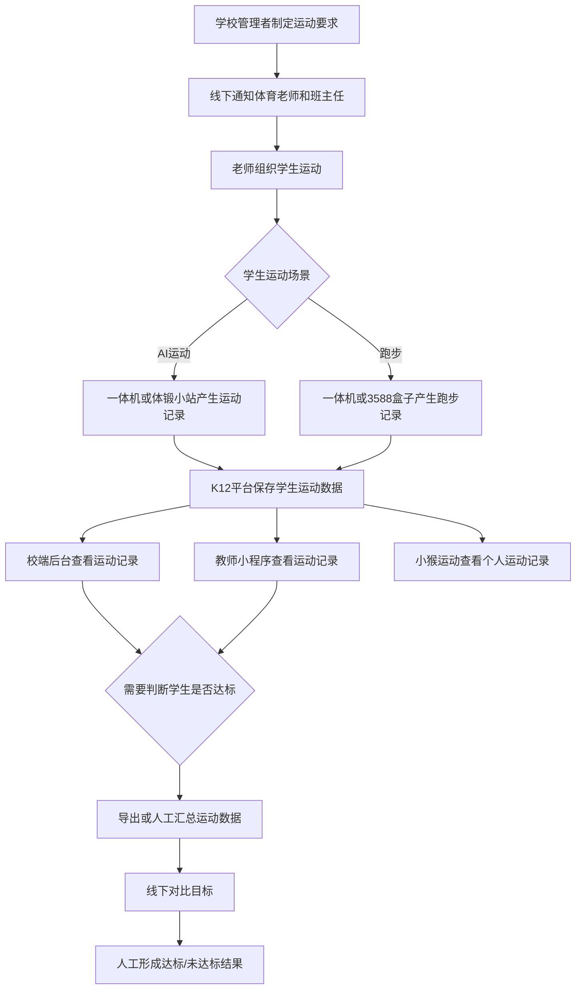
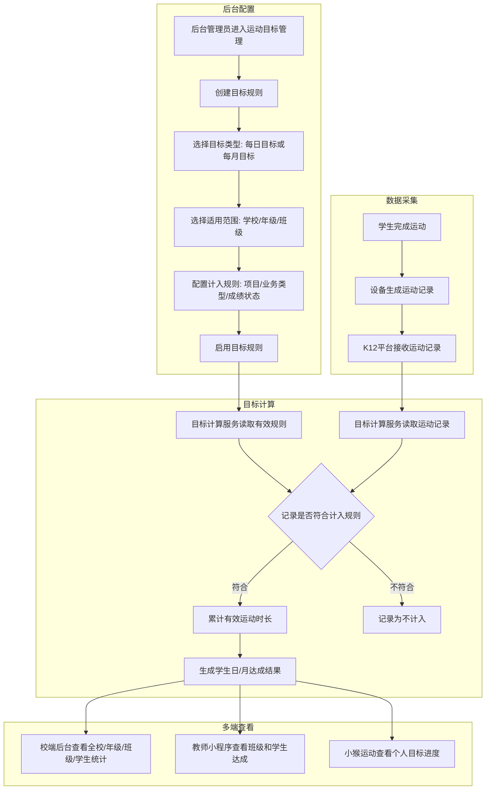
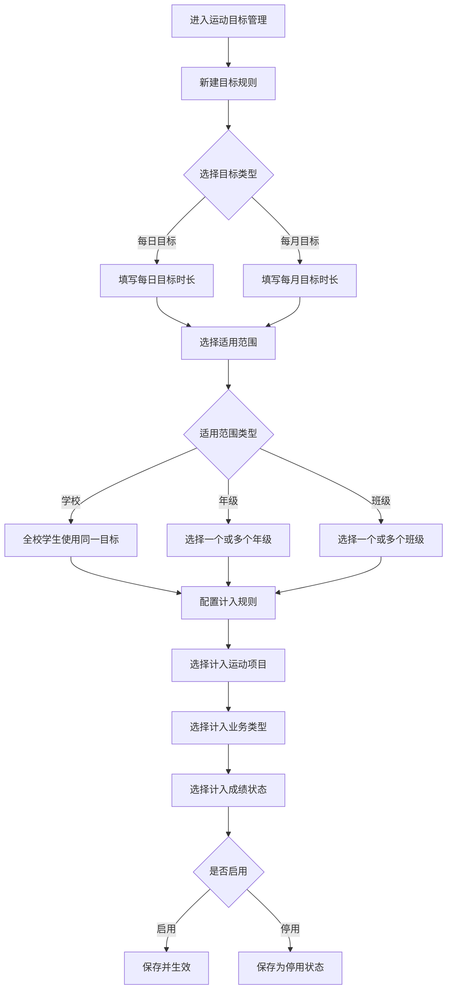
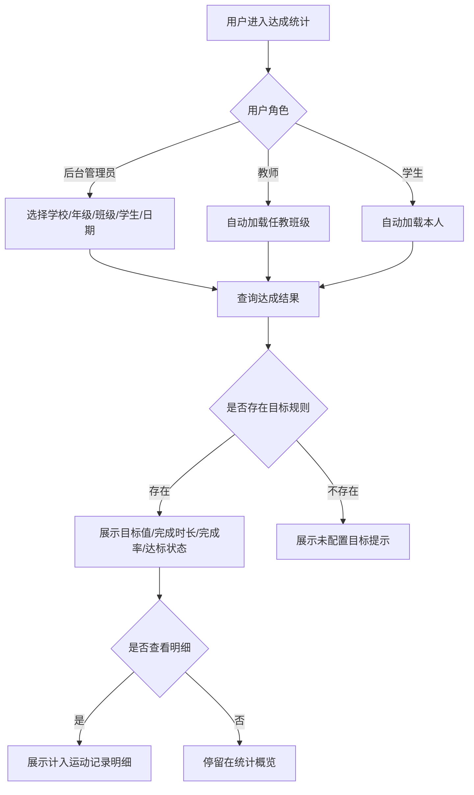

# 运动目标设置 - 需求分析 codex V2

**版本**：V2.0  
**日期**：2026-05-11  
**分析人**：Codex  
**面向对象**：中小学生  
**涉及终端**：校端后台（K12）、教师小程序（K12）、小猴运动（K12 学生小程序）、K12 平台后端  
**V1 范围**：运动目标配置、计入规则配置、达成统计分析、教师端查看、学生端查看

---

## 一、需求背景分析

### 1.1 需求来源

学校希望围绕中小学生日常运动建立一套可配置、可统计、可查看的运动目标体系。当前明确诉求包括：

| 诉求 | 说明 |
|------|------|
| 设置运动目标 | 支持设置每日、每月运动目标，例如每天锻炼 2 小时 |
| 查看达成情况 | 学校、老师可查看学生、班级、年级的目标完成情况 |
| 配置计入范围 | 学校可设定哪些运动项目、业务类型、成绩状态计入目标统计 |
| 多端闭环 | 后台老师配置，教师小程序查看班级情况，学生端查看个人进度 |

### 1.2 政策背景

教育部等五部门于 2025 年 11 月发布《关于实施学生体质强健计划的意见》。公开文件明确提出，到 2027 年，以义务教育阶段为重点，中小学生每天综合体育活动时间不少于 2 小时要求全面高质量落实；基础教育阶段要统筹课内外、校内外，推进每天综合体育活动时间不低于 2 小时。

政策对学校形成的产品要求是：学校不仅要组织学生运动，还要能解释学生每日、每月运动目标是否完成，哪些数据被计入，哪些学生和班级未达标。

**政策来源**：

| 来源 | 链接 | 公开资料已确认内容 |
|------|------|------------------|
| 中国政府网 | [教育部等五部门关于实施学生体质强健计划的意见](https://www.gov.cn/zhengce/zhengceku/202511/content_7049009.htm) | 2027 年前落实中小学生每天综合体育活动时间不少于 2 小时 |
| 教育部官网 | [教育部体卫艺司负责人答记者问](https://www.moe.gov.cn/jyb_xwfb/s271/202511/t20251119_1420844.html) | 以保证中小学生每天综合体育活动不低于 2 小时为切口推进学校体育改革 |
| 教育部官网 | [中小学生每天综合体育活动时间不低于 2 小时](https://www.moe.gov.cn/fbh/live/2026/77889/mtbd/202602/t20260228_1429557.html) | 全面实施学生体质强健计划，落实每天综合体育活动时间不低于 2 小时 |

### 1.3 系统现状

根据现有系统状态，校体云 K12 已具备运动数据采集、运动记录查看和多终端展示基础，但缺少运动目标层能力。

| 终端/服务 | 现有能力 | 与本需求的关系 |
|----------|----------|----------------|
| 一体机（1 代 / 2 代） | 支持自由训练、随堂测试、串班训练、体质测试、阳光跑，产生 AI 运动成绩和运动记录 | 作为目标达成计算的核心数据来源 |
| 体锻小站 | 支持跳绳、立定跳远、仰卧起坐、俯卧撑、开合跳、深蹲等项目 | 作为目标达成计算的数据来源 |
| 3588 智慧体育盒子 | 支持长跑、短跑、阳光跑、校园跑，教师小程序远程控制 | 与阳光跑、跑步类目标统计有关 |
| 校端后台（K12） | 已有学生管理、班级管理、学期管理、评分标准管理、阳光跑管理、学生运动数据 | 承接目标配置、达成统计、数据导出 |
| 教师小程序（K12） | 已有设备控制、运动记录查看、Excel 导出、串班训练详情 | 承接班级目标和学生达成查看 |
| 小猴运动（K12 学生小程序） | 已有运动改善方案、体测报告、AI 运动记录、体能训练记录 | 承接个人目标进度和明细查看 |
| 局端后台（K12） | 已有辖区驾驶舱、区级体测、学校管理 | V1 不纳入，后续确认是否同步区域指标 |

### 1.4 当前业务痛点

| 痛点 | 现状表现 | 影响 |
|------|----------|------|
| 缺少目标配置 | 学校无法在系统中配置每日、每月运动目标 | 目标依赖线下通知，无法形成系统化管理 |
| 缺少达成判定 | 运动记录仅反映学生做过哪些运动，不反映目标是否完成 | 老师无法快速判断哪些学生未达标 |
| 计入口径不可控 | 不同学校对自由训练、随堂测试、阳光跑、体质测试、异常成绩的计入要求不一致 | 同一套统计口径无法适配不同学校管理要求 |
| 多端信息割裂 | 后台、教师端、学生端都有运动记录，但没有统一目标进度 | 学校管理、教师督促、学生自我查看无法闭环 |
| 竞标表达不足 | 竞品普遍强调 AI 智慧体育、数据平台、运动指导和过程评价 | 校体云缺少“目标达成统计”这类面向学校管理的显性能力 |

### 1.5 竞品分析

#### 1.5.1 竞品来源与公开资料确认

| 品牌 | 来源 | 公开资料已确认内容 | 需进一步调研内容 |
|------|------|------------------|------------------|
| 安徽一视 | [一视集团官网](https://www.yishijituan.com/about)、[一视公开介绍](https://srwedu.cn/enterprise/info?id=73) | 提供全场景 AI 智慧操场、自助式 AI 体测中心、游戏化 AI 体育角、常态化 AI 阳光跑、标准化 AI 中考体育考场；强调科学化训练、个性化教学、规模化测试 | 是否支持学校自定义每日/月度目标、计入规则、教师小程序和学生端目标进度 |
| 大沩 | [大沩官网](https://www.daweiai.com/about)、[大沩国际官网](https://int.daweiaiint.com/) | 通过机器视觉、深度学习赋能体育教育，面向中小幼学校、社区、比赛场馆提供智慧体育产品和服务 | “一生一案”、目标配置、达成统计、教师端和学生端软件形态需试用确认 |
| 融梦 | [融梦官网](https://www.dreamsports.ai/)、[融梦公司简介](https://www.dreamsports.ai/about)、[智慧体育数据平台](https://www.dreamsports.ai/analysis) | 产品包含 AI 体育锻炼屏、AI 体育教学测试屏、AI 跳绳魔盒、AI 体育测试小站、智慧体育数据平台；数据平台采集整合体测、校内锻炼、校外居家运动数据，提供多维度可视化分析 | 是否支持按学校规则配置每日/月度目标、异常成绩计入、学生端目标进度 |
| 恒鸿达 | [恒鸿达官网](https://hengonda.com/)、[AI 智慧体育介绍](https://hxyxpt.com/) | AI 智慧操场支持 50/100 米、800/1000 米、阳光跑、自由跑等户外项目；强调视觉识别、骨骼计算、大数据分析，覆盖体育教学、考试、体质健康测试、体育锻炼等场景 | 青少年运动处方智能体在学校端的目标配置、达成统计和多端展示需试用确认 |
| 科大讯飞 | [智慧体育官网](https://edu.iflytek.com/solution/school/physical-education)、[智慧体育新闻](https://edu.iflytek.com/about-us/news/company-news/2733.html) | 智慧体育覆盖教、学、赛、练、测、考、评、管；数据驾驶舱呈现运动参与率、体质优良率、课堂达标等指标，可穿透到班级、个人维度 | 是否支持学校自定义目标规则、计入范围、学生端目标进度需试用确认 |
| 宇视等视觉厂商 | 公开智慧操场/视觉识别类方案 | 以摄像头、边缘计算、视觉识别、跑步/体测场景为主要优势 | 学校端软件闭环、教师小程序、学生端进度展示需专项调研 |

#### 1.5.2 能力维度对标

| 能力维度 | 安徽一视 | 大沩 | 融梦 | 恒鸿达 | 科大讯飞 | 校体云现状 |
|----------|----------|------|------|--------|----------|------------|
| 目标/处方能力 | 公开资料强调科学化训练、个性化教学 | 公开资料强调 AI 赋能体育教育 | 公开资料强调体锻和数据平台 | 公开资料强调训练处方智能体、AI 智慧操场 | 公开资料强调科学指导、AI 备课和达标数据 | 无运动目标配置 |
| 运动数据采集 | AI 智慧操场、AI 阳光跑、体测场景 | 机器视觉、深度学习采集 | AI 锻炼屏、教学测试屏、跳绳魔盒、测试小站 | AI 智慧操场、AI 体测室 | AI 视觉测评、智慧操场 | 一体机、体锻小站、3588 盒子 |
| 达成统计 | 需试用确认目标达成口径 | 需试用确认目标达成口径 | 数据平台支持多维度分析 | 需试用确认目标达成口径 | 数据驾驶舱支持参与率、课堂达标等指标 | 仅有运动记录，缺少目标达成 |
| 教师端 | 需试用确认 | 需试用确认 | 需试用确认 | 需试用确认 | 公开资料体现教师后台查看趋势 | 教师小程序可看运动记录 |
| 学生端 | 需试用确认 | 需试用确认 | 设备端强互动，学生端需确认 | 需试用确认 | 需试用确认 | 小猴运动可看个人运动记录 |
| 软件成熟度 | 全场景解决方案，需看后台体验 | 产品覆盖广，需看后台体验 | 官网明确数据平台，软件表达较完整 | 硬件和算法表达强，需看平台体验 | 数据驾驶舱和平台能力表达清晰 | K12 基础数据完整，目标层缺失 |

#### 1.5.3 对校体云的启示

| 启示 | 说明 | V1 处理方式 |
|------|------|------------|
| 先补学校管理闭环 | 竞品强调 AI 和体测，但学校直接关心每天、每月是否完成目标 | V1 优先做目标配置、达成统计、三端查看 |
| 强化规则可解释 | 公开资料较少明确“哪些运动计入目标”的精细配置 | V1 做成校体云差异点：项目、业务类型、成绩状态、统计周期均可解释 |
| 保持多端一致 | 老师和学生需要看到同一套目标和进度 | V1 后台配置，教师小程序和小猴运动只读取同一目标结果 |
| AI 处方后置 | AI 个性化处方涉及体测、运动能力画像、推荐算法和训练内容库 | V1 不纳入，作为后续迭代方向 |

### 1.6 不做的影响

| 影响 | 说明 |
|------|------|
| 学校无法形成目标管理闭环 | 每日 2 小时等目标无法在系统中配置、执行和复盘 |
| 教师督促效率低 | 老师需要导出运动记录后人工判断学生是否完成目标 |
| 学生缺少自我反馈 | 学生只能看到运动记录，看不到目标和剩余差距 |
| 数据价值不足 | 一体机、体锻小站、阳光跑产生的数据没有转化为学校管理指标 |
| 对外竞争弱 | 竞品强调智慧体育数据平台和过程评价，校体云缺少目标达成统计表达 |

---

## 二、需求目标确认

### 2.1 核心目标

| 编号 | 目标 | 衡量指标 |
|------|------|----------|
| O1 | 建立运动目标配置体系 | 校端后台支持配置每日目标、每月目标、适用范围、计入规则、启停状态 |
| O2 | 实现目标达成统计 | 后台支持按全校、年级、班级、学生查看日/月达成率、完成时长、未达标人数 |
| O3 | 打通教师查看闭环 | 教师小程序支持查看任教班级目标、班级达标率、学生达成列表和个人明细 |
| O4 | 打通学生自查闭环 | 小猴运动支持学生查看今日/月度目标、当前进度、计入明细和历史达成 |
| O5 | 形成可解释计入口径 | 后台配置项与统计结果可追溯，老师能解释某条运动记录是否计入目标 |

### 2.2 V1 范围

| 范围 | 说明 |
|------|------|
| 目标类型 | 每日运动时长目标、每月运动时长目标 |
| 适用范围 | 学校、年级、班级；班级配置优先于年级配置 |
| 计入范围 | 运动项目、业务类型、成绩状态 |
| 展示终端 | 校端后台、教师小程序、小猴运动 |
| 统计维度 | 全校、年级、班级、学生 |
| 数据来源 | 一体机、体锻小站、3588 盒子等已上传到 K12 平台的运动记录 |

### 2.3 V1 非目标

| 非目标 | 说明 |
|--------|------|
| AI 个性化运动处方 | 不生成一人一案训练建议，不做算法推荐 |
| 家长端 | 不新增家长端查看和提醒 |
| 局端后台 | 不在 V1 同步局端统计指标，后续由业务确认 |
| 一体机端展示 | 不在一体机、体锻小站、LED 大屏展示目标进度 |
| 积分勋章 | 不做积分、勋章、连续达标奖励 |
| 消息推送 | 不做小程序订阅消息、短信、公众号模板消息推送 |
| 运动次数/里程/热量目标 | V1 目标以运动时长为主，其余指标作为扩展项 |

### 2.4 成功标准

| 标准 | 验收方式 |
|------|----------|
| 学校能配置目标 | 后台新增目标规则后，指定年级/班级学生产生目标记录 |
| 老师能看达成 | 教师小程序可查看班级达标率和学生列表 |
| 学生能看进度 | 小猴运动可查看今日目标、已完成时长、完成率 |
| 统计可解释 | 后台可查看计入明细，说明每条运动记录是否计入 |
| 数据可导出 | 后台可导出学生达成列表，支撑学校线下管理和汇报 |

---

## 三、业务流程分析

### 3.1 当前流程（现状）

**输入与输出说明**：

| 节点 | 输入 | 输出 |
|------|------|------|
| 学校管理者制定运动要求 | 学校管理要求、政策要求 | 线下运动目标 |
| 一体机/体锻小站/3588 盒子产生记录 | 学生身份、运动项目、运动成绩、运动时间 | 运动记录 |
| K12 平台保存学生运动数据 | 设备上传记录 | 学生运动数据 |
| 人工汇总运动数据 | 运动记录、线下目标 | 达标/未达标结果 |

**现状问题**：

| 问题 | 说明 |
|------|------|
| 目标离线 | 目标没有进入系统，不能与运动记录自动关联 |
| 统计人工 | 老师需要人工对比目标和实际数据 |
| 结果滞后 | 学生当天是否达标无法及时查看 |
| 口径不清 | 哪些运动计入目标由人工判断，缺少统一规则 |

### 3.2 目标流程（改善后）

**输入与输出说明**：

| 节点 | 输入 | 输出 |
|------|------|------|
| 创建目标规则 | 目标类型、目标值、适用范围、计入规则 | 目标规则 |
| K12 平台接收运动记录 | 设备上传运动数据 | 标准化运动记录 |
| 目标计算服务 | 目标规则、运动记录、学生班级关系 | 达成结果、计入明细 |
| 校端后台查看统计 | 达成结果、组织结构 | 管理看板、列表、导出文件 |
| 教师小程序查看班级 | 达成结果、教师任教关系 | 班级达标概览、学生列表 |
| 小猴运动查看个人 | 达成结果、个人运动明细 | 今日/月度进度、计入明细 |

### 3.3 目标规则配置流程

### 3.4 达成统计查询流程

---

## 四、功能拆解清单

### 4.1 功能清单总表

| 终端 | 模块 | 功能 | 功能描述 | 优先级 |
|------|------|------|----------|--------|
| 校端后台（K12） | 运动目标管理 | 目标规则列表 | 展示目标名称、目标类型、目标值、适用范围、计入规则摘要、启停状态、创建时间，支持筛选和查看详情 | P0 |
| 校端后台（K12） | 运动目标管理 | 新建目标规则 | 支持配置每日/月度运动时长目标、适用范围、计入规则、启停状态 | P0 |
| 校端后台（K12） | 运动目标管理 | 编辑目标规则 | 支持编辑未删除目标规则；已产生统计数据的规则变更需记录更新时间 | P0 |
| 校端后台（K12） | 运动目标管理 | 启用/停用规则 | 启用后参与后续达成计算，停用后不再生成新的达成结果 | P0 |
| 校端后台（K12） | 运动目标管理 | 删除目标规则 | 支持删除未使用规则；已产生统计数据的规则删除策略需确认 | P1 |
| 校端后台（K12） | 运动目标管理 | 计入运动项目配置 | 支持选择跳绳、立定跳远、引体向上、仰卧起坐、俯卧撑、短跑、长跑、阳光跑、球类、趣味运动等项目 | P0 |
| 校端后台（K12） | 运动目标管理 | 计入业务类型配置 | 支持选择自由训练、随堂测试、串班训练、体质测试、阳光跑等业务类型 | P0 |
| 校端后台（K12） | 运动目标管理 | 计入成绩状态配置 | 支持选择正常、异常、违规等成绩状态，默认仅正常成绩计入 | P0 |
| 校端后台（K12） | 运动目标统计 | 达成概览 | 展示全校目标覆盖人数、达标人数、未达标人数、达标率、累计运动时长 | P0 |
| 校端后台（K12） | 运动目标统计 | 年级/班级统计 | 按年级、班级展示目标值、完成人数、达标率、平均完成时长、排名 | P0 |
| 校端后台（K12） | 运动目标统计 | 学生达成列表 | 展示学生姓名、学籍号、班级、目标时长、完成时长、完成率、达标状态 | P0 |
| 校端后台（K12） | 运动目标统计 | 学生达成详情 | 展示学生每日/月度目标、计入运动记录、不计入记录原因 | P1 |
| 校端后台（K12） | 运动目标统计 | 筛选查询 | 支持按日期、月份、年级、班级、学生、达标状态查询 | P0 |
| 校端后台（K12） | 运动目标统计 | 数据导出 | 支持导出学生达成列表，字段与页面列表一致 | P0 |
| 校端后台（K12） | 运动目标统计 | 趋势分析 | 支持按日/月查看达标率、运动时长趋势 | P1 |
| 教师小程序（K12） | 运动目标 | 班级目标查看 | 展示教师任教班级的每日/月度目标、适用规则、统计日期 | P0 |
| 教师小程序（K12） | 运动目标 | 班级达标概览 | 展示班级达标率、达标人数、未达标人数、平均完成时长 | P0 |
| 教师小程序（K12） | 运动目标 | 学生达成列表 | 展示班级学生目标完成情况，支持按达标/未达标筛选 | P0 |
| 教师小程序（K12） | 运动目标 | 学生个人明细 | 点击学生查看目标值、完成时长、计入运动明细 | P1 |
| 教师小程序（K12） | 运动目标 | 未达标标记 | 对未达标学生在列表中高亮展示，不触发消息推送 | P1 |
| 小猴运动 | 运动目标 | 首页目标卡片 | 展示今日目标、已完成时长、完成率、达标状态 | P0 |
| 小猴运动 | 运动目标 | 月度目标进度 | 展示本月目标、累计完成时长、月度完成率 | P0 |
| 小猴运动 | 运动目标 | 计入明细 | 展示计入目标的运动记录，包括项目、时间、时长、来源设备 | P1 |
| 小猴运动 | 运动目标 | 历史达成记录 | 按日历或列表展示历史每日达标状态 | P1 |
| K12 平台后端 | 目标规则服务 | 规则存储 | 存储目标类型、目标值、适用范围、计入规则、启停状态 | P0 |
| K12 平台后端 | 目标规则服务 | 规则匹配 | 根据学生所在学校、年级、班级匹配生效目标，班级规则优先于年级规则 | P0 |
| K12 平台后端 | 目标计算服务 | 运动记录过滤 | 根据项目、业务类型、成绩状态过滤运动记录 | P0 |
| K12 平台后端 | 目标计算服务 | 达成结果生成 | 生成学生日/月目标完成时长、完成率、达标状态 | P0 |
| K12 平台后端 | 目标计算服务 | 计入明细生成 | 记录计入目标的运动记录和不计入原因，支持前端解释统计结果 | P1 |
| K12 平台后端 | 数据接口 | 后台统计接口 | 提供概览、年级班级统计、学生列表、学生详情、导出数据 | P0 |
| K12 平台后端 | 数据接口 | 教师端接口 | 提供教师班级目标、班级概览、学生列表、学生详情 | P0 |
| K12 平台后端 | 数据接口 | 学生端接口 | 提供个人今日目标、月度目标、完成进度、计入明细 | P0 |

### 4.2 目标规则字段建议

| 字段 | 说明 | V1 要求 |
|------|------|---------|
| 目标名称 | 便于后台识别规则 | 必填 |
| 目标类型 | 每日目标、每月目标 | 必填 |
| 目标值 | 运动时长，单位分钟 | 必填 |
| 适用范围类型 | 学校、年级、班级 | 必填 |
| 适用对象 | 学校 ID、年级 ID、班级 ID | 必填 |
| 计入运动项目 | 多选运动项目 | 必填 |
| 计入业务类型 | 多选业务类型 | 必填 |
| 计入成绩状态 | 多选成绩状态 | 必填 |
| 生效日期 | 规则开始生效日期 | 必填 |
| 失效日期 | 规则结束日期 | 选填 |
| 启停状态 | 启用、停用 | 必填 |
| 创建人/更新时间 | 审计字段 | 必填 |

### 4.3 计入规则建议

| 配置维度 | V1 选项 | 默认值 |
|----------|---------|--------|
| 运动项目 | 跳绳、立定跳远、引体向上、仰卧起坐、俯卧撑、50 米跑、100 米跑、800 米跑、1000 米跑、实心球、排球、足球、篮球、开合跳、深蹲、阳光跑、长跑、自定义跑步项目 | 默认全选，学校可调整 |
| 业务类型 | 自由训练、随堂测试、串班训练、体质测试、阳光跑 | 默认全选，学校可调整 |
| 成绩状态 | 正常、异常、违规 | 默认仅正常 |
| 统计周期 | 每日、每月 | 跟随目标类型 |
| 统计单位 | 分钟 | 固定为分钟 |

### 4.4 运动时长计算口径

| 规则 | V1 建议 | 状态 |
|------|---------|------|
| 基础公式 | 有效运动时长 = 符合计入规则的运动记录时长之和 | 需技术确认字段来源 |
| 运动记录时长 | 优先使用运动记录中的开始时间、结束时间计算 | 需确认现有数据是否完整 |
| 无结束时间记录 | 不计入目标统计，并在明细中标注不计入原因 | 需确认 |
| 重叠记录 | 同一学生同一时间段发生重叠时，按时间并集计算 | 需确认 |
| 不足 1 分钟 | 按 1 分钟计入，或向下取整 | 待确认 |
| 异常/违规成绩 | 默认不计入，后台可配置 | 待确认 |

### 4.5 页面展示建议

| 页面 | 核心内容 |
|------|----------|
| 后台-目标规则列表 | 规则名称、目标类型、目标值、适用范围、计入规则、状态、操作 |
| 后台-新建/编辑目标 | 基础信息、适用范围、计入规则、启停状态 |
| 后台-达成概览 | 达标率、未达标人数、累计时长、年级/班级排名 |
| 后台-学生列表 | 学生、班级、目标值、完成时长、完成率、达标状态、详情 |
| 教师小程序-班级概览 | 班级目标、达标率、达标/未达标人数、统计日期 |
| 教师小程序-学生列表 | 学生姓名、完成时长、完成率、达标状态 |
| 小猴运动-首页目标卡 | 今日目标、已完成、剩余、完成率 |
| 小猴运动-目标详情 | 今日/月度进度、计入运动明细、历史达成 |

### 4.6 后续扩展方向

| 扩展方向 | 说明 | 纳入 V1 |
|----------|------|---------|
| 运动次数目标 | 如每日完成 3 次运动 | 否 |
| 里程目标 | 如每月跑步 30 公里 | 否 |
| 热量目标 | 依赖热量估算模型 | 否 |
| AI 运动处方 | 基于体测、运动数据生成个性化建议 | 否 |
| 家长端查看 | 家长查看孩子达成情况 | 否 |
| 消息推送 | 未达标提醒学生或老师 | 否 |
| 局端统计 | 区域查看学校达标率 | 否 |
| LED 大屏展示 | 大屏展示班级达标榜 | 否 |

---

## 五、待确认事项

| 序号 | 待确认事项 | 状态 | 负责人 | 截止日期 |
|------|------------|------|--------|----------|
| 1 | 目标适用范围是否只支持学校、年级、班级，是否需要支持学生个人目标 | 待确认 | 产品/业务 | - |
| 2 | 班级规则与年级规则冲突时，是否确认班级规则优先 | 待确认 | 产品/业务 | - |
| 3 | 每日目标统计周期是否按自然日 00:00-23:59，是否需要学校自定义统计时段 | 待确认 | 产品/业务 | - |
| 4 | 每月目标统计周期是否按自然月，是否需要按学期月或自定义周期统计 | 待确认 | 产品/业务 | - |
| 5 | 运动记录是否具备稳定的开始时间、结束时间、运动时长字段 | 待确认 | 后端 | - |
| 6 | 同一学生重叠运动记录是否按时间并集去重计算 | 待确认 | 产品/后端 | - |
| 7 | 不足 1 分钟的运动记录按 1 分钟计入，还是向下取整不计入 | 待确认 | 产品/业务 | - |
| 8 | 异常成绩、违规成绩默认不计入目标统计是否符合学校管理要求 | 待确认 | 产品/业务 | - |
| 9 | 体质测试数据是否计入运动目标，还是仅自由训练、随堂测试、阳光跑计入 | 待确认 | 产品/业务 | - |
| 10 | 阳光跑管理已有数据是否直接纳入运动目标统计，是否需要复用阳光跑既有规则 | 待确认 | 产品/后端 | - |
| 11 | 小猴运动首页目标卡片展示优先级是否高于现有运动改善方案 | 待确认 | 产品/设计 | - |
| 12 | 教师小程序是否只展示任教班级，班主任、体育老师、管理员的可见范围是否一致 | 待确认 | 产品/业务 | - |
| 13 | 后台导出是否需要包含计入明细，还是仅导出学生达成结果 | 待确认 | 产品/业务 | - |
| 14 | 已产生统计数据的目标规则被编辑后，历史统计是否重算 | 待确认 | 产品/后端 | - |
| 15 | 已产生统计数据的目标规则是否允许删除，删除后历史结果如何展示 | 待确认 | 产品/后端 | - |
| 16 | 是否需要将学校、年级、班级达标率同步到局端后台 | 待确认 | 产品/业务 | - |
| 17 | 是否需要在后续版本接入 AI 个性化运动处方，与体测成绩、BMI、弱项项目联动 | 待确认 | 产品/业务 | - |

