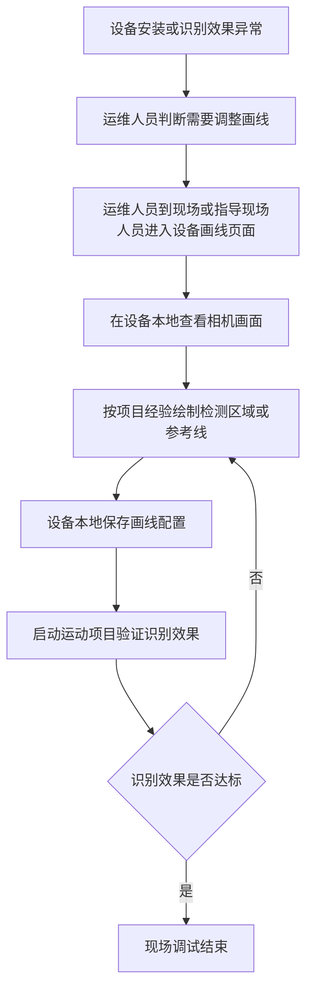
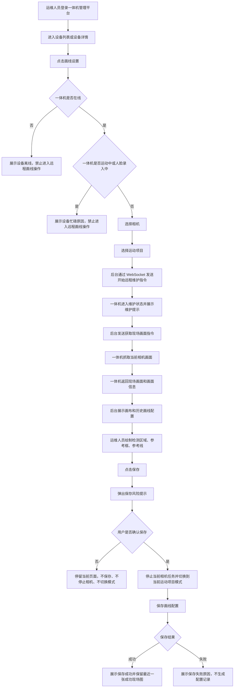
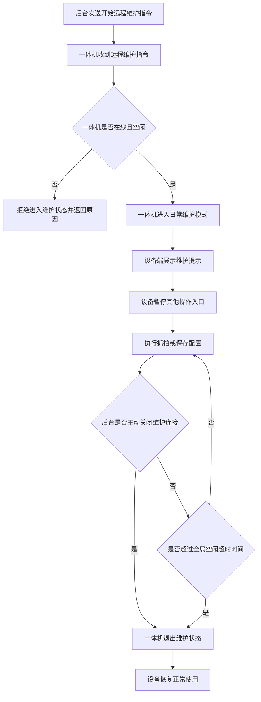
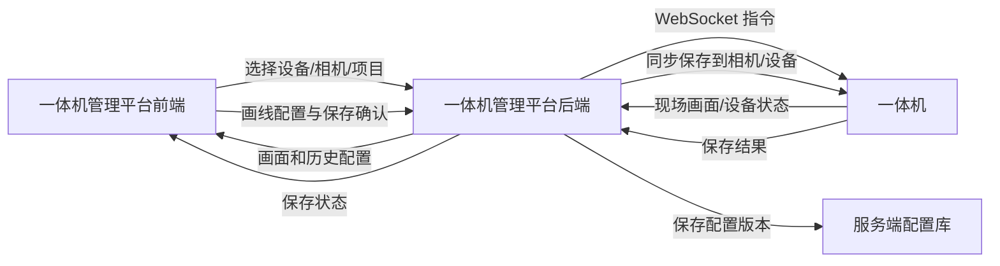
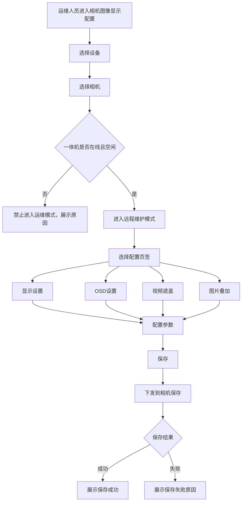

# 远程画线需求分析

**分析日期：** 2026-05-27  
**分析对象：** 一体机运维护管理平台 - 一体机远程画线与相机图像显示配置  
**覆盖范围：** 一体机  
**状态：** 需求分析

---

## 一、需求背景分析

### 1.1 需求来源

一体机在 AI 运动识别前需要配置检测区域、参考框、参考线等画线信息。不同运动项目的画线规则存在差异，现场安装和调试时需要运维人员根据相机画面完成画线配置。

当前用户提供的历史原型包含以下能力线索：

- 后台可进入设备画线设置页面。
- 后台可获取设备现场画面作为画线底图。
- 画线配置包含检测区域、参考框、参考线等元素。
- 引体向上、仰卧起坐等项目存在不同的画线工具和专项配置项。
- 后台和设备可通过 WebSocket 建立连接。
- 设备收到抓拍或画线指令后，需要进入维护状态并在设备端提示不可操作。
- 保存画线规则会停止当前相机任务，并将相机切换到当前运动项目模式。
- 相机存在独立的图像显示配置模块，包含显示设置、OSD 设置、视频遮盖、图片叠加。

### 1.2 当前业务痛点

| 痛点 | 说明 | 影响 |
|------|------|------|
| 现场依赖高 | 画线依赖运维人员到设备现场操作或远程指导现场人员操作 | 运维成本高，问题处理周期长 |
| 配置分散 | 设备本地存在画线配置，后台缺少统一的远程保存闭环 | 多设备、多项目运维时难以追踪最新配置 |
| 项目规则差异大 | 不同运动项目需要的画线元素、专项参数不同 | 一次性写死所有项目规则会阻塞一期基础能力建设 |
| 相机复用风险 | 保存画线规则会停止相机并切换当前运动项目模式 | 若相机正在被其他设备或运动复用，可能影响正在进行的运动 |
| 相机配置独立 | 相机图像显示配置与远程画线流程是两个独立模块 | 需求分析中需要明确边界，避免画线流程依赖相机显示配置 |

### 1.3 受影响角色

| 角色 | 影响 |
|------|------|
| 运维人员 | 负责设备运维、远程获取现场画面、完成画线、保存配置并确认结果 |
| 设备端使用者 | 设备进入维护状态时，需要看到明确提示，避免继续操作 |
| 研发/实施人员 | 需要统一画线基础结构，支持后续补充不同项目的专项配置规则，并确认相机图像显示配置的一期实现范围 |

### 1.4 不做的影响

- 运维人员继续依赖现场处理画线问题，设备调试效率低。
- 后台无法掌握设备画线配置是否保存成功，配置生效依赖人工确认。
- 后续新增运动项目时，每个项目独立实现画线能力，增加重复开发和维护成本。
- 相机图像显示配置缺少后台统一入口时，运维人员仍需依赖其他工具调整相机画面参数。

---

## 二、需求目标确认

### 2.1 核心目标

在一体机运维护管理平台建设一体机远程画线基础能力，使运维人员可以在后台完成“选择设备、选择相机、选择运动项目、获取现场画面、绘制画线配置、保存前风险确认、保存服务端配置并同步到相机/设备”的闭环。

同时，将相机图像显示配置作为一期独立模块纳入需求分析。该模块与远程画线流程解耦，远程画线获取现场画面时不依赖、不应用相机图像显示配置。

### 2.2 一期目标

| 目标 | 说明 | 优先级 |
|------|------|--------|
| 设备远程画线入口 | 在一体机管理平台设备列表或设备详情中提供画线设置入口 | P0 |
| 相机选择 | 进入画线前先选择相机，每个相机作为独立对象 | P0 |
| 项目选择 | 在相机下选择运动项目，一个相机下可为多个运动项目分别保存画线配置 | P0 |
| 获取现场画面 | 后台向在线且空闲的一体机发起抓拍指令，设备返回当前相机画面 | P0 |
| 画布绘制 | 后台基于现场画面绘制检测区域、参考框、参考线等通用元素 | P0 |
| 保存前风险提示 | 保存前提示相机会停止当前任务并切换到当前运动项目模式 | P0 |
| 配置保存 | 保存成功即视为配置已同步到相机/设备；保存失败不生成配置记录 | P0 |
| 保存状态展示 | 展示未保存、保存中、保存成功、保存失败 | P0 |
| 项目画线规则配置模块 | 后续按项目补充专项配置项，不默认所有项目都有单人/双人等模式 | P1 |
| 相机图像显示配置 | 提供相机显示设置、OSD 设置、视频遮盖、图片叠加的配置入口 | P1 |
| 远程维护空闲超时 | 提供全局配置，默认 15 分钟无交互后自动退出维护状态 | P1 |

### 2.3 一期范围约束

- 本次主入口为一体机运维护管理平台，K12 校端后台、高校校端后台不作为主入口。
- 本次覆盖设备类型为一体机，不覆盖智慧体育盒子。
- 本次不支持设备离线自动保存或自动下发配置。
- 本次不支持画线配置版本回滚。
- 本次不写死完整项目画线规则矩阵，项目专项配置等待后续截图补充。
- 本次保存画线规则是一次同步保存动作，保存成功即代表后台配置与相机/设备侧配置完成。
- 本次不提供独立的“下发失败”“设备应用失败”业务状态；失败统一归为保存失败。
- 相机图像显示配置纳入一期需求分析，优先级为 P1，需研发确认可实现范围。

### 2.4 一期支持项目

一期支持在画线页面选择以下运动项目：

| 序号 | 项目 |
|------|------|
| 1 | 引体向上 |
| 2 | 俯卧撑 |
| 3 | 仰卧起坐（抱头） |
| 4 | 仰卧起坐（抱胸） |
| 5 | 跳绳 |
| 6 | 立定跳远 |
| 7 | 短跑 |
| 8 | 长跑 |
| 9 | 实心球 |
| 10 | 排球 |
| 11 | 足球 |
| 12 | 篮球 |
| 13 | 手势识别 |
| 14 | 互动游戏 |

### 2.5 远程画线基础配置说明

一期建设的是“远程画线底座”，不是单个项目的固定画线页面。画线配置统一绑定以下基础对象：

| 配置对象 | 说明 |
|----------|------|
| 设备 | 画线配置必须绑定设备 ID、设备类型 |
| 相机 | 画线配置必须绑定一个相机 |
| 运动项目 | 画线配置必须绑定一个运动项目 |
| 画布 | 现场画面、画面尺寸、坐标系、画面获取时间 |
| 图形元素 | 检测区域、参考框、参考线，支持后续增加点位、多边形、方向线 |
| 版本信息 | 每次保存生成服务端配置版本，仅展示最新版本，不支持回滚 |
| 保存状态 | 未保存、保存中、保存成功、保存失败 |

不是每个运动项目都有单人、双人、A/B 区域等配置。每个项目需要哪些专项配置，后续由“项目画线规则配置模块”单独承载，等待后续截图补充后再细化。

### 2.6 保存前风险提示

保存画线规则前，后台必须弹出确认提示，避免运维误影响正在复用该相机的其他运动。

建议文案：

> 保存后，相机会停止当前相机任务，并切换到当前运动项目模式。若该相机正在被其他设备或运动复用，可能影响正在进行的运动。确认保存吗？

交互规则：

- 用户点击“确认”后，才执行保存。
- 用户点击“取消”后，停留在当前画线页面，不保存配置，不停止相机，不切换运动项目模式。
- 保存成功后，展示保存成功，即视为下发成功。
- 保存失败后，展示失败原因，不生成配置记录。

### 2.7 相机图像显示配置边界

相机图像显示配置作为一期独立模块纳入需求分析，和远程画线流程保持解耦：

- 远程画线获取现场画面时，不依赖相机图像显示配置。
- 远程画线获取现场画面时，不要求应用相机图像显示配置效果。
- 相机图像显示配置是整个相机维度的配置，不需要选择运动项目。
- 相机图像显示配置必须在运维模式下设置，因为配置需要下发到相机保存。
- 相机图像显示配置只需要配置参数，不需要展示相机预览画面。
- 相机图像显示配置的开发实现范围需研发确认。

---

## 三、业务流程分析

### 3.1 当前流程（现状）

**现状问题：**

- 输入为现场设备画面和运维经验，输出为设备本地配置。
- 后台没有统一的远程保存状态。
- 不同项目规则散落在实施经验和项目页面中，缺少统一扩展结构。

### 3.2 目标流程（改善后）

### 3.3 设备维护状态流程

### 3.4 数据流向

### 3.5 相机图像显示配置流程

---

## 四、功能拆解清单

### 4.1 一体机管理平台 - 远程画线

| 终端 | 模块 | 功能 | 功能描述 | 优先级 |
|------|------|------|----------|--------|
| 一体机管理平台 | 设备列表/设备详情 | 画线设置入口 | 对一体机提供画线设置入口，进入后展示设备信息、在线状态、相机选择、项目选择 | P0 |
| 一体机管理平台 | 画线设置 | 在线状态校验 | 进入画线前校验一体机在线状态；离线时禁止获取现场画面、进入维护、保存配置 | P0 |
| 一体机管理平台 | 画线设置 | 忙碌状态校验 | 一体机运动中或人脸录入中时，禁止全部远程画线操作并展示原因 | P0 |
| 一体机管理平台 | 画线设置 | 相机选择 | 支持先选择相机；每个相机作为独立配置对象 | P0 |
| 一体机管理平台 | 画线设置 | 项目选择 | 支持在相机下选择运动项目，配置保存时绑定该项目 | P0 |
| 一体机管理平台 | 画线设置 | 获取现场画面 | 点击后向一体机发送抓拍指令，页面展示获取中、成功、失败状态 | P0 |
| 一体机管理平台 | 画线设置 | 现场画面展示 | 展示一体机返回的现场图片、获取时间、相机信息 | P0 |
| 一体机管理平台 | 画线设置 | 历史配置加载 | 按设备、相机、项目加载服务端最新画线配置；无配置时展示空画布 | P0 |
| 一体机管理平台 | 画线设置 | 检测区域绘制 | 支持在画布上绘制、调整、删除检测区域 | P0 |
| 一体机管理平台 | 画线设置 | 参考框绘制 | 支持在画布上绘制、调整、删除参考框 | P0 |
| 一体机管理平台 | 画线设置 | 参考线绘制 | 支持在画布上绘制、调整、删除参考线 | P0 |
| 一体机管理平台 | 画线设置 | 清空画线 | 支持清空当前相机、当前项目下的画线元素，清空前需二次确认 | P1 |
| 一体机管理平台 | 画线设置 | 保存前风险提示 | 保存前提示相机会停止当前任务并切换到当前运动项目模式，用户确认后才保存 | P0 |
| 一体机管理平台 | 画线设置 | 保存配置 | 保存画线元素、画布信息、设备、相机、项目信息；保存成功即视为下发成功 | P0 |
| 一体机管理平台 | 画线设置 | 保存状态展示 | 展示未保存、保存中、保存成功、保存失败 | P0 |
| 一体机管理平台 | 画线设置 | 最近成功现场图 | 仅保留最近一张画线成功的现场图片，新的成功图片覆盖旧图片 | P0 |
| 一体机管理平台 | 画线设置 | 失败提示 | 获取现场画面失败、保存失败时展示明确失败原因 | P0 |

### 4.2 一体机管理平台后端

| 终端 | 模块 | 功能 | 功能描述 | 优先级 |
|------|------|------|----------|--------|
| 一体机管理平台后端 | 设备连接服务 | WebSocket 连接管理 | 管理一体机 WebSocket 在线连接，记录设备在线、离线、最后心跳时间 | P0 |
| 一体机管理平台后端 | 设备状态服务 | 设备状态查询 | 查询一体机是否在线、运动中、人脸录入中、远程维护中 | P0 |
| 一体机管理平台后端 | 远程维护服务 | 开始远程维护 | 在线且空闲时允许进入维护状态；离线、运动中、人脸录入中时拒绝 | P0 |
| 一体机管理平台后端 | 远程维护服务 | 关闭远程维护 | 运维完成后主动关闭 WebSocket 维护连接，使设备退出维护状态 | P0 |
| 一体机管理平台后端 | 远程维护服务 | 空闲超时配置 | 提供全局空闲超时时间配置，默认 15 分钟，可调整 | P1 |
| 一体机管理平台后端 | 远程指令服务 | 获取现场画面指令 | 向指定一体机、指定相机发送抓拍指令，接收设备返回的现场画面和画面信息 | P0 |
| 一体机管理平台后端 | 画线配置服务 | 配置保存 | 保存设备、相机、项目、画布、画线元素、版本号，并同步保存到相机/设备 | P0 |
| 一体机管理平台后端 | 画线配置服务 | 最新配置查询 | 按设备、相机、项目查询服务端最新版本配置 | P0 |
| 一体机管理平台后端 | 画线配置服务 | 最近成功现场图保存 | 每组设备、相机、项目仅保留最近一张画线成功的现场图片 | P0 |
| 一体机管理平台后端 | 画线配置服务 | 保存失败处理 | 保存失败时不生成配置记录，返回失败原因 | P0 |
| 一体机管理平台后端 | 画线配置服务 | 版本记录 | 每次保存成功生成新版本，保留版本号、保存人、保存时间；不支持回滚 | P1 |
| 一体机管理平台后端 | 权限与审计 | 操作日志 | 记录获取现场画面、保存确认、保存配置、清空配置、关闭维护连接等操作 | P1 |

### 4.3 一体机端

| 终端 | 模块 | 功能 | 功能描述 | 优先级 |
|------|------|------|----------|--------|
| 一体机 | 设备通信 | WebSocket 保持连接 | 与一体机管理平台后端保持 WebSocket 连接并上报在线状态 | P0 |
| 一体机 | 设备状态 | 状态上报 | 上报在线、运动中、人脸录入中、远程维护中等状态 | P0 |
| 一体机 | 远程维护 | 进入维护状态 | 收到开始远程维护指令后，在线且空闲时进入日常维护模式 | P0 |
| 一体机 | 远程维护 | 忙碌拒绝 | 设备运动中或人脸录入中时拒绝远程维护，并返回具体原因 | P0 |
| 一体机 | 远程维护 | 维护提示 | 有屏设备展示维护提示，告知现场用户设备维护中、请稍后再使用 | P0 |
| 一体机 | 远程维护 | 空闲自动退出 | 超过全局空闲超时时间无交互后自动退出维护状态 | P1 |
| 一体机 | 相机服务 | 现场画面抓拍 | 根据后台指令抓取指定相机画面，并返回画面、尺寸、相机标识、时间 | P0 |
| 一体机 | 相机服务 | 停止并切换运动模式 | 用户确认保存后，停止当前相机任务并切换到当前运动项目模式 | P0 |
| 一体机 | 画线配置 | 配置保存 | 接收并保存后台画线配置，校验设备、相机、项目、版本信息 | P0 |
| 一体机 | 画线配置 | 保存结果回执 | 返回保存成功或保存失败结果；失败时返回失败原因 | P0 |
| 一体机 | 远程维护 | 退出维护状态 | 后台主动关闭维护连接后退出维护状态并恢复正常使用 | P0 |

### 4.4 远程画线基础配置

| 终端 | 模块 | 功能 | 功能描述 | 优先级 |
|------|------|------|----------|--------|
| 一体机管理平台 | 画线配置模型 | 设备绑定 | 画线配置必须绑定设备 ID、设备类型 | P0 |
| 一体机管理平台 | 画线配置模型 | 相机绑定 | 画线配置必须绑定相机 | P0 |
| 一体机管理平台 | 画线配置模型 | 项目绑定 | 画线配置必须绑定运动项目 | P0 |
| 一体机管理平台 | 画线配置模型 | 画布信息 | 记录图片宽高、坐标系、现场画面获取时间、相机信息 | P0 |
| 一体机管理平台 | 画线配置模型 | 图形元素 | 支持检测区域、参考框、参考线三类基础元素 | P0 |
| 一体机管理平台 | 画线配置模型 | 保存状态 | 支持未保存、保存中、保存成功、保存失败 | P0 |
| 一体机管理平台 | 项目画线规则配置 | 专项配置扩展 | 后续按项目补充专项配置项，不默认所有项目都有单人/双人等模式 | P1 |

### 4.5 相机图像显示配置

| 终端 | 模块 | 功能 | 功能描述 | 优先级 |
|------|------|------|----------|--------|
| 一体机管理平台 | 相机图像显示配置 | 配置入口 | 在相机配置中提供图像显示配置入口，独立于远程画线流程 | P1 |
| 一体机管理平台 | 相机图像显示配置 | 运维模式校验 | 相机图像显示配置必须在设备在线且空闲、已进入运维模式后才能设置 | P1 |
| 一体机管理平台 | 相机图像显示配置 | 相机维度配置 | 配置只绑定设备和相机，不需要选择运动项目 | P1 |
| 一体机管理平台 | 相机图像显示配置 | 显示设置 | 支持普通、背光、顺光、低照度、自定义1、自定义2等参数套餐 | P1 |
| 一体机管理平台 | 相机图像显示配置 | 图像调节 | 支持图像调节配置项，具体字段由研发根据相机能力确认 | P1 |
| 一体机管理平台 | 相机图像显示配置 | 曝光 | 支持曝光相关配置项，具体字段由研发根据相机能力确认 | P1 |
| 一体机管理平台 | 相机图像显示配置 | 聚焦 | 支持聚焦相关配置项，具体字段由研发根据相机能力确认 | P1 |
| 一体机管理平台 | 相机图像显示配置 | 日夜转换 | 支持日夜转换相关配置项，具体字段由研发根据相机能力确认 | P1 |
| 一体机管理平台 | 相机图像显示配置 | 补光灯 | 支持补光灯相关配置项，具体字段由研发根据相机能力确认 | P1 |
| 一体机管理平台 | 相机图像显示配置 | 背光 | 支持背光相关配置项，具体字段由研发根据相机能力确认 | P1 |
| 一体机管理平台 | 相机图像显示配置 | 白平衡 | 支持白平衡相关配置项，具体字段由研发根据相机能力确认 | P1 |
| 一体机管理平台 | 相机图像显示配置 | 降噪 | 支持降噪相关配置项，具体字段由研发根据相机能力确认 | P1 |
| 一体机管理平台 | 相机图像显示配置 | 透雾 | 支持透雾相关配置项，具体字段由研发根据相机能力确认 | P1 |
| 一体机管理平台 | 相机图像显示配置 | 防抖 | 支持防抖相关配置项，具体字段由研发根据相机能力确认 | P1 |
| 一体机管理平台 | 相机图像显示配置 | 视频调整 | 支持视频调整相关配置项，具体字段由研发根据相机能力确认 | P1 |
| 一体机管理平台 | 相机图像显示配置 | 其他 | 支持其他相机显示配置项，具体字段由研发根据相机能力确认 | P1 |
| 一体机管理平台 | 相机图像显示配置 | OSD 设置 | 支持相机 OSD 相关配置入口 | P1 |
| 一体机管理平台 | 相机图像显示配置 | 视频遮盖 | 支持视频遮盖相关配置入口 | P1 |
| 一体机管理平台 | 相机图像显示配置 | 图片叠加 | 支持图片叠加相关配置入口 | P1 |
| 一体机 | 相机配置 | 保存图像显示配置 | 接收后台下发的相机图像显示配置并返回保存结果 | P1 |

### 4.6 WebSocket 协议范围草案

以下为需求级协议范围，用于整理需求和研发评估；最终字段名、枚举值、失败码由研发在技术方案中定稿。

| 类型 | 指令/回执 | 说明 | 优先级 |
|------|-----------|------|--------|
| 指令 | 连接/心跳 | 维持后台与一体机 WebSocket 连接，更新在线状态 | P0 |
| 指令 | 设备状态查询 | 查询一体机是否在线、运动中、人脸录入中、远程维护中 | P0 |
| 指令 | 开始远程维护 | 请求一体机进入远程维护状态 | P0 |
| 指令 | 获取现场画面 | 请求一体机按指定相机抓拍现场画面 | P0 |
| 指令 | 保存画线配置 | 停止当前相机任务，切换当前运动项目模式，并保存画线配置 | P0 |
| 指令 | 保存相机图像显示配置 | 保存整个相机维度的图像显示配置，不绑定运动项目 | P1 |
| 指令 | 关闭远程维护 | 运维完成后关闭维护连接并退出维护状态 | P0 |
| 回执 | 收到指令 | 设备确认收到后台指令 | P0 |
| 回执 | 执行中 | 设备正在执行抓拍、配置保存等操作 | P0 |
| 回执 | 保存成功 | 设备完成保存并返回结果 | P0 |
| 回执 | 保存失败 | 设备保存失败并返回失败原因 | P0 |
| 回执 | 设备忙碌 | 设备处于运动中或人脸录入中，拒绝执行 | P0 |
| 回执 | 设备离线/连接不可用 | 后台无法向设备发送指令或设备连接不可用 | P0 |
| 回执 | 参数错误 | 指令参数缺失或不合法 | P0 |
| 回执 | 超时 | 指令超过约定时间未完成 | P0 |

失败码范围：

| 失败码范围 | 说明 |
|------------|------|
| DEVICE_OFFLINE | 设备离线 |
| DEVICE_IN_SPORT | 设备运动中 |
| DEVICE_FACE_ENROLLING | 设备人脸录入中 |
| CAMERA_UNAVAILABLE | 相机不可用 |
| SNAPSHOT_FAILED | 抓拍失败 |
| CONFIG_VALIDATE_FAILED | 配置校验失败 |
| CONFIG_SAVE_FAILED | 配置保存失败 |
| CONNECTION_TIMEOUT | 连接超时 |
| UNKNOWN_ERROR | 未知异常 |

### 4.7 历史原型规则示例

以下内容仅作为远程画线基础配置的示例，不作为一期完整项目规则矩阵。

| 项目 | 原型中的画线元素 | 原型中的配置项 | 一期处理方式 |
|------|------------------|----------------|--------------|
| 引体向上 | 单人检测区域、单人参考框；双人检测区域 A/B、参考框 A/B | 单人/双人模式，下颚过杆、直臂检测、脚接触立杆、脚接触地面、手离杆、疑似作弊行为 | 一期支持项目、区域、参考框；专项配置进入后续项目画线规则配置模块 |
| 仰卧起坐 | 单人检测区域、参考线；双人检测区域 A/B、参考线 A/B | 单人/双人模式，背触垫子、坐起、双膝未弯曲、未抱头/未抱胸、臀部离垫、躺地、躺地时间 | 一期支持项目、区域、参考线；专项配置进入后续项目画线规则配置模块 |

### 4.8 验收场景

| 场景 | 验收标准 | 优先级 |
|------|----------|--------|
| 项目范围 | 一期项目列表仅展示已确认支持的运动项目 | P0 |
| 在线空闲设备远程画线 | 在线且空闲的一体机可选择相机、选择项目、获取现场画面并进入画线 | P0 |
| 离线设备拦截 | 离线一体机无法获取现场画面、进入维护、保存配置，并展示离线原因 | P0 |
| 忙碌设备拦截 | 运动中、人脸录入中的一体机无法进入远程画线操作，并展示忙碌原因 | P0 |
| 多项目配置 | 同一相机下不同运动项目可分别保存和加载画线配置 | P0 |
| 保存风险提示 | 点击保存画线规则前必须展示风险确认文案 | P0 |
| 取消保存 | 用户取消保存确认时，不保存配置、不停止相机、不切换运动项目模式 | P0 |
| 保存成功 | 用户确认保存且成功后，页面展示保存成功，并视为下发成功 | P0 |
| 保存失败 | 保存失败时，不生成配置记录，页面只展示保存失败原因 | P0 |
| 状态简化 | 页面不展示下发失败、设备应用失败等独立状态 | P0 |
| 最近成功现场图 | 画线成功后只保留最近一张成功现场图片，新的成功图片覆盖旧图片 | P0 |
| 主动关闭维护 | 后台主动关闭维护连接后，设备退出维护状态 | P0 |
| 空闲自动退出 | 后台忘记关闭时，设备超过全局空闲时长 15 分钟无交互后自动退出维护状态 | P1 |
| 相机图像显示配置 | 相机图像显示配置不展示相机预览画面 | P1 |
| 相机图像显示配置运维模式 | 相机图像显示配置必须在运维模式下配置和保存 | P1 |
| 相机图像显示配置项目选择 | 相机图像显示配置不要求选择运动项目 | P1 |
| 不支持回滚 | 后台不展示版本回滚入口，不支持按历史版本恢复画线配置 | P1 |
| 不支持离线保存 | 设备离线时不能保存配置，不生成自动保存任务 | P0 |

---

## 五、待确认事项

| 序号 | 待确认事项 | 状态 | 负责人 | 截止日期 |
|------|------------|------|--------|----------|
| 1 | 引体向上、俯卧撑、仰卧起坐、跳绳、立定跳远、短跑、长跑、球类、手势识别、互动游戏等项目的完整画线规则矩阵，等待后续截图补充后确认 | 待确认 | PM | - |
| 2 | 相机图像显示配置一期可实现范围，包括显示设置、OSD 设置、视频遮盖、图片叠加中哪些配置项可真实下发到一体机 | 待确认 | 研发 | - |
| 3 | WebSocket 最终协议字段、枚举值、失败码、超时时间由研发在技术方案中定稿 | 待确认 | 研发 | - |
