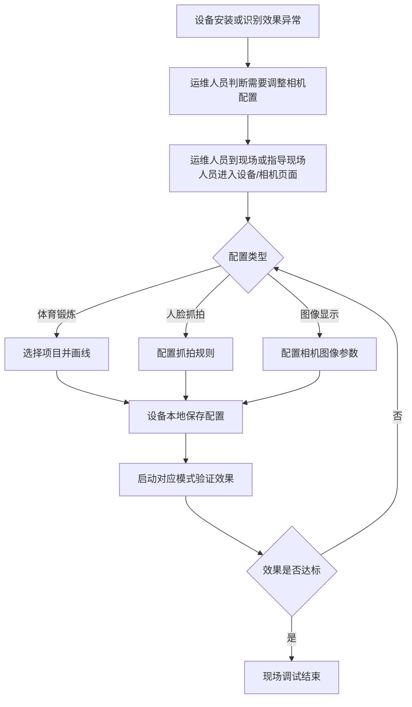
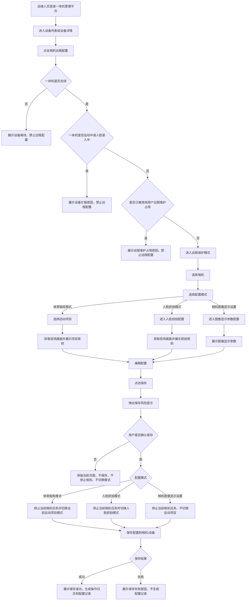
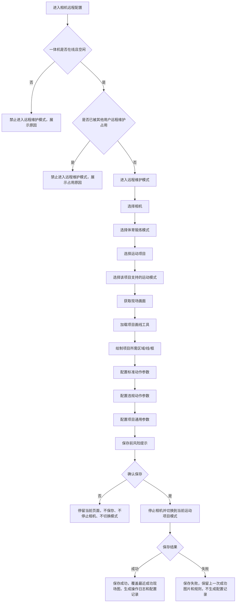
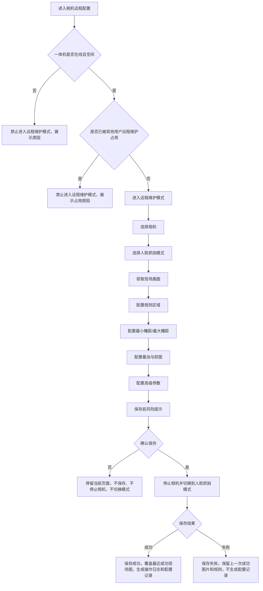
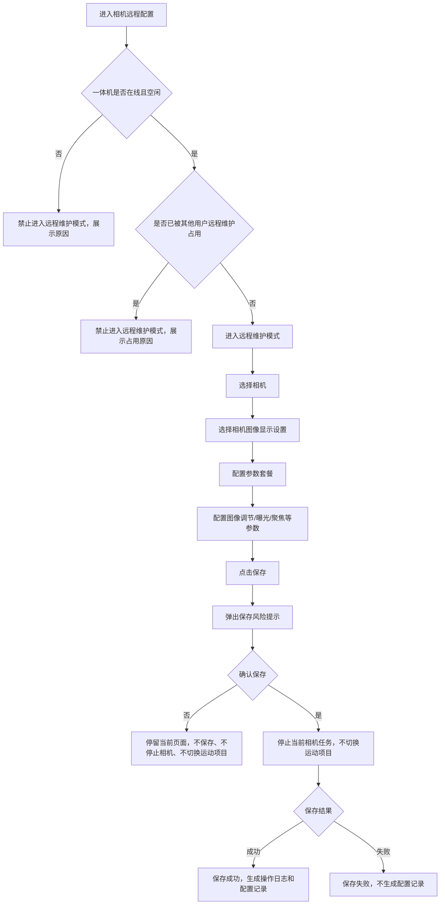
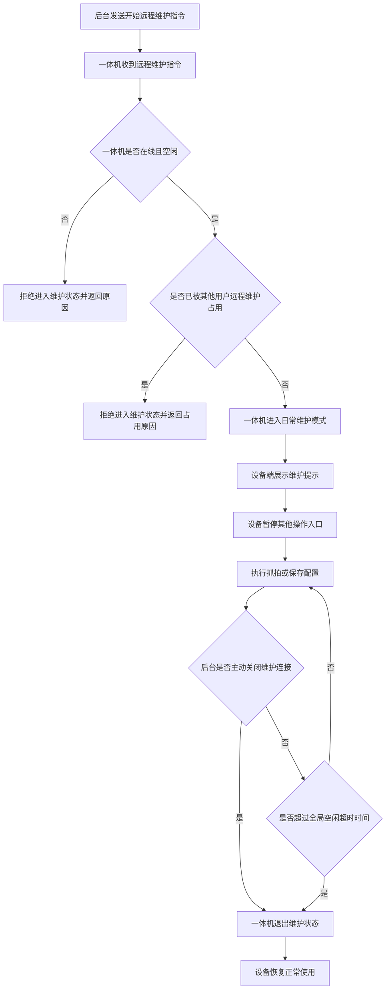

# 远程画线需求分析

**分析日期：** 2026-05-28  
**分析对象：** 一体机运维护管理平台 - 一体机远程画线与相机配置  
**覆盖范围：** 一体机  
**状态：** 需求分析

---

## 一、需求背景分析

### 1.1 需求来源

一体机在 AI 运动识别、人脸抓拍前，需要根据相机画面配置识别区域、参考线、参考框、跑道线、抓拍区域等规则。当前这些配置依赖现场设备或相机页面操作，运维人员无法在一体机运维护管理平台内完成统一远程配置。

本次需求将一体机相机配置分为三类能力：

| 类型 | 说明 |
|------|------|
| 体育锻炼模式 | 需要选择具体运动项目，每个项目有独立画线规则和参数配置 |
| 人脸抓拍模式 | 不需要选择运动项目，配置人脸抓拍区域、叠加与抓图、高级参数 |
| 相机图像显示设置 | 不区分体育锻炼或人脸抓拍，按相机单独设置图像显示规则 |

当前用户提供的历史原型包含以下能力线索：

- 远程画线前需要先选择设备、相机、工作模式。
- 体育锻炼模式下需要选择运动项目，不同项目展示不同画线工具和参数项。
- 人脸抓拍模式不需要选择运动项目，按相机配置抓拍规则。
- 相机图像显示设置是独立模块，可单独配置相机画面参数。
- 后台和设备可通过 WebSocket 建立连接。
- 设备收到抓拍、画线、保存指令后，需要进入维护状态并在设备端提示不可操作。
- 保存画线规则会停止当前相机任务，并将相机切换到当前运动项目或当前相机工作模式。

### 1.2 当前业务痛点

| 痛点 | 说明 | 影响 |
|------|------|------|
| 现场依赖高 | 画线依赖运维人员到设备现场操作或远程指导现场人员操作 | 运维成本高，问题处理周期长 |
| 项目规则差异大 | 不同运动项目需要的画线元素、参数、模式不同 | 需要按项目沉淀配置规则，避免通用页面无法覆盖真实业务 |
| 人脸抓拍独立 | 人脸抓拍不是运动项目，不适合放在体育锻炼项目规则下 | 需要单独入口和配置流程 |
| 相机配置独立 | 图像显示设置是相机全局能力，不属于某个项目 | 需要单独配置，不依赖体育锻炼或人脸抓拍 |
| 相机复用风险 | 保存配置会停止相机并切换模式 | 若相机正在被其他设备或运动复用，可能影响正在进行的运动 |

### 1.3 受影响角色

| 角色 | 影响 |
|------|------|
| 运维人员 | 负责设备运维、远程获取现场画面、完成体育锻炼画线、人脸抓拍配置、相机图像显示设置 |
| 设备端使用者 | 设备进入维护状态时，需要看到明确提示，避免继续操作 |
| 研发/实施人员 | 需要按模式和项目实现不同配置规则，并确认各相机配置项的实际下发能力 |

### 1.4 不做的影响

- 运维人员继续依赖现场处理画线和相机参数问题，设备调试效率低。
- 体育锻炼、人脸抓拍、图像显示设置混在一起，容易造成入口和配置边界不清。
- 后续新增运动项目时，每个项目独立实现画线能力，重复开发和维护成本高。
- 保存配置缺少相机复用风险提示，可能误影响其他正在使用该相机的运动或设备。

---

## 二、需求目标确认

### 2.1 核心目标

在一体机运维护管理平台建设一体机相机远程配置能力，支持运维人员按“体育锻炼模式、人脸抓拍模式、相机图像显示设置”完成不同类型的配置。

其中：

- 进入相机远程配置后，先完成在线、空闲、远程维护占用校验，并进入远程维护模式。
- 体育锻炼模式：进入远程维护模式后选择相机、配置模式和运动项目，根据项目展示对应画线工具、运动模式和参数项。
- 人脸抓拍模式：进入远程维护模式后选择相机和人脸抓拍模式，直接配置抓拍规则，不选择运动项目。
- 相机图像显示设置：进入远程维护模式后选择相机和图像显示设置，配置图像显示规则，不依赖体育锻炼或人脸抓拍。

### 2.2 一期目标

| 目标 | 说明 | 优先级 |
|------|------|--------|
| 设备远程配置入口 | 在一体机管理平台设备列表或设备详情中提供相机远程配置入口 | P0 |
| 进入远程维护模式 | 进入配置后先校验设备在线、空闲、未被远程维护占用，校验通过后进入远程维护模式 | P0 |
| 模式选择 | 支持体育锻炼模式、人脸抓拍模式、相机图像显示设置三类配置 | P0 |
| 相机选择 | 进入远程维护模式后选择相机，每个相机作为独立配置对象 | P0 |
| 体育锻炼项目选择 | 体育锻炼模式下选择具体运动项目 | P0 |
| 获取现场画面 | 后台向在线且空闲的一体机发起抓拍指令，设备返回当前相机画面 | P0 |
| 项目画线规则 | 按运动项目展示对应画线工具、运动模式、标准动作参数、违规动作参数 | P0 |
| 人脸抓拍配置 | 支持人脸抓拍规则配置、叠加与抓图配置、高级参数配置 | P0 |
| 相机图像显示设置 | 支持参数套餐、图像调节、曝光、聚焦、日夜转换、补光灯、背光、白平衡、降噪、透雾、防抖、视频调整 | P0 |
| 保存前风险提示 | 保存前提示相机会停止当前任务；体育锻炼、人脸抓拍保存时切换到当前模式，图像显示设置保存时不切换运动项目 | P0 |
| 配置保存 | 保存成功即视为配置已同步到相机/设备，并生成操作日志和配置记录；保存失败不生成配置记录 | P0 |
| 保存状态展示 | 展示未保存、保存中、保存成功、保存失败 | P0 |
| 远程维护空闲超时 | 提供全局配置，默认 15 分钟无交互后自动退出维护状态 | P1 |

### 2.3 一期范围约束

- 本次主入口为一体机运维护管理平台，K12 校端后台、高校校端后台不作为主入口。
- 本次覆盖设备类型为一体机 1 代和一体机 2 代，不覆盖智慧体育盒子。
- 本次不支持设备离线自动保存或自动下发配置。
- 本次不支持配置版本回滚。
- 本次保存配置是一次同步保存动作，保存成功即代表后台配置与相机/设备侧配置完成。
- 本次不提供独立的“下发失败”“设备应用失败”业务状态；失败统一归为保存失败。
- 相机图像显示设置的实际可下发范围需研发确认。
- 每台设备支持的相机数量与相机来源不在本次需求分析中展开。

### 2.4 配置模式说明

| 配置模式 | 是否选择运动项目 | 配置对象 | 核心配置 |
|----------|------------------|----------|----------|
| 体育锻炼模式 | 是 | 设备 + 相机 + 运动项目 | 项目画线规则、运动模式、标准动作参数、违规动作参数、项目相机全局参数 |
| 人脸抓拍模式 | 否 | 设备 + 相机 | 抓拍区域、抓拍距离、叠加与抓图、高级参数 |
| 相机图像显示设置 | 否 | 设备 + 相机 | 图像显示套餐与相机画面参数 |

### 2.5 体育锻炼模式支持项目

体育锻炼模式支持在画线页面选择以下运动项目：

| 序号 | 项目 |
|------|------|
| 1 | 引体向上 |
| 2 | 俯卧撑 |
| 3 | 仰卧起坐（抱头） |
| 4 | 仰卧起坐（抱胸） |
| 5 | 跳绳 |
| 6 | 立定跳远 |
| 7 | 短跑 |
| 8 | 长跑 |
| 9 | 实心球 |
| 10 | 排球 |
| 11 | 足球 |
| 12 | 篮球 |
| 13 | 手势识别 |
| 14 | 互动游戏 |

### 2.6 保存前风险提示

保存体育锻炼画线规则、人脸抓拍配置、相机图像显示设置前，后台必须弹出确认提示，避免运维误影响正在复用该相机的其他运动或设备。

保存行为按配置模式区分：

- 体育锻炼模式：停止当前相机任务，并切换到当前运动项目模式。
- 人脸抓拍模式：停止当前相机任务，并切换到人脸抓拍模式。
- 相机图像显示设置：停止当前相机任务，保存相机维度图像显示设置，不切换运动项目。

建议文案：

> 保存后，相机会停止当前相机任务；体育锻炼和人脸抓拍配置会切换到当前配置模式，图像显示设置不会切换运动项目。若该相机正在被其他设备或运动复用，可能影响正在进行的运动。确认保存吗？

交互规则：

- 用户点击“确认”后，才执行保存。
- 用户点击“取消”后，停留在当前页面，不保存配置，不停止相机，不切换模式。
- 保存成功后，展示保存成功，即视为下发成功，并生成操作日志和配置记录。
- 保存失败后，展示失败原因，不生成配置记录。

现场图保留规则：

- 体育锻炼、人脸抓拍抓拍图片后，图片展示在画线窗口页面。
- 画线完成且保存成功后，使用本次抓拍图片覆盖上一次成功现场图。
- 抓拍后画线保存失败时，不覆盖上一次成功现场图，前一次成功保存的图片和规则继续保留。

### 2.7 远程配置基础模型

| 配置对象 | 体育锻炼模式 | 人脸抓拍模式 | 相机图像显示设置 |
|----------|--------------|--------------|------------------|
| 设备 | 必选 | 必选 | 必选 |
| 相机 | 必选 | 必选 | 必选 |
| 运动项目 | 必选 | 不需要 | 不需要 |
| 画布/现场图 | 需要 | 需要 | 不需要 |
| 图形元素 | 按项目配置 | 抓拍区域 | 不需要 |
| 参数配置 | 按项目配置 | 抓拍参数、叠加与抓图、高级参数 | 图像显示参数 |
| 保存状态 | 未保存、保存中、保存成功、保存失败 | 未保存、保存中、保存成功、保存失败 | 未保存、保存中、保存成功、保存失败 |
| 最近成功现场图 | 保存成功后覆盖，保存失败不覆盖 | 保存成功后覆盖，保存失败不覆盖 | 不需要 |

---

## 三、业务流程分析

### 3.1 当前流程（现状）

**现状问题：**

- 输入为现场设备画面和运维经验，输出为设备本地配置。
- 后台没有统一的远程保存状态。
- 体育锻炼、人脸抓拍、相机图像显示设置缺少清晰入口边界。
- 不同项目规则散落在实施经验和项目页面中，缺少统一扩展结构。

### 3.2 目标流程（改善后）

### 3.3 体育锻炼模式流程

### 3.4 人脸抓拍模式流程

### 3.5 相机图像显示设置流程

### 3.6 设备维护状态流程

---

## 四、功能拆解清单

### 4.1 一体机管理平台 - 远程配置入口

| 终端 | 模块 | 功能 | 功能描述 | 优先级 |
|------|------|------|----------|--------|
| 一体机管理平台 | 设备列表/设备详情 | 相机远程配置入口 | 对一体机提供相机远程配置入口，进入后先校验设备状态并进入远程维护模式 | P0 |
| 一体机管理平台 | 相机远程配置 | 在线状态校验 | 进入配置前校验一体机在线状态；离线时禁止获取现场画面、进入维护、保存配置 | P0 |
| 一体机管理平台 | 相机远程配置 | 忙碌状态校验 | 一体机运动中或人脸录入中时，禁止全部远程配置操作并展示原因 | P0 |
| 一体机管理平台 | 相机远程配置 | 远程维护互斥 | 同一设备同一时间只允许一个用户进入远程维护；已被占用时拒绝后进入用户并展示占用提示 | P0 |
| 一体机管理平台 | 相机远程配置 | 进入远程维护模式 | 设备在线且空闲、未被远程维护占用时，先进入远程维护模式，再允许选择相机和配置模式 | P0 |
| 一体机管理平台 | 相机远程配置 | 相机选择 | 进入远程维护模式后选择相机；每个相机作为独立配置对象 | P0 |
| 一体机管理平台 | 相机远程配置 | 配置模式选择 | 进入远程维护模式并选择相机后，支持选择体育锻炼模式、人脸抓拍模式、相机图像显示设置 | P0 |
| 一体机管理平台 | 相机远程配置 | 保存前风险提示 | 保存前提示相机会停止当前任务；体育锻炼、人脸抓拍保存时切换到当前模式，图像显示设置保存时不切换运动项目，用户确认后才保存 | P0 |
| 一体机管理平台 | 相机远程配置 | 保存状态展示 | 展示未保存、保存中、保存成功、保存失败 | P0 |
| 一体机管理平台 | 相机远程配置 | 最近成功现场图 | 体育锻炼、人脸抓拍保存成功后，用本次抓拍图片覆盖上一次成功现场图；保存失败时保留上一次成功图片和规则；图片展示在画线窗口页面 | P0 |
| 一体机管理平台 | 相机远程配置 | 操作日志 | 保存成功后生成操作日志，记录操作用户、设备、相机、配置模式、保存结果和操作时间 | P0 |
| 一体机管理平台 | 相机远程配置 | 配置记录 | 保存成功后生成最新配置记录；保存失败不生成新配置记录 | P0 |

### 4.2 体育锻炼模式 - 项目规则矩阵

| 项目 | 支持模式 | 画线元素 | 参数配置 | 优先级 |
|------|----------|----------|----------|--------|
| 引体向上 | 单人、双人 | 检测区域、参考框、人脸识别区域；双人模式支持 A/B 区域 | 下颚过杆、直臂检测；脚接触立杆、脚接触地面、手离杆、疑似作弊行为、瞳距过滤 | P0 |
| 俯卧撑 | 单人、双人 | 检测区域、参考线；双人模式支持 A/B 区域和 A/B 参考线 | 最低点、双手臂支撑、身体直线；趴地、趴地时间、瞳距过滤 | P0 |
| 仰卧起坐（抱头） | 单人、双人 | 检测区域、参考线；双人模式支持 A/B 区域和 A/B 参考线 | 背触垫子、坐起、双膝未弯曲、未抱头、未抱头等级、臀部离垫、躺地、躺地时间、瞳距过滤 | P0 |
| 仰卧起坐（抱胸） | 单人、双人 | 检测区域、参考线；双人模式支持 A/B 区域和 A/B 参考线 | 背触垫子、坐起、双膝未弯曲、未抱胸、未抱胸等级、臀部离垫、躺地、躺地时间、瞳距过滤 | P0 |
| 跳绳 | 单人、双人、多人 | 检测区域；多人模式支持多个区域，当前原型展示 5 人 | 定时配置开关、定时周期、瞳距过滤 | P0 |
| 立定跳远 | 单人 | 起跳区域、运动区域/落地区域、起跳方向线 | 疑似作弊行为、瞳距过滤 | P0 |
| 短跑 | 起点、终点 | 跑道区域、跑道线、起点/终点线 | 相机模式、相机安装模式、跑道数量、轨迹叠加、轨迹延时时间、串道持续时间、瞳距过滤 | P0 |
| 长跑 | 终点 | 跑道区域、跑道线、终点线 | 相机模式、跑道数量、轨迹叠加、轨迹延时时间、瞳距过滤 | P0 |
| 实心球 | 单人 | 运动区域、参考线 | 运动区域总长、分值线间隔、参考线生成方向、瞳距过滤 | P0 |
| 排球 | 单人 | 检测区域、参考线 | 瞳距过滤 | P0 |
| 足球 | 起点、起终点 | 检测区域、方向线 | 相机模式、瞳距过滤 | P0 |
| 篮球 | 起终点 | 检测区域、方向线 | 相机模式、瞳距过滤 | P0 |
| 手势识别 | 不区分运动项目模式 | 不需要画线；基于全画面识别 | 左手侧平举、右手侧平举、双手侧平举、双手胸前交叉、举手等动作阈值；瞳距过滤 | P0 |
| 互动游戏 | 不区分运动项目模式 | 检测区域 | 瞳距过滤 | P0 |

### 4.3 体育锻炼模式 - 相机全局高级参数

| 终端 | 模块 | 功能 | 功能描述 | 优先级 |
|------|------|------|----------|--------|
| 一体机管理平台 | 体育锻炼模式 | OSD 叠加 | 支持开启/关闭体育锻炼模式下相机 OSD 叠加 | P1 |
| 一体机管理平台 | 体育锻炼模式 | 抓拍参数 | 支持人脸曝光开关 | P1 |
| 一体机管理平台 | 体育锻炼模式 | 参考亮度 | 支持设置参考亮度数值 | P1 |
| 一体机管理平台 | 体育锻炼模式 | 最短持续时间 | 支持设置最短持续时间，单位分钟 | P1 |
| 一体机管理平台 | 体育锻炼模式 | 保存高级参数 | 高级参数为相机全局配置，保存前需进入远程维护模式并弹出保存风险提示 | P1 |

### 4.4 人脸抓拍模式

| 终端 | 模块 | 功能 | 功能描述 | 优先级 |
|------|------|------|----------|--------|
| 一体机管理平台 | 人脸抓拍模式 | 配置入口 | 进入远程维护模式并选择相机后进入人脸抓拍模式，不需要选择运动项目 | P0 |
| 一体机管理平台 | 人脸抓拍模式 | 规则区域 | 支持配置抓拍规则区域，要求人脸完整包含在规则框内 | P0 |
| 一体机管理平台 | 人脸抓拍模式 | 最小瞳距 | 支持设置最小瞳距 | P0 |
| 一体机管理平台 | 人脸抓拍模式 | 最大瞳距 | 支持设置最大瞳距 | P0 |
| 一体机管理平台 | 人脸抓拍模式 | 码流叠加智能信息 | 支持开启/关闭码流叠加智能信息 | P1 |
| 一体机管理平台 | 人脸抓拍模式 | 报警抓图叠加目标信息 | 支持开启/关闭报警抓图叠加目标信息 | P1 |
| 一体机管理平台 | 人脸抓拍模式 | 背景图片上传 | 支持开启/关闭背景图片上传 | P1 |
| 一体机管理平台 | 人脸抓拍模式 | 人脸图片 | 支持开启/关闭人脸图片 | P1 |
| 一体机管理平台 | 人脸抓拍模式 | 图像质量/分辨率 | 支持设置图像质量、图片分辨率 | P1 |
| 一体机管理平台 | 人脸抓拍模式 | 目标图片类型 | 支持自定义、大头照、半身照、全身照 | P1 |
| 一体机管理平台 | 人脸抓拍模式 | 图片尺寸比例 | 支持设置宽度、人脸部分高度、身体部分高度等比例 | P1 |
| 一体机管理平台 | 人脸抓拍模式 | 抓拍模式 | 支持最佳抓拍、快速抓拍 | P1 |
| 一体机管理平台 | 人脸抓拍模式 | 快速抓拍阈值 | 支持设置快速抓拍阈值 | P1 |
| 一体机管理平台 | 人脸抓拍模式 | 最长抓拍时间 | 支持设置最长抓拍时间 | P1 |
| 一体机管理平台 | 人脸抓拍模式 | 抓拍次数 | 支持无限次、有限次；有限次可设置次数 | P1 |
| 一体机管理平台 | 人脸抓拍模式 | 人脸曝光 | 支持开启/关闭人脸曝光 | P1 |
| 一体机管理平台 | 人脸抓拍模式 | 人脸姿态过滤 | 支持开启/关闭人脸姿态过滤 | P1 |
| 一体机管理平台 | 人脸抓拍模式 | 上传属性值 | 支持开启/关闭上传属性值 | P1 |
| 一体机管理平台 | 人脸抓拍模式 | 活体检测 | 支持开启/关闭活体检测 | P1 |

### 4.5 相机图像显示设置

| 终端 | 模块 | 功能 | 功能描述 | 优先级 |
|------|------|------|----------|--------|
| 一体机管理平台 | 相机图像显示设置 | 配置入口 | 在相机配置中提供图像显示设置入口，独立于体育锻炼和人脸抓拍 | P0 |
| 一体机管理平台 | 相机图像显示设置 | 运维模式校验 | 必须在设备在线且空闲、已进入远程维护模式后才能设置 | P0 |
| 一体机管理平台 | 相机图像显示设置 | 相机维度配置 | 配置只绑定设备和相机，不需要选择运动项目 | P0 |
| 一体机管理平台 | 相机图像显示设置 | 保存行为 | 保存前停止当前相机任务，保存相机维度图像显示设置，不切换运动项目 | P0 |
| 一体机管理平台 | 相机图像显示设置 | 参数套餐 | 支持普通、背光、顺光、低照度、自定义1、自定义2 | P0 |
| 一体机管理平台 | 相机图像显示设置 | 图像调节 | 支持图像调节配置项，具体字段由研发根据相机能力确认 | P0 |
| 一体机管理平台 | 相机图像显示设置 | 曝光 | 支持曝光相关配置项，具体字段由研发根据相机能力确认 | P0 |
| 一体机管理平台 | 相机图像显示设置 | 聚焦 | 支持聚焦相关配置项，具体字段由研发根据相机能力确认 | P0 |
| 一体机管理平台 | 相机图像显示设置 | 日夜转换 | 支持日夜转换相关配置项，具体字段由研发根据相机能力确认 | P0 |
| 一体机管理平台 | 相机图像显示设置 | 补光灯 | 支持补光灯相关配置项，具体字段由研发根据相机能力确认 | P0 |
| 一体机管理平台 | 相机图像显示设置 | 背光 | 支持背光相关配置项，具体字段由研发根据相机能力确认 | P0 |
| 一体机管理平台 | 相机图像显示设置 | 白平衡 | 支持白平衡相关配置项，具体字段由研发根据相机能力确认 | P0 |
| 一体机管理平台 | 相机图像显示设置 | 降噪 | 支持降噪相关配置项，具体字段由研发根据相机能力确认 | P0 |
| 一体机管理平台 | 相机图像显示设置 | 透雾 | 支持透雾相关配置项，具体字段由研发根据相机能力确认 | P0 |
| 一体机管理平台 | 相机图像显示设置 | 防抖 | 支持防抖相关配置项，具体字段由研发根据相机能力确认 | P0 |
| 一体机管理平台 | 相机图像显示设置 | 视频调整 | 支持视频调整相关配置项，具体字段由研发根据相机能力确认 | P0 |

### 4.6 一体机端与后端能力

| 终端 | 模块 | 功能 | 功能描述 | 优先级 |
|------|------|------|----------|--------|
| 一体机管理平台后端 | 设备连接服务 | WebSocket 连接管理 | 管理一体机 WebSocket 在线连接，记录设备在线、离线、最后心跳时间 | P0 |
| 一体机管理平台后端 | 设备状态服务 | 设备状态查询 | 查询一体机是否在线、运动中、人脸录入中、远程维护中 | P0 |
| 一体机管理平台后端 | 远程维护服务 | 开始远程维护 | 在线且空闲、未被其他用户远程维护占用时允许进入维护状态；离线、运动中、人脸录入中、远程维护占用时拒绝 | P0 |
| 一体机管理平台后端 | 远程维护服务 | 远程维护互斥 | 同一设备同一时间只允许一个用户进入远程维护，记录当前占用用户和进入时间 | P0 |
| 一体机管理平台后端 | 远程维护服务 | 关闭远程维护 | 运维完成后主动关闭 WebSocket 维护连接，使设备退出维护状态 | P0 |
| 一体机管理平台后端 | 远程维护服务 | 空闲超时配置 | 提供全局空闲超时时间配置，默认 15 分钟，可调整 | P1 |
| 一体机管理平台后端 | 配置记录服务 | 配置记录生成 | 保存成功后生成最新配置记录；保存失败不生成新配置记录 | P0 |
| 一体机管理平台后端 | 操作日志服务 | 操作日志生成 | 保存成功后记录操作用户、设备、相机、配置模式、保存结果和操作时间 | P0 |
| 一体机 | 设备状态 | 状态上报 | 上报在线、运动中、人脸录入中、远程维护中等状态 | P0 |
| 一体机 | 远程维护 | 维护提示 | 有屏设备展示维护提示，告知现场用户设备维护中、请稍后再使用 | P0 |
| 一体机 | 相机服务 | 现场画面抓拍 | 根据后台指令抓取指定相机画面，并返回画面、尺寸、相机标识、时间 | P0 |
| 一体机 | 相机服务 | 停止并切换模式 | 用户确认保存体育锻炼或人脸抓拍配置后，停止当前相机任务并切换到当前配置模式 | P0 |
| 一体机 | 相机服务 | 停止相机任务 | 用户确认保存相机图像显示设置后，停止当前相机任务，不切换运动项目 | P0 |
| 一体机 | 配置保存 | 保存结果回执 | 返回保存成功或保存失败结果；失败时返回失败原因 | P0 |

### 4.7 WebSocket 协议范围草案

以下为需求级协议范围，用于整理需求和研发评估；最终字段名、枚举值、失败码由研发在技术方案中定稿。

| 类型 | 指令/回执 | 说明 | 优先级 |
|------|-----------|------|--------|
| 指令 | 连接/心跳 | 维持后台与一体机 WebSocket 连接，更新在线状态 | P0 |
| 指令 | 设备状态查询 | 查询一体机是否在线、运动中、人脸录入中、远程维护中 | P0 |
| 指令 | 开始远程维护 | 请求一体机进入远程维护状态 | P0 |
| 指令 | 获取现场画面 | 请求一体机按指定相机抓拍现场画面 | P0 |
| 指令 | 保存体育锻炼配置 | 停止当前相机任务，切换当前运动项目模式，并保存体育锻炼配置 | P0 |
| 指令 | 保存人脸抓拍配置 | 停止当前相机任务，切换人脸抓拍模式，并保存人脸抓拍配置 | P0 |
| 指令 | 保存相机图像显示设置 | 停止当前相机任务，保存相机维度图像显示设置，不绑定运动项目，不切换运动项目 | P0 |
| 指令 | 关闭远程维护 | 运维完成后关闭维护连接并退出维护状态 | P0 |
| 回执 | 收到指令 | 设备确认收到后台指令 | P0 |
| 回执 | 执行中 | 设备正在执行抓拍、配置保存等操作 | P0 |
| 回执 | 保存成功 | 设备完成保存并返回结果 | P0 |
| 回执 | 保存失败 | 设备保存失败并返回失败原因 | P0 |
| 回执 | 设备忙碌 | 设备处于运动中或人脸录入中，拒绝执行 | P0 |
| 回执 | 远程维护占用 | 设备已被其他用户远程维护占用，拒绝后进入用户 | P0 |
| 回执 | 设备离线/连接不可用 | 后台无法向设备发送指令或设备连接不可用 | P0 |
| 回执 | 参数错误 | 指令参数缺失或不合法 | P0 |
| 回执 | 超时 | 指令超过约定时间未完成 | P0 |

失败码范围：

| 失败码范围 | 说明 |
|------------|------|
| DEVICE_OFFLINE | 设备离线 |
| DEVICE_IN_SPORT | 设备运动中 |
| DEVICE_FACE_ENROLLING | 设备人脸录入中 |
| DEVICE_MAINTENANCE_OCCUPIED | 设备已被其他用户远程维护占用 |
| CAMERA_UNAVAILABLE | 相机不可用 |
| SNAPSHOT_FAILED | 抓拍失败 |
| CONFIG_VALIDATE_FAILED | 配置校验失败 |
| CONFIG_SAVE_FAILED | 配置保存失败 |
| CONNECTION_TIMEOUT | 连接超时 |
| UNKNOWN_ERROR | 未知异常 |

### 4.8 验收场景

| 场景 | 验收标准 | 优先级 |
|------|----------|--------|
| 模式选择 | 相机远程配置支持体育锻炼模式、人脸抓拍模式、相机图像显示设置 | P0 |
| 先进入远程维护模式 | 进入远程配置后必须先完成在线、空闲、远程维护占用校验，并进入远程维护模式 | P0 |
| 远程维护后配置 | 进入远程维护模式后，才能选择相机、选择体育锻炼模式/人脸抓拍模式/相机图像显示设置 | P0 |
| 体育锻炼项目选择 | 体育锻炼模式必须选择运动项目 | P0 |
| 人脸抓拍无需项目 | 人脸抓拍模式不展示运动项目选择 | P0 |
| 图像显示无需项目 | 相机图像显示设置不展示运动项目选择 | P0 |
| 在线空闲设备配置 | 在线且空闲、未被远程维护占用的一体机可先进入远程维护模式，再选择相机并进入对应配置模式 | P0 |
| 离线设备拦截 | 离线一体机无法获取现场画面、进入维护、保存配置，并展示离线原因 | P0 |
| 忙碌设备拦截 | 运动中、人脸录入中的一体机无法进入远程配置，并展示忙碌原因 | P0 |
| 远程维护占用拦截 | 设备已被一个用户远程维护占用时，第二个用户无法进入，并展示占用提示 | P0 |
| 项目规则展示 | 选择不同体育锻炼项目后，展示对应画线工具和参数项 | P0 |
| 保存风险提示 | 点击保存前必须展示风险确认文案 | P0 |
| 取消保存 | 用户取消保存确认时，不保存配置、不停止相机、不切换配置模式 | P0 |
| 图像显示设置保存 | 用户确认保存相机图像显示设置后，停止当前相机任务，保存相机维度配置，不切换运动项目 | P0 |
| 保存成功 | 用户确认保存且成功后，页面展示保存成功，并视为下发成功，生成操作日志和配置记录 | P0 |
| 保存失败 | 保存失败时，不生成配置记录，页面只展示保存失败原因 | P0 |
| 最近成功现场图 | 体育锻炼、人脸抓拍保存成功后用本次抓拍图片覆盖上一次成功现场图；保存失败时保留上一次成功图片和规则 | P0 |
| 主动关闭维护 | 后台主动关闭维护连接后，设备退出维护状态 | P0 |
| 空闲自动退出 | 后台忘记关闭时，设备超过全局空闲时长 15 分钟无交互后自动退出维护状态 | P1 |
| 不支持回滚 | 后台不展示版本回滚入口，不支持按历史版本恢复配置 | P1 |
| 不支持离线保存 | 设备离线时不能保存配置，不生成自动保存任务 | P0 |

---

## 五、待确认事项

| 序号 | 待确认事项 | 状态 | 负责人 | 截止日期 |
|------|------------|------|--------|----------|
| 1 | 手势识别、互动游戏的完整参数项是否按当前截图仅保留瞳距过滤，需确认 | 待确认 | PM | - |
| 2 | 相机图像显示设置一期可实现范围，包括各折叠项中哪些配置项可真实下发到一体机 | 待确认 | 研发 | - |
| 3 | 体育锻炼模式下相机全局高级参数是否对所有运动项目生效，需确认 | 待确认 | PM/研发 | - |
| 4 | WebSocket 最终协议字段、枚举值、失败码、超时时间由研发在技术方案中定稿 | 待确认 | 研发 | - |
