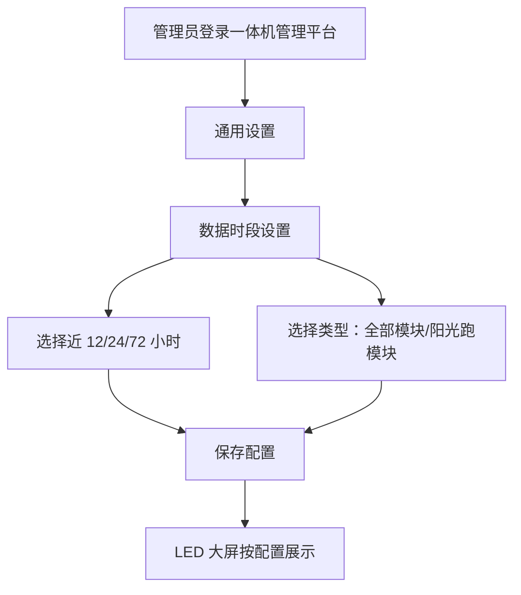
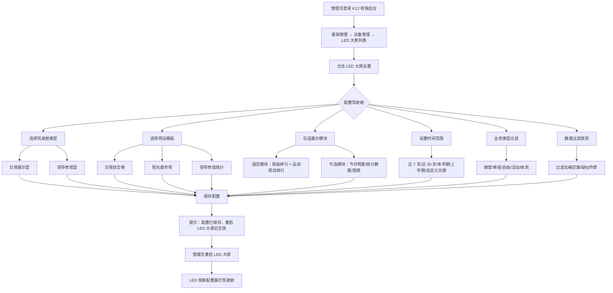
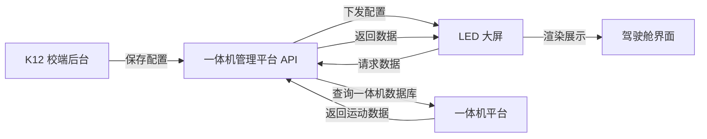

# LED 大屏驾驶舱需求分析（V3）

**分析日期：** 2026-04-28
**分析人：** PM
**版本：** V3
**状态：** 需求分析

---

## 一、需求背景分析

### 1.1 客户核心诉求

**诉求 1：** LED 大屏首页驾驶舱内容不够丰富，现有版块少、数据量少，不足以吸引学生观看。

**诉求 2：** 希望自定义排行数据的时间范围，现有默认展示全部数据，无法灵活调整。

**诉求 3：** 需要支持不同场景——日常学生/老师查看成绩排名，以及领导参观时展示学校体育整体数据。

### 1.2 系统现状

**当前 LED 大屏驾驶舱能力：**
- 模板类型：2 种（全部模块/阳光跑模块）
- 时间范围：近 12 小时/24 小时/72 小时
- 固定展示：班级排名、阳光跑榜单、各运动榜单、今日明星榜
- 配置入口：一体机管理平台 → 通用设置

**存在的问题：**
| 问题 | 现状 | 影响 |
|------|------|------|
| 模板少 | 只有 2 种固定模板 | 无法匹配不同学校运动项目数量差异 |
| 时间范围死板 | 只能选近 12/24/72 小时 | 无法查看本周/本月/学期数据 |
| 无法过滤 | 所有数据都展示 | 无绳空跳等无效数据也展示 |
| 无场景区分 | 只有一种展示风格 | 领导参观时看不到统计图表 |
| 配置入口深 | 在一体机管理平台 | K12 管理员不易找到 |

### 1.3 数据源说明

**重要架构说明：**

```
LED 大屏 ← 一体机管理平台 ← (数据同步) ← K12/高校平台
```

LED 大屏展示的数据**直接从一体机管理平台获取**，一体机平台已聚合了 K12/高校平台的运动数据。

**本期可实现的数据：**
- ✅ 运动排行榜（班级/个人/项目）
- ✅ 运动统计数据（参与人数、次数、时长）
- ✅ 运动项目明细数据
- ✅ 业务类型标记（随堂/串班/自由/活动/体测）
- ✅ 违规标记（无绳空跳/疑似作弊）

**本期无法实现的数据**（依赖校体云平台业务数据）：
- ❌ 体测成绩分布、达标率
- ❌ 体育课开课情况
- ❌ 家校共育数据

### 1.4 受影响角色

| 角色 | 当前痛点 | 期望改进 |
|------|----------|----------|
| 学生 | 排行榜数据少，看不到自己的排名 | 希望看到更多项目、更详细的排名 |
| 教师 | 无法查看课堂运动数据概览 | 希望有随堂/串班的数据筛选 |
| 学校管理员 | 配置入口深，模板选择少 | 希望在 K12 后台配置，模板更丰富 |
| 领导/参观人员 | 看不到学校体育整体数据 | 希望有统计图表展示整体情况 |

---

## 二、需求目标确认

### 2.1 核心目标

为 K12 校端后台的 LED 大屏设置增加驾驶舱自定义配置能力：

1. **两种驾驶舱类型**：日常展示型、领导参观型
2. **3 个预设模板**：日常综合榜、阳光跑专项、领导参观统计
3. **时间范围**：近 7 天、近 30 天（默认）、本学期、上学期、自定义日期（≤180 天）
4. **业务类型过滤**：随堂、串班、自由、活动、体测
5. **数据过滤**：过滤无绳空跳、过滤疑似作弊
6. **配置入口**：K12 校端后台 → 基础管理 → 设备管理 → LED 大屏 → LED 大屏设置

### 2.2 具体指标

| 指标 | 目标值 |
|------|--------|
| 驾驶舱类型 | 2 种（日常展示型、领导参观型） |
| 预设模板 | 3 个（日常综合榜、阳光跑专项、领导参观统计） |
| 时间范围选项 | 5 种（近 7 天、近 30 天、本学期、上学期、自定义≤180 天） |
| 业务类型 | 5 种（随堂、串班、自由、活动、体测） |
| 数据过滤 | 2 种（无绳空跳、疑似作弊） |
| 配置作用范围 | 每台 LED 设备独立设置 |
| 生效方式 | 保存配置 → 提示重启 → 重启后生效 |

### 2.3 范围约束

- **本次仅覆盖 K12 校端后台**，高校暂不纳入
- 领导参观型的统计数据仅限一体机平台已有的运动数据
- 模板不支持学校自定义，使用预设的 3 个模板

---

## 三、业务流程分析

### 3.1 当前流程（现状）



### 3.2 目标流程（改善后）



### 3.3 数据流向



---

## 四、功能拆解清单

### 4.1 K12 校端后台 - LED 大屏设置

| 模块 | 功能 | 功能描述 | 优先级 |
|------|------|----------|----------|
| 驾驶舱类型选择 | 下拉选择驾驶舱类型 | 日常展示型（排行榜 + 成绩）、领导参观型（统计数据 + 图表） | P0 |
| 模板选择 | 下拉选择预设模板 | 日常综合榜、阳光跑专项、领导参观统计 | P0 |
| 模块勾选 | 固定模块必选，可选模块支持勾选/取消 | 日常型：班级排行 + 运动项目排行（固定）+ 今日明星 + 统计数据（可选）；参观型：体育数据概览 + 班级对比（固定）+ 趋势图 + 今日明星（可选） | P0 |
| 时间范围 | 5 种选项 | 近 7 天、近 30 天（默认）、本学期、上学期、自定义日期（≤180 天） | P0 |
| 业务类型过滤 | 复选框组 | 随堂、串班、自由、活动、体测，支持多选，默认全选 | P0 |
| 数据过滤 | 复选框组 | 过滤无绳空跳（跳绳）、过滤疑似作弊（引体向上） | P0 |
| 年级/性别筛选 | 下拉选择 | 运动项目排行榜的固定筛选条件：全校/各年级/男/女 | P1 |
| 保存配置 | 保存并提示 | 保存后显示提示："配置已保存，重启 LED 大屏后生效" | P0 |

### 4.2 驾驶舱类型 - 日常展示型

**适用场景：** 日常学生/老师查看成绩和排名

| 模块 | 类型 | 展示内容 | 默认勾选 |
|------|------|----------|----------|
| 班级排行榜 | 固定 | 运动时长排名 + 运动次数排名，支持滚动 | 必选 |
| 运动项目排行榜 | 固定 | 过滤后的各运动项目排行，支持滚动 | 必选 |
| 今日明星 | 可选 | 当日各运动项目成绩冠军 | 日常综合榜默认勾选 |
| 统计数据 | 可选 | 今日/本周参与人数、运动次数、运动时长 | 日常综合榜默认勾选 |

**运动项目排行榜设计：**
- 支持多个运动项目同时展示（滚动轮播）
- 仅 1 个运动项目时，该区域面积自适应变大
- 项目之间自动轮播，每个项目展示 3-5 秒

### 4.3 驾驶舱类型 - 领导参观型

**适用场景：** 领导参观、检查时展示学校体育整体数据

| 模块 | 类型 | 展示内容 | 默认勾选 |
|------|------|----------|----------|
| 体育数据概览 | 固定 | 学生总数、参与率、运动总次数、运动总时长 | 必选 |
| 班级对比图表 | 固定 | 各班运动数据对比柱状图（时长/次数） | 必选 |
| 趋势图 | 可选 | 运动参与趋势（按时间范围自动切换天/周/月粒度） | 领导参观统计默认勾选 |
| 今日明星 | 可选 | 当日各运动项目成绩冠军 | 领导参观统计默认勾选 |
| 项目参与图表 | 可选 | 各运动项目的参与人数对比柱状图 | 领导参观统计默认勾选 |

**领导参观型图表说明：**

| 图表 | 维度 | 数据粒度 |
|------|------|----------|
| 班级对比柱状图 | 各班级平均运动时长、总次数 | 按班级 |
| 项目参与柱状图 | 各运动项目的参与人数 | 按项目 |
| 趋势图 | 参与人数、运动时长 | 近 7 天→按天、近 30 天→按周、学期→按月 |

### 4.4 预设模板清单（3 个）

| 模板名称 | 驾驶舱类型 | 默认勾选模块 | 适用场景 |
|----------|------------|-------------|----------|
| 日常综合榜 | 日常展示型 | 班级排行 + 运动项目排行 + 今日明星 + 统计数据 | 日常使用，默认模板 |
| 阳光跑专项 | 日常展示型 | 班级排行 + 运动项目排行（阳光跑） + 今日明星（阳光跑） + 统计数据 | 阳光跑活动月 |
| 领导参观统计 | 领导参观型 | 体育数据概览 + 班级对比图表 + 趋势图 + 今日明星 + 项目参与图表 | 领导参观、检查 |

### 4.5 时间范围规则

| 选项 | 说明 | 默认值 |
|------|------|--------|
| 近 7 天 | 从今天往前推 7 天 | - |
| 近 30 天 | 从今天往前推 30 天 | ✅ |
| 本学期 | 从当前学期开始日期至今 | - |
| 上学期 | 上一学期的完整日期范围 | - |
| 自定义日期 | 选择开始日期和结束日期，最大间隔 180 天 | - |

**学期日期来源：** 一体机管理平台 → 学期管理（与 K12 校端后台的学期管理同步）

### 4.6 业务类型过滤

| 业务类型 | 说明 | 默认 |
|----------|------|------|
| 随堂 | 随堂测试模式产生的数据 | ☑ |
| 串班 | 串班训练模式产生的数据 | ☑ |
| 自由 | 自由训练模式产生的数据 | ☑ |
| 活动 | 校园活动模式产生的数据 | ☑ |
| 体测 | 体质测试模式产生的数据 | ☑ |

### 4.7 数据过滤规则

| 过滤项 | 适用项目 | 过滤效果 | 默认 |
|--------|----------|----------|------|
| 过滤无绳空跳 | 跳绳 | 被标记为"无绳空跳"的记录不计入排行榜 | ☐ |
| 过滤疑似作弊 | 引体向上 | 被标记为"疑似作弊"的记录不计入排行榜 | ☐ |

### 4.8 LED 大屏 - 驾驶舱渲染

| 功能 | 功能描述 | 优先级 |
|------|----------|----------|
| 日常展示型渲染 | 按配置渲染：班级排行榜（滚动）+ 运动项目排行榜（滚动）+ 可选模块 | P0 |
| 领导参观型渲染 | 按配置渲染：体育数据概览 + 班级对比图表 + 趋势图 + 可选模块 | P1 |
| 自适应布局 | 运动项目数量自适应：多项目时滚动轮播，单项目时区域放大 | P0 |
| 数据刷新 | 定时刷新数据（建议 5 分钟/次） | P0 |
| 重启生效 | 接收新配置后，重启 LED 大屏应用新配置 | P0 |

### 4.9 一体机管理平台 - API

| 接口 | 功能描述 | 优先级 |
|------|----------|----------|
| 保存 LED 配置 | 接收 K12 校端后台的 LED 驾驶舱配置 | P0 |
| 下发配置到 LED | 将配置下发至指定 LED 大屏设备 | P0 |
| 查询运动数据 | 按时间范围、业务类型、过滤规则查询运动数据 | P0 |
| 查询统计数据 | 按时间范围查询体育数据概览、班级对比、趋势图数据 | P0 |
| 查询学期信息 | 返回当前学期、上学期的日期范围 | P1 |

---

## 五、配置页面原型

### 5.1 LED 大屏设置页面

```
┌──────────────────────────────────────────────────────────────┐
│ LED 大屏设置                                    [保存] [重置] │
├──────────────────────────────────────────────────────────────┤
│ 设备信息：LED-操场 -001                          在线 ●      │
│ 序列号：ABC123456789                                         │
│ 最后心跳：2026-04-28 17:30:00                                │
├──────────────────────────────────────────────────────────────┤
│ 驾驶舱配置                                                   │
│ ┌────────────────────────────────────────────────────────┐   │
│ │ 驾驶舱类型：[日常展示型 ▼]                              │   │
│ │                                                        │   │
│ │ 预设模板：[日常综合榜 ▼]                                │   │
│ │                                                        │   │
│ │ 展示模块：                                              │   │
│ │ ☑ 班级排行榜（固定，必选）                               │   │
│ │ ☑ 运动项目排行榜（固定，必选）                           │   │
│ │ ☑ 今日明星                                              │   │
│ │ ☑ 统计数据                                              │   │
│ │                                                        │   │
│ │ 时间范围：                                              │   │
│ │ ○ 近 7 天   ● 近 30 天   ○ 本学期   ○ 上学期   ○ 自定义    │   │
│ │                                                        │   │
│ │ 业务类型过滤：                                          │   │
│ │ ☑ 随堂   ☑ 串班   ☑ 自由   ☑ 活动   ☑ 体测               │   │
│ │                                                        │   │
│ │ 数据过滤：                                              │   │
│ │ ☐ 过滤无绳空跳（跳绳）                                   │   │
│ │ ☐ 过滤疑似作弊（引体向上）                               │   │
│ │                                                        │   │
│ │ 年级/性别筛选：                                         │   │
│ │ 年级：[全校 ▼]    性别：[全部 ▼]                         │   │
│ └────────────────────────────────────────────────────────┘   │
├──────────────────────────────────────────────────────────────┤
│ 其他配置                                                     │
│ ┌────────────────────────────────────────────────────────┐   │
│ │ 设备类型：[多项目滚动屏 ▼]                               │   │
│ │ 投屏规则：[运动开启后直接投屏 ▼]                         │   │
│ └────────────────────────────────────────────────────────┘   │
└──────────────────────────────────────────────────────────────┘
```

### 5.2 保存成功提示

```
┌─────────────────────────────────────┐
│  ✓  配置已保存                       │
│                                     │
│     重启 LED 大屏后生效              │
│                                     │
│              [确定]                 │
└─────────────────────────────────────┘
```

---

## 六、LED 大屏驾驶舱界面参考

### 6.1 日常展示型 - 日常综合榜

```
┌─────────────────────────────────────────────────────────────────┐
│                    智慧体育校园                                   │
│                  2026 年 04 月 28 日 星期一 15:30                  │
├──────────────────────┬──────────────────────────────────────────┤
│                      │                                          │
│   班级排行榜          │        运动项目排行榜                     │
│   ─────────────      │        ──────────────                    │
│   1. 八年级 1 班        │         跳绳     跑步    仰卧起坐          │
│      运动时长 12.5h   │         ┌───┐   ┌───┐    ┌───┐        │
│   2. 八年级 2 班        │         │排名│   │排名│    │排名│        │
│      运动时长 11.2h   │         └───┘   └───    └───┘        │
│   3. 七年级 1 班        │         (滚动展示多个运动项目)            │
│      运动时长 10.8h   │                                          │
│   (滚动展示)          │                                          │
│                      ├──────────────────────────────────────────┤
│   运动次数排名        │         今日明星                         │
│   ─────────────      │         ────────                         │
│   1. 八年级 1 班        │         张三  跳绳  180 个/分  ⭐          │
│      运动次数 320 次   │         李四  跑步  50 米  7.2s   ⭐          │
│   2. 八年级 2 班        │         王五  仰卧起坐  52 个/分 ⭐          │
│      运动次数 298 次   │                                          │
│   (滚动展示)          │                                          │
└──────────────────────┴──────────────────────────────────────────┘
```

### 6.2 日常展示型 - 阳光跑专项

```
┌─────────────────────────────────────────────────────────────────┐
│                    智慧体育校园                                   │
│       阳光跑  奔跑吧！少年                                       │
│                  2026 年 04 月 28 日 星期一 15:30                  │
├──────────────────────┬──────────────────────────────────────────┤
│                      │                                          │
│   阳光跑班级排名      │        阳光跑个人 TOP 榜                   │
│   ─────────────      │        ──────────────                    │
│   1. 八年级 1 班        │         ┌───┐ ┌─── ┌───┐ ───┐ ┌───┐   │
│      累计 1250 公里    │         │头像│ │头像│ │头像│ │头像│ │头像│   │
│   2. 八年级 2 班        │         │张三│ │李四│ │王五│ │赵六│ │钱七│   │
│      累计 1180 公里    │         │50km│ │48km│ │45km│ │42km│ │40km│   │
│   3. 七年级 1 班        │         └───┘ └─── └───┘ ───┘ └───┘   │
│      累计 1050 公里    │                                          │
│   (滚动展示)          │        运动记录                          │
│                      │        ──────────                        │
│   阳光跑统计          │        张三  50m  38"   7'00"/km         │
│   ─────────────      │        李四  100m 1'20" 7'10"/km         │
│   参与人数 520 人     │        王五  50m  42"   8'40"/km         │
│   累计里程 8520 公里   │        (滚动展示)                        │
│   人均 16.4 公里       │                                          │
└──────────────────────┴──────────────────────────────────────────┘
```

### 6.3 领导参观型 - 领导参观统计

```
┌─────────────────────────────────────────────────────────────────┐
│                    智慧体育校园                                   │
│                    体育数据概览                                   │
│                  2026 年 04 月 28 日 星期一 15:30                  │
├──────────────────────┬──────────────────────┬───────────────────┤
│  学生总数             │  参与率               │  运动总次数        │
│  1,520 人            │  93.4%               │  45,280 次         │
├──────────────────────┴──────────────────────┴───────────────────┤
│  运动总时长                                                       │
│  12,580 小时                                                     │
├──────────────────────┬──────────────────────────────────────────┤
│                      │                                          │
│   班级对比（运动时长）  │        趋势图（按月）                     │
│   ─────────────      │        ────────                          │
│   │  ████            │           ╱╲    ╱╲                       │
│   │  ████  ███       │          ╱  ╲  ╱  ╲╱╲                    │
│   │  ████  ███  ██   │         ╱    ╲╱    ╲                     │
│   │  ████  ███  ██   │        ╱      ╲     ╲                    │
│   └──────────────    │       1 月   2 月   3 月   4 月             │
│   八 1  八 2  七 1  七 2  │                                          │
│                      ├──────────────────────────────────────────┤
│                      │         项目参与人数                      │
│                      │         ──────────                        │
│                      │    跳绳  ████████████  520 人              │
│                      │    跑步  ██████████  420 人                │
│                      │    仰卧起坐 ████████  350 人               │
│                      │    引体向上 ████  180 人                   │
│                      │                                          │
└──────────────────────┴──────────────────────────────────────────┘
```

---

## 七、待确认事项

| 序号 | 待确认事项 | 建议方案 | 状态 | 负责人 |
|------|------------|----------|------|--------|
| 1 | 年级/性别筛选的具体选项 | 年级：全校/七年级/八年级/九年级；性别：全部/男/女 | 待确认 | PM |
| 2 | 趋势图展示哪些指标 | 参与人数 + 运动时长（双 Y 轴） | 待确认 | PM |
| 3 | 自定义日期最大限制 | 180 天 | 待确认 | PM |
| 4 | 数据刷新频率 | 5 分钟/次 | 待确认 | 研发 |
| 5 | 运动项目少时区域布局 | 自适应放大，显示更详细数据 | 待确认 | PM |
| 6 | 学期日期同步方式 | 一体机平台同步 K12 后台的学期数据 | 待确认 | 研发 |
| 7 | 提示框类型 | Toast（3 秒自动消失） | 待确认 | 研发 |

---

## 八、版本规划

### V3（本期）
- ✅ 2 种驾驶舱类型（日常展示型、领导参观型）
- ✅ 3 个预设模板（日常综合榜、阳光跑专项、领导参观统计）
- ✅ 5 种时间范围（近 7 天、近 30 天、本学期、上学期、自定义≤180 天）
- ✅ 5 种业务类型过滤（随堂、串班、自由、活动、体测）
- ✅ 2 种数据过滤（无绳空跳、疑似作弊）
- ✅ 配置入口：K12 校端后台 → LED 大屏设置
- ✅ 保存提示：重启后生效

### V4（后续迭代）
- ⏳ 增加更多预设模板（跳绳专项、跑步专项）
- ⏳ 领导参观型增加体质健康分析图表
- ⏳ 领导参观型增加体育课开课情况统计
- ⏳ 课堂运动报告模块

---

## 九、附录

### 9.1 术语表

| 术语 | 说明 |
|------|------|
| 随堂 | 随堂测试模式，教师课堂组织的运动测试 |
| 串班 | 串班训练模式，跨班级的运动训练 |
| 自由 | 自由训练模式，学生自主运动 |
| 活动 | 校园活动模式，学校组织的运动活动 |
| 体测 | 体质测试模式，正式体测数据 |
| 无绳空跳 | 跳绳项目中 detected 无绳空跳的违规行为 |
| 疑似作弊 | 引体向上项目中 detected 的疑似作弊行为 |

### 9.2 参考文档

| 文档 | 路径 |
|------|------|
| 系统现状 | reference/system-status.md |
| LED 操作手册 | /Users/mac/Desktop/校体云资料/用户操作手册/户外大屏/LED 大屏/LED 操作手册 1222.docx |
| 参考图片 | /Users/mac/Desktop/参考/ |
