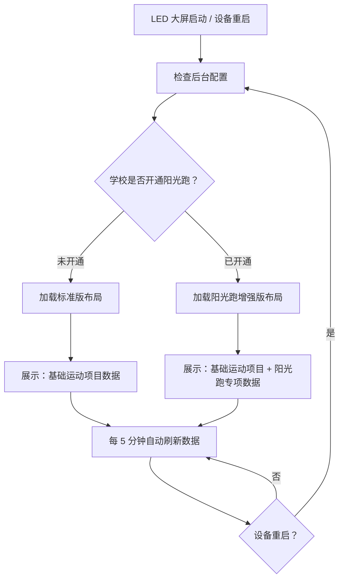

# LED 智慧体育大屏驾驶舱需求分析

## 一、需求背景分析

**需求来源：** 校体云系统 LED 大屏展示优化需求

**现状问题：**
- 当前 LED 大屏驾驶舱展示内容较为单一，无法适配不同学校的业务场景
- 部分学校未开通"阳光跑"业务，但大屏仍需展示统一的界面布局
- 需要针对"开通阳光跑"和"未开通阳光跑"两种学校类型提供差异化展示方案

**受影响用户/角色：**
- 学校师生：通过大屏查看运动数据和排名
- 访客/参观者：通过大屏了解学校体育运动开展情况

**需求价值：**
- 提升大屏展示的专业性和适配性
- 避免未开通阳光跑的学校出现空白展示区域
- 最大化利用大屏空间展示有价值的运动数据

---

## 二、需求目标确认

**核心目标：**
1. 支持两种布局模式自动切换（设备启动/重启时根据后台配置判断是否开通阳光跑）
2. 未开通阳光跑：展示传统运动项目（跳绳、跳远、引体向上、长跑、50 米）的成绩排名和班级排名
3. 已开通阳光跑：增加阳光跑专属展示区域（个人成绩排名、班级排名、全部运动汇总）
4. 支持后台配置数据统计时间范围，大屏实时展示
5. 今日最佳成绩支持降级逻辑（今日→昨日→无数据提示）

**成功标准：**
- 布局切换自动化，设备重启时自动检查配置并切换
- 两种布局都能充分利用大屏空间（运动成绩排名最多 50 条，班级排名最多 10 条）
- 数据每 5 分钟自动刷新，支持轮播和手动滑动
- 降级逻辑完善，确保无数据时大屏有合理的提示信息

---

## 三、业务流程分析

### 3.1 布局切换逻辑



### 3.2 标准版布局（未开通阳光跑）

```
┌─────────────────────────────────────────────────────────────────┐
│  智慧体育大屏                                          时间    │
├────────────────────────────────────────────┬──────────────────┤
│  累计参与人数  │  累计运动时长  │  热门项目  │  参与率最高班级│  学校名称
│    100       │     100       │   跳绳    │    四年级 1 班   │  近 X 天（后台配置）
├────────────────────────────────────────────┼──────────────────┤
│                                            │  今日最佳成绩    │
│  运动成绩排名（跳绳）                        │  跳绳  跳远  长跑│
│  全部 | 男生 | 女生                         │  270 个 200cm 3'20"│
│  1. 李某某 ♂ 四年级 1 班  300 个               │  李某某 李某某 李某某│
│  2. 王某某 ♀ 四年级 1 班  290 个               │─────────────────│
│  ...最多展示 50 条...                          │  班级运动排名    │
│                                            │  四年级|三年级|二年级│
│                                            │  时长 次数 参与率│
│                                            │  1. 四年级 1 班... │
│                                            │  2. 四年级 1 班... │
│                                            │  ...最多 10 条...  │
└────────────────────────────────────────────┴──────────────────┘
备注：支持自动轮播查看更多排名，每 5 分钟刷新；支持手动滑动切换页面
```

### 3.3 阳光跑增强版布局（已开通阳光跑）

```
┌─────────────────────────────────────────────────────────────────────────────┐
│  智慧体育大屏                                                      时间    │
├─────────────────────────────────────────────────────────────────────────────┤
│  累计参与人数  │  累计运动时长  │  热门项目  │  参与率最高班级│  学校名称   │
│    100       │     100       │   跳绳    │    四年级 1 班   │  近 X 天（后台配置）│
├──────────────┬────────────────┬─────────────────────────────────────────────┤
│ 运动成绩排名  │ 阳光跑成绩排名 │           今日最佳成绩                      │
│ （跳绳）     │ （阳光跑）     │  跳绳    立定跳远    长跑                   │
│ 全部|男生|女生│ 全部|男生|女生 │  270 个   200 厘米   3 分 20 秒               │
│ 1-25 名...    │ 1-25 名...      │  李某某   李某某     李某某                 │
│              │                ├─────────────────────────────────────────────┤
│              │                │         阳光跑班级排名                      │
│              │                │  四年级|三年级|二年级                        │
│              │                │  平均跑量  跑步人数  参与率                 │
│              │                │  1. 四年级 1 班  2.0km   30   90%            │
│              │                │  2. 四年级 1 班  2.0km   20   80%            │
│              │                │  ...最多 10 条...                           │
│              │                ├─────────────────────────────────────────────┤
│              │                │         全部运动排名                        │
│              │                │  四年级|三年级|二年级                        │
│              │                │  运动时长  运动次数  参与率                 │
│              │                │  1. 四年级 1 班  10 小时  100 次  90%         │
│              │                │  2. 四年级 1 班  10 小时  100 次  80%         │
│              │                │  ...最多 10 条...                           │
└──────────────┴────────────────┴─────────────────────────────────────────────┘
备注：支持自动轮播查看更多排名，每 5 分钟刷新；支持手动滑动切换页面
```

---

## 四、功能拆解清单

| 终端 | 模块 | 功能 | 功能描述 | 优先级 |
|------|------|------|----------|----------|
| LED 大屏 | 数据驾驶舱 | 布局模式自动切换 | 设备启动/重启时检查后台配置，根据学校是否开通阳光跑自动选择标准版或增强版布局 | Must |
| LED 大屏 | 数据驾驶舱 | 顶部统计卡片 | 展示累计参与人数、累计运动时长、热门运动项目、参与率最高班级 | Must |
| LED 大屏 | 数据驾驶舱 | 学校信息展示 | 展示学校名称和数据统计时间范围（后台配置，如近 7 天/近 30 天等） | Must |
| LED 大屏 | 数据驾驶舱 | 运动成绩排名（基础版） | 展示基础项目的学生成绩排名，支持按性别筛选，最多展示 50 条记录 | Must |
| LED 大屏 | 数据驾驶舱 | 运动成绩排名（阳光跑版） | 左侧展示基础项目成绩排名（最多 50 条），中间展示阳光跑成绩排名（最多 50 条），均支持按性别筛选 | Must |
| LED 大屏 | 数据驾驶舱 | 今日最佳成绩 | 展示各项目的最佳成绩和学生姓名；今日无数据时降级展示昨日最佳，均未查询到数据则提示"今日暂无运动记录" | Must |
| LED 大屏 | 数据驾驶舱 | 班级运动排名（标准版） | 展示各班级运动时长、运动次数、参与率排名，支持按年级筛选，最多展示 10 条 | Must |
| LED 大屏 | 数据驾驶舱 | 阳光跑班级排名（增强版） | 展示各班级阳光跑平均跑量、跑步人数、参与率，支持按年级筛选，最多展示 10 条 | Must |
| LED 大屏 | 数据驾驶舱 | 全部运动排名（增强版） | 展示各班级全部运动项目的汇总排名（时长/次数/参与率），最多展示 10 条 | Must |
| LED 大屏 | 数据驾驶舱 | 轮播/滑动 | 支持自动轮播查看更多排名数据，支持手动滑动切换页面 | Should |
| LED 大屏 | 数据驾驶舱 | 数据刷新 | 每 5 分钟自动刷新大屏数据 | Must |
| LED 大屏 | 数据驾驶舱 | 实时时间显示 | 在屏幕右上角显示当前日期和时间 | Must |
| 校端后台 | 数据服务 | 大屏数据接口 | 提供聚合数据接口，支持按布局类型和配置的统计时间范围返回对应数据 | Must |
| 校端后台 | 数据服务 | 统计时间范围配置 | 支持后台配置大屏数据统计时间范围（如近 7 天/近 30 天/近 90 天等） | Must |

---

## 五、业务规则

| 规则项 | 计算逻辑 | 说明 |
|--------|----------|------|
| 平均跑量 | 总有效跑量 / 班级人数 | 用于阳光跑班级排名 |
| 参与率 | 有运动记录的人数 / 班级人数 | 适用于各类排名卡片 |
| 热门运动项目 | 产生运动记录最多的运动项目（不含阳光跑） | 用于顶部统计卡片 |
| 今日最佳成绩 | 当日最佳成绩 → 昨日最佳 → 无数据提示 | 降级逻辑：今日有数据展示今日最佳；今日无数据且昨日有数据则提示"今日暂无运动记录，目前展示的是昨日的数据"并显示昨日最佳；均未查询到则提示"今日暂无运动记录" |
| 数据统计时间范围 | 后台可配置 | 大屏上展示所选时间范围（如"近 7 天"、"近 30 天"） |
| 运动项目配置 | 根据学校采购情况后台配置 | 可能无阳光跑但至少有 1 个运动项目；也可能仅开通阳光跑无其他运动项目；两者可并存 |
| 数据刷新 | 每 5 分钟自动刷新 | 大屏自动拉取最新数据 |
| 轮播/滑动 | 支持自动轮播和手动滑动 | 自动轮播查看更多排名数据，手动滑动可切换页面 |
| 布局切换 | 设备启动/重启时检查后台配置 | 根据是否开通阳光跑自动切换布局 |

---

## 六、待确认事项（技术实现）

| 序号 | 待确认事项 | 状态 | 负责人 | 截止日期 |
|------|------------|------|--------|----------|
| 1 | 后台配置接口字段设计（统计时间范围、是否开通阳光跑、运动项目配置） | 待确认 | - | - |
| 2 | 设备重启时的配置检查接口调用方式和频率 | 待确认 | - | - |
| 3 | 运动项目后台配置与大屏展示的映射规则（如何确定排名区域展示哪些项目） | 待确认 | - | - |

---

## 七、系统现状参考

根据 `system-status.md`，当前 LED 大屏已有功能：

| 模块 | 页面/功能 | 核心功能 |
|------|-----------|----------|
| 日常展示 | 数据驾驶舱 | 班级排名、阳光跑榜单、成绩排名、今日明星榜 |
| 运动时 | 实时投屏 | 长跑/阳光跑/短跑/跳绳实时数据投屏 |
| 学生查看 | 扫脸查看 | 学生扫脸查看个人运动记录 |
| 宣传 | 图片/视频轮播 | 支持定时开关机 |

本次需求是对现有"数据驾驶舱"功能的细化和增强，需要支持两种布局模式的自适应切换。
