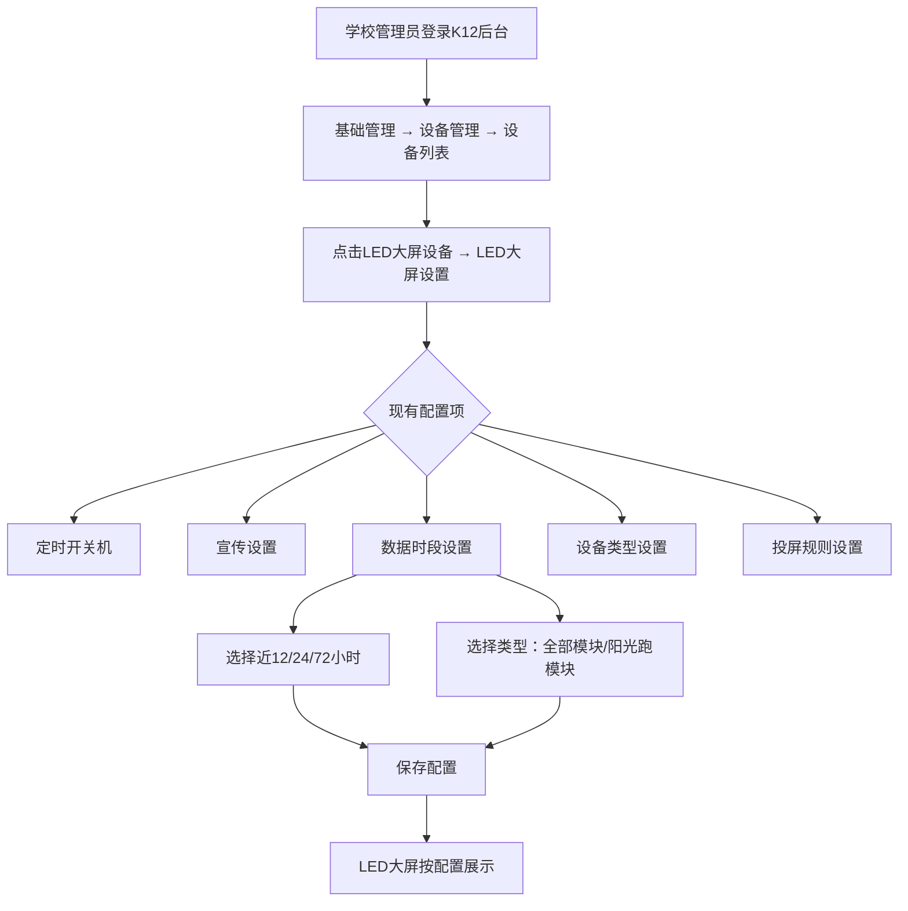
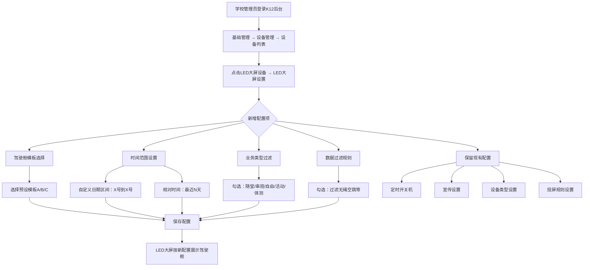

# LED大屏驾驶舱需求分析

**分析日期：** 2026-04-28
**分析人：** PM
**状态：** 需求分析

---

## 一、需求背景分析

### 1.1 客户核心诉求

**诉求 1：** LED大屏首页驾驶舱内容不够丰富，现有几个简单版块，每个版块数据量少。客户反馈驾驶舱展示的内容不足以吸引学生观看，数据单调导致大屏的使用价值不高。

**诉求 2：** 希望自定义排行数据计算的时间范围，现有默认展示全部数据，无法灵活调整。

### 1.2 现状问题

**系统现状（LED大屏）：**
- LED大屏当前功能包含：数据驾驶舱（班级排名、阳光跑榜单、各运动榜单、今日明星榜）、运动投屏（长跑/阳光跑/短跑/跳绳）、数据查询（刷脸查看成绩）、后台配置（定时开关机、宣传设置、数据时段设置、设备类型设置、投屏规则设置）
- 数据时段设置：支持按近12小时/24小时/72小时等筛选数据看板
- 驾驶舱模板：现有2种预设类型（全部模块/阳光跑模块），数据时段筛选功能在「一体机管理平台 → 通用设置」下有基础实现

**存在的问题：**
| 问题 | 说明 | 影响 |
|------|------|------|
| 内容单一 | 驾驶舱只有4个固定版块，运动项目少时内容更单薄 | 学生不感兴趣，大屏价值无法发挥 |
| 时间范围死板 | 只能选近12/24/72小时，无法自定义日期范围 | 无法满足学校特定时间段的数据展示需求 |
| 无法过滤数据 | 所有运动数据都展示，无法隐藏不需要展示的类型 | 某些场景下展示不相关数据（如无绳空跳）|
| 配置分散 | 数据时段设置在一体机管理平台，其他配置在校端后台 | 运维和教学管理不在同一后台，增加操作成本 |

### 1.3 受影响角色

| 角色 | 影响 |
|------|------|
| 学校管理员 | 无法自定义驾驶舱内容，被动接受固定模板 |
| 学生 | 看到的数据单调，缺乏吸引力 |
| 运维人员 | 配置分散在不同后台，操作不便 |

### 1.4 不做的影响

- 客户满意度持续下降，LED大屏作为亮点功能但使用体验不佳
- 大屏内容无法匹配不同学校运动项目数量的差异

---

## 二、需求目标确认

### 2.1 核心目标

为 K12校端后台的 LED大屏设置 增加驾驶舱自定义配置能力，支持按设备独立设置模板、时间范围、业务类型过滤和数据过滤规则，让每台 LED大屏的驾驶舱内容能匹配学校的实际运动项目情况。

### 2.2 具体指标

- 预设 3-5 个驾驶舱模板，覆盖运动项目少（1个）、多（全部）、中间情况
- 时间范围支持自定义日期区间（具体几号到几号）和相对时间（最近N天），默认最近N天
- 业务类型过滤：支持勾选随堂、串班、自由、活动、体测
- 数据过滤：支持过滤无绳空跳等违规标记数据
- 配置入口：K12校端后台 → 基础管理 → 设备管理 → 设备列表 → LED大屏 → LED大屏设置
- 配置作用范围：每台设备独立设置

### 2.3 范围约束

- **本次仅覆盖 K12校端后台**，高校暂不纳入
- 模板为学校预设模板，不支持学校自定义模板内容

---

## 三、业务流程分析

### 3.1 当前流程（现状）



**现状痛点：**
- 数据时段设置功能在「一体机管理平台 → 通用设置」和「K12校端后台 → 设备管理」两处分散存在
- 模板类型只有2种（全部模块/阳光跑模块），无法根据运动项目数量灵活切换
- 无法自定义时间范围，只能选择预设的时间段
- 无业务类型过滤和数据过滤能力

### 3.2 目标流程（改善后）



### 3.3 数据流向

```
K12校端后台（设备设置页面）
    ↓ 保存配置
一体机管理平台（API接收配置）
    ↓ 下发配置
LED大屏（接收并应用配置）
    ↓ 按模板+时间范围+过滤规则查询数据
K12/高校平台（数据库）
    ↓ 返回过滤后的运动数据
LED大屏（驾驶舱按配置展示）
```

---

## 四、功能拆解清单

### 4.1 LED大屏设置 - 驾驶舱配置

| 终端 | 模块 | 功能 | 功能描述 | 优先级 |
|------|------|------|----------|----------|
| K12校端后台 | 设备管理 → LED大屏设置 | 驾驶舱模板选择 | 下拉选择预设模板，覆盖现有"选择类型"（全部模块/阳光跑模块），提供3-5个预设模板 | P0 |
| K12校端后台 | 设备管理 → LED大屏设置 | 时间范围设置 | 支持自定义日期区间（具体日期到具体日期）和相对时间（最近N天），默认最近N天 | P0 |
| K12校端后台 | 设备管理 → LED大屏设置 | 业务类型过滤 | 复选框组：随堂、串班、自由、活动、体测，支持多选，默认全选 | P0 |
| K12校端后台 | 设备管理 → LED大屏设置 | 数据过滤规则 | 复选框：过滤无绳空跳等，参考"一体机设置"中的过滤机制，仅过滤被标记为违规的数据 | P1 |
| LED大屏 | 驾驶舱 | 按模板+规则渲染 | 根据后台配置动态渲染驾驶舱内容：切换模板布局、按时间范围查询数据、按业务类型过滤、按数据过滤规则排除违规记录 | P0 |
| 一体机管理平台 | 设备配置 API | 接收/下发配置 | 接收K12校端后台的LED驾驶舱配置，下发至对应LED大屏设备 | P0 |

### 4.2 驾驶舱预设模板清单

| 模板名称 | 适用场景 | 展示内容 | 优先级 |
|----------|----------|----------|----------|
| 全面展示模板 | 运动项目多、数据丰富的学校 | 班级排名 + 阳光跑榜单 + 各运动项目榜单 + 今日明星榜（4个模块） | P0 |
| 阳光跑专项模板 | 以阳光跑为主要运动的学校 | 班级排名 + 阳光跑TOP榜（2个模块，阳光跑相关模块面积放大） | P0 |
| 跳绳专项模板 | 以跳绳为主要运动的学校 | 今日明星榜（跳绳项目）+ 各运动榜单（跳绳专项）（2个模块） | P1 |
| 跑步专项模板 | 以跑步为主要运动的学校 | 今日明星榜（跑步项目）+ 各运动榜单（跑步专项）（2个模块） | P1 |
| 综合运动模板 | 运动项目中等的学校 | 班级排名 + 各运动项目榜单 + 今日明星榜（3个模块） | P1 |

### 4.3 现有功能保留

| 终端 | 模块 | 功能 | 优先级 |
|------|------|------|----------|
| K12校端后台 | 设备管理 → LED大屏设置 | 定时开关机 | 保留 |
| K12校端后台 | 设备管理 → LED大屏设置 | 宣传设置 | 保留 |
| K12校端后台 | 设备管理 → LED大屏设置 | 设备类型设置（单项目屏/多项目滚动屏） | 保留 |
| K12校端后台 | 设备管理 → LED大屏设置 | 投屏规则设置 | 保留 |

> 注：现有的"数据时段设置"功能中的"选择类型"（全部模块/阳光跑模块）将被新的"驾驶舱模板选择"替换。时间范围部分将被新的"时间范围设置"替换。

---

## 五、待确认事项

| 序号 | 待确认事项 | 状态 | 负责人 | 截止日期 |
|------|------------|------|--------|----------|
| 1 | 3-5个预设模板的具体名称和内容是否需要进一步细化（如模板的布局比例、各模块尺寸） | 待确认 | PM | - |
| 2 | 时间范围"最近N天"的默认值是多少天（建议7天） | 待确认 | PM | - |
| 3 | 数据过滤除了"过滤无绳空跳"外，是否还需要支持引体向上"过滤疑似作弊" | 待确认 | PM | - |
| 4 | 时间范围自定义时，是否有最大日期区间限制（如最多查询近180天） | 待确认 | PM | - |
| 5 | 配置保存后，LED大屏是否实时生效，还是需要等待大屏刷新周期 | 待确认 | 研发 | - |
| 6 | 如果学校运动项目少于模板要求的运动项目数量，驾驶舱是自动适配（隐藏无数据的模块）还是显示空状态 | 待确认 | PM | - |
