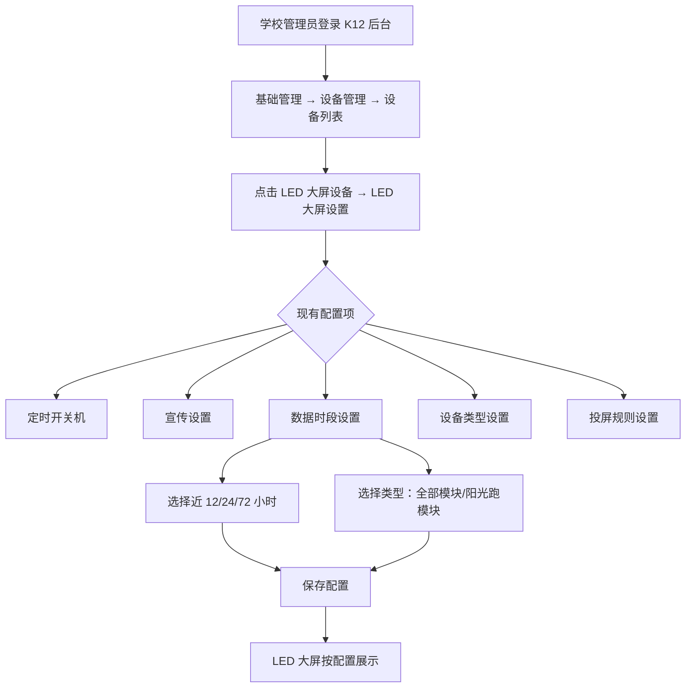
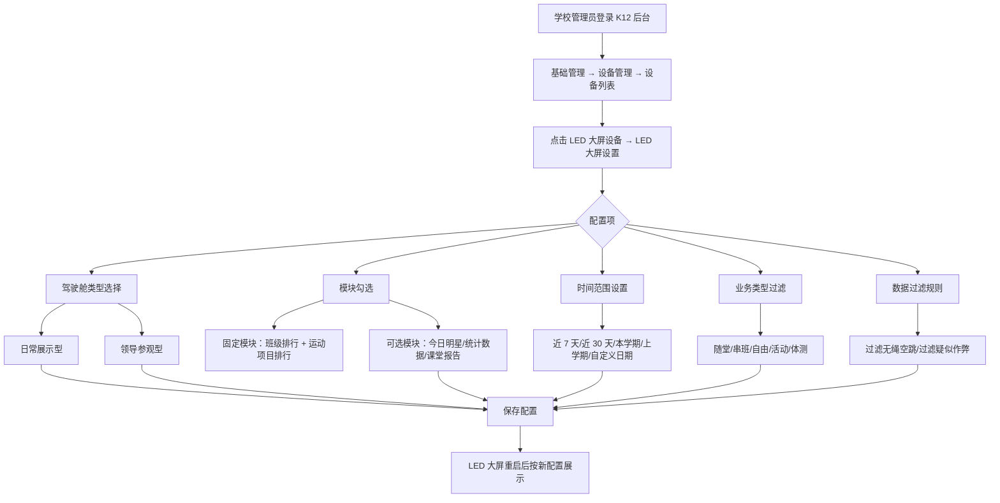

# LED 大屏驾驶舱需求分析

**分析日期：** 2026-04-28
**分析人：** PM
**状态：** 需求分析

---

## 一、需求背景分析

### 1.1 客户核心诉求

**诉求 1：** LED 大屏首页驾驶舱的内容不够丰富，现有几个简单版块，每个版块数据量少。客户反馈驾驶舱展示的内容不足以吸引学生观看，数据单调导致大屏的使用价值不高。

**诉求 2：** 希望自定义排行数据计算的时间范围，现有默认展示全部数据，无法灵活调整。

**诉求 3（新增）：** 需要支持不同类型的驾驶舱——日常展示型（学生/老师查看排行榜和成绩）和领导参观型（展示学校体育整体数据和统计图表）。

### 1.2 现状问题

**系统现状（LED 大屏）：**
- LED 大屏当前功能包含：数据驾驶舱（班级排名、阳光跑榜单、各运动榜单、今日明星榜）、运动投屏（长跑/阳光跑/短跑/跳绳）、数据查询（刷脸查看成绩）、后台配置（定时开关机、宣传设置、数据时段设置、设备类型设置、投屏规则设置）
- 数据时段设置：支持按近 12 小时/24 小时/72 小时等筛选数据看板
- 驾驶舱模板：现有 2 种预设类型（全部模块/阳光跑模块）

**存在的问题：**
| 问题 | 说明 | 影响 |
|------|------|------|
| 内容单一 | 驾驶舱只有 4 个固定版块，运动项目少时内容更单薄 | 学生不感兴趣，大屏价值无法发挥 |
| 时间范围死板 | 只能选近 12/24/72 小时，无法自定义日期范围 | 无法满足学校特定时间段的数据展示需求 |
| 无法过滤数据 | 所有运动数据都展示，无法隐藏不需要展示的类型 | 某些场景下展示不相关数据（如无绳空跳）|
| 缺少场景区分 | 没有区分日常展示和领导参观两种场景 | 领导参观时看不到学校整体体育数据概览 |
| 配置分散 | 数据时段设置在一体机管理平台，其他配置在校端后台 | 运维和教学管理不在同一后台，增加操作成本 |

### 1.3 受影响角色

| 角色 | 影响 |
|------|------|
| 学校管理员 | 无法自定义驾驶舱内容，被动接受固定模板 |
| 学生 | 看到的数据单调，缺乏吸引力；无法快速找到自己的成绩排名 |
| 教师 | 无法查看课堂运动数据概览 |
| 领导/参观人员 | 看不到学校体育整体数据（开课率、参与率、体质健康等） |
| 运维人员 | 配置分散在不同后台，操作不便 |

### 1.4 不做的影响

- 客户满意度持续下降，LED 大屏作为亮点功能但使用体验不佳
- 大屏内容无法匹配不同学校运动项目数量的差异
- 缺少领导参观型驾驶舱，无法展示学校体育建设成果

---

## 二、需求目标确认

### 2.1 核心目标

为 K12 校端后台的 LED 大屏设置 增加驾驶舱自定义配置能力，支持：
1. **两种驾驶舱类型**：日常展示型（排行榜 + 成绩）、领导参观型（统计数据 + 图表）
2. **固定模块 + 可选模块**：学校根据需求勾选展示模块
3. **时间范围**：近 7 天/近 30 天/本学期/上学期/自定义日期（≤180 天）
4. **业务类型过滤**：随堂、串班、自由、活动、体测
5. **数据过滤**：过滤无绳空跳、过滤疑似作弊

### 2.2 具体指标

- 驾驶舱类型：2 种（日常展示型、领导参观型）
- 固定模块：班级排行榜、运动项目排行榜（日常展示型）
- 可选模块：今日明星、统计数据、课堂运动报告
- 时间范围：5 种选项（近 7 天、近 30 天【默认】、本学期、上学期、自定义日期≤180 天）
- 业务类型过滤：5 种类型，支持多选
- 数据过滤：2 种（无绳空跳、疑似作弊）
- 配置作用范围：每台设备独立设置

### 2.3 范围约束

- **本次仅覆盖 K12 校端后台**，高校暂不纳入
- 领导参观型驾驶舱的统计数据本期仅实现基础数据（参与人数、运动次数、运动时长），复杂图表（体质健康分析、开课率趋势）后续迭代

---

## 三、业务流程分析

### 3.1 当前流程（现状）



**现状痛点：**
- 驾驶舱只有 2 种类型（全部模块/阳光跑模块），无法区分日常展示和领导参观场景
- 无法自定义日期范围，只能选择预设的时间段
- 无业务类型过滤和数据过滤能力

### 3.2 目标流程（改善后）



### 3.3 数据流向

```
K12 校端后台（设备设置页面）
    ↓ 保存配置
一体机管理平台（API 接收配置）
    ↓ 下发配置
LED 大屏（接收并应用配置）
    ↓ 按类型 + 模块+时间范围 + 过滤规则查询数据
K12/高校平台（数据库）
    ↓ 返回过滤后的运动数据/统计数据
LED 大屏（驾驶舱按配置展示）
```

---

## 四、功能拆解清单

### 4.1 LED 大屏设置 - 驾驶舱配置

| 终端 | 模块 | 功能 | 功能描述 | 优先级 |
|------|------|------|----------|----------|
| K12 校端后台 | 设备管理 → LED 大屏设置 | 驾驶舱类型选择 | 下拉选择：日常展示型（排行榜 + 成绩）、领导参观型（统计数据 + 图表） | P0 |
| K12 校端后台 | 设备管理 → LED 大屏设置 | 模块勾选 | 固定模块（班级排行 + 运动项目排行）必选，可选模块（今日明星/统计数据/课堂报告）支持勾选 | P0 |
| K12 校端后台 | 设备管理 → LED 大屏设置 | 时间范围设置 | 5 种选项：近 7 天、近 30 天（默认）、本学期、上学期、自定义日期（≤180 天） | P0 |
| K12 校端后台 | 设备管理 → LED 大屏设置 | 业务类型过滤 | 复选框组：随堂、串班、自由、活动、体测，支持多选，默认全选 | P0 |
| K12 校端后台 | 设备管理 → LED 大屏设置 | 数据过滤规则 | 复选框：过滤无绳空跳（跳绳）、过滤疑似作弊（引体向上） | P0 |
| K12 校端后台 | 设备管理 → LED 大屏设置 | 年级/性别筛选 | 运动项目排行榜的固定筛选条件，后台配置后大屏固定展示指定年级/性别 | P1 |
| LED 大屏 | 驾驶舱 | 日常展示型渲染 | 按配置渲染：班级排行榜（滚动）+ 运动项目排行榜（滚动）+ 可选模块（今日明星/统计数据） | P0 |
| LED 大屏 | 驾驶舱 | 领导参观型渲染 | 按配置渲染：统计数据概览（参与人数/运动次数/运动时长）+ 图表（班级对比柱状图/趋势图） | P1 |
| 一体机管理平台 | 设备配置 API | 接收/下发配置 | 接收 K12 校端后台的 LED 驾驶舱配置，下发至对应 LED 大屏设备 | P0 |

### 4.2 驾驶舱类型与模块清单

#### 日常展示型（学生/老师查看成绩和排名）

| 模块 | 类型 | 说明 | 默认勾选 |
|------|------|------|----------|
| 班级排行榜 | 固定 | 运动时长排名 + 运动次数排名 + 阳光跑排名（有数据时展示），支持滚动 | 必选 |
| 运动项目排行榜 | 固定 | 过滤规则生效后的各运动项目排行，支持按年级/性别切换（后台配置），支持滚动 | 必选 |
| 今日明星 | 可选 | 当日各运动项目成绩冠军 | 模板可预设 |
| 统计数据 | 可选 | 今日/本周参与人数、运动次数、运动时长 | 模板可预设 |

#### 领导参观型（展示学校体育整体数据）

| 模块 | 类型 | 说明 | 默认勾选 |
|------|------|------|----------|
| 体育数据概览 | 固定 | 学生总数、参与率、运动总次数、运动总时长 | 必选 |
| 班级对比图表 | 固定 | 各班运动数据对比柱状图 | 必选 |
| 趋势图 | 可选 | 运动参与趋势（周/月） | P1 |
| 体质健康分析 | 可选 | 体测成绩分布、达标率 | P2（后续迭代） |
| 开课情况统计 | 可选 | 体育课开课率、课时统计 | P2（后续迭代） |

### 4.3 预设模板清单

| 模板名称 | 驾驶舱类型 | 默认勾选模块 | 适用场景 |
|----------|------------|-------------|----------|
| 日常综合榜 | 日常展示型 | 班级排行 + 运动项目排行 + 今日明星 + 统计数据 | 日常使用，默认模板 |
| 阳光跑专项 | 日常展示型 | 班级排行 + 运动项目排行（阳光跑） + 今日明星（阳光跑） | 阳光跑活动月 |
| 跳绳专项榜 | 日常展示型 | 班级排行 + 运动项目排行（跳绳） + 今日明星（跳绳） | 跳绳比赛/测试 |
| 跑步专项榜 | 日常展示型 | 班级排行 + 运动项目排行（跑步） + 今日明星（跑步） | 跑步比赛/测试 |
| 领导参观统计 | 领导参观型 | 体育数据概览 + 班级对比图表 + 趋势图 | 领导参观、检查 |

### 4.4 现有功能保留

| 终端 | 模块 | 功能 | 优先级 |
|------|------|------|----------|
| K12 校端后台 | 设备管理 → LED 大屏设置 | 定时开关机 | 保留 |
| K12 校端后台 | 设备管理 → LED 大屏设置 | 宣传设置 | 保留 |
| K12 校端后台 | 设备管理 → LED 大屏设置 | 设备类型设置（单项目屏/多项目滚动屏） | 保留 |
| K12 校端后台 | 设备管理 → LED 大屏设置 | 投屏规则设置 | 保留 |

> 注：现有的"数据时段设置"功能将被新的"时间范围设置"替换。

---

## 五、待确认事项

| 序号 | 待确认事项 | 状态 | 负责人 | 截止日期 |
|------|------------|------|--------|----------|
| 1 | 领导参观型的图表具体展示哪些维度（如班级对比按什么指标） | 待确认 | PM | - |
| 2 | 趋势图的数据源和时间粒度（按天/周/月） | 待确认 | PM | - |
| 3 | 课堂运动报告模块的数据来源（是否需要对接一体机随堂测试数据） | 待确认 | 研发 | - |
| 4 | 时间范围"本学期/上学期"的具体日期如何获取（是否依赖学期管理模块） | 待确认 | 研发 | - |
| 5 | 配置保存后 LED 大屏重启生效，是否需要前端提示"重启后生效" | 待确认 | PM | - |
| 6 | 运动项目少于模板要求时，排行榜区域是自动隐藏空模块还是显示"暂无数据" | 待确认 | PM | - |

---

## 六、参考图片

用户提供的参考驾驶舱图片（`/Users/mac/Desktop/参考/`）：
- IMG_4272 - 军事考核数据大屏：按项目分列展示
- IMG_4284 - AI 智慧操场：阳光跑主题
- IMG_4289 - 运动报告/心率报告：课堂数据分析
- IMG_4296/IMG_4331 - 体质健康驾驶舱：校级统计
- IMG_4330 - 校级数据中心：体育数据概览
