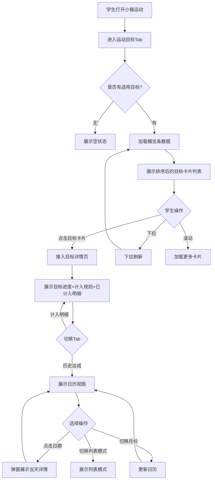

# 运动目标设置-小猴运动-运动目标-PRD

**文档版本**：v1.5.0
**创建日期**：2026-05-11
**负责人**：产品经理
**状态**：待评审
**关联全局业务 PRD**：运动目标设置-全局业务-PRD.md

---

## 版本更新记录

| 版本 | 时间 | 修改内容 | 修改人 |
|------|------|---------|--------|
| 初始版本 | 2026-05-11 | 初始版本 | 产品经理 |
| v1.3.0 | 2026-05-16 | 5.5 计入运动记录明细表格新增「运动时长」列和「计入成绩」列：阳光跑区分有效时长/总时长（取决于成绩状态配置），其他项目统一运动时长；全部项目模式下计入成绩展示时长 | 产品经理 |
| v1.4.0 | 2026-05-16 | 首页卡片保留当前日/月进度；目标详情新增整体进度与计算规则问号弹窗；阳光跑周/月频次按目标生效时段内自然周/月逐周期判断 | 产品经理 |
| v1.5.0 | 2026-05-17 | 明确多个单项顶部进度展示为「已完成子条件数/总子条件数 项」，禁止出现 0/0；历史目标列表统一展示「整体进度」，不固定展示达标天数 | 产品经理 |

---

## 1. 需求背景

### 1.1 功能定位

为学生提供个人运动目标进度查看能力，让学生了解自己当前被要求完成哪些运动目标、各自完成得怎么样、还差多少，形成自我驱动的运动习惯。

### 1.2 目标用户

K12 中小学生（使用小猴运动学生小程序）。

### 1.3 核心场景

- 学生放学回家后打开小猴运动，查看今天运动目标完成了几个
- 学期中学生查看阳光跑目标进度，了解还差多少公里和多少次
- 学生在运动记录产生后打开小程序，看到目标卡片进度更新

### 1.4 菜单位置

小猴运动（K12 学生小程序）→ 底部导航「运动目标」Tab（新增，介于「运动记录」和「我的」之间）

---

## 2. 页面结构

```
小猴运动 - 运动目标
├── 顶部：目标达成概览条（总计+占比）
├── 模块 A：多目标卡片列表
│   └── 每个目标：进度条 + 达成状态 + 剩余量
│       └── 点击 → 模块 B：目标详情页
└── 模块 B：目标详情页（推入，含计算规则问号入口）
    └── 模块 C：历史达成记录（详情页内 Tab 切换）
```

---

## 3. 顶部：目标达成概览条

### 3.1 用户故事

> 作为一个学生，我想要打开小程序就看到我今天/本月有多少个目标要完成、已经完成了几个，以便于快速了解自己的运动任务完成情况。

### 3.2 概览条内容

**原型描述**：
页面顶部固定区域，左侧大号占比数字（环形进度或大号百分比），右侧文字"共 N 个目标，已完成 X 个"，下方展示全部达标或继续加油提示。

| 字段 | 类型 | 说明 |
|------|------|------|
| 达成占比 | 展示 | 已达标目标数 ÷ 适用目标总数 × 100；格式：百分比，0位小数；配合环形进度图 |
| 目标总数 | 展示 | 学生当前所有适用且生效中的目标规则总数 |
| 已完成数 | 展示 | 已达标目标数 |

**边界情况**：
- 生效目标数为 0 时，占比显示"--"，下方显示"暂无目标，请等待老师配置"
- 已完成数为 0 时，占比显示"0%"，提示"继续加油！"

---

## 4. 模块 A：多目标卡片列表

### 4.1 用户故事

> 作为一个学生，我想要看到所有我需要完成的运动目标，每个目标的进度和还差多少，以便于知道自己该重点完成哪些运动。

### 4.2 目标卡片

**原型描述**：
卡片式列表，每张卡片对应一个生效中的目标规则。已过期/已停止目标不在首页卡片列表中展示，可通过页面底部「历史目标」入口查看。卡片左侧为目标类型大图标，右侧主体区域依次为：目标名称（粗体）、目标值摘要、进度条（绿色已达标/蓝色未达标+灰色背景）、剩余量提示、达标状态标签。

| 字段 | 类型 | 说明 |
|------|------|------|
| 计入运动项目图标 | 展示 | 多个项目（时钟）、单个项目（运动鞋）、多个单项（图标叠加）、阳光跑（太阳+跑步） |
| 目标名称 | 展示 | 如"每日运动 2 小时" |
| 目标值摘要 | 展示 | 多个项目→"目标 X 分钟"；单个项目→"目标 X [单位] [项目名]"；多个单项→"共 N 个条件"；阳光跑→根据开关配置动态展示（里程目标→"目标Xkm"，开启周次数→"周X次"，开启月次数→"月X次"，开启每日最多计入→"日最多Xkm"） |
| 完成值 | 展示 | 多个项目→"已完成 X 分钟"；单个项目→"已完成 X [单位]"；多个单项→"X/N 条件满足"；阳光跑→"已跑 X.X 公里" + 根据开关动态展示周/月次数完成情况 |
| 进度条 | 展示 | 0-100%，颜色：<100%蓝色，≥100%绿色；多个单项取各子条件完成率最低值 |
| 剩余量提示 | 展示 | 多个项目→"还差 XX 分钟"；单个项目→"还差 XX [单位]"；多个单项→"还差 X 个条件"；阳光跑→综合提示（里程/次数取紧迫者）；已达标→显示"已达标 ✅"，不显示剩余 |
| 达标状态 | 展示 | 已达标(绿色标签"已达标") / 未达标(蓝色标签"进行中") |
| 周期信息 | 展示 | 每日目标→"今天"；每月→"本月"；学期→"本学期"；自定义→"MM.DD 截止" |

### 4.3 多个单项目标卡片特殊展示

多个单项目标的卡片中，完成值行以子条件列表形式展示：

```
✅ 跳绳 100 个
❌ 跑步 1 公里（还差 0.5 公里）
✅ 仰卧起坐 50 个
```

每个子条件一行，已完成绿色勾，未完成红色叉+差距。

### 4.4 阳光跑目标卡片特殊展示

阳光跑目标**必须配置里程目标**，不存在不配里程目标的阳光跑目标。卡片中展示当前周期里程累计和已开启频次条件的达标情况。展示内容根据目标开关配置动态调整：未开启的指标不展示。

**展示规则**：

| 配置项 | 开启时展示 | 关闭时展示 |
|--------|-----------|-----------|
| 周最低次数 | 周达标情况：X/Y 次（达标/未达标） | 不展示 |
| 月最低次数 | 月达标情况：X/Y 次（达标/未达标） | 不展示 |
| 每日最多计入 | 日最多计入：Xkm 提示 | 不展示 |
| 里程目标（必配） | 当前周期里程：X/Y 公里 | - |

**常规阳光跑目标**（配置了学期里程 + 开启周次数和月次数）：

```
🏃 学期里程：12.5/30 公里（还差 17.5 公里）
📅 周达标情况：2/2 次 ✅
📅 月达标情况：5/8 次（还差 3 次）
💡 每日最多计入：5.0 公里
```

> 达标判定：里程目标达标 AND 已开启的频次条件都达标 → 达标。周最低次数按目标生效时段内覆盖的自然周逐个判断，自然周为周一至周日；月最低次数按目标生效时段内覆盖的自然月逐个判断，不足一个自然周/自然月也按一个周期判断。

**每日阳光跑目标**：不设置周/月次数，每日目标仅展示每日有效里程累计和剩余量。若开启了每日最多计入限制，额外展示提示。

```
🏃 今日里程：1.2/3.0 公里（还差 1.8 公里）
💡 每日最多计入：5.0 公里
```

### 4.5 卡片排序规则（综合排序）

默认按综合优先级排序，优先级算法考虑两个因素：

| 排序因子 | 权重说明 |
|---------|---------|
| 周期紧迫性 | 距离周期结束越近，优先级越高 |
| 完成度 | 完成度越低，优先级越高 |

**排序计算**：`综合优先级得分 = (1 - 达成率) × 0.6 + 周期紧迫度 × 0.4`

| 参数 | 计算方式 |
|------|---------|
| 达成率 | 已达标=1，其他按实际百分比 |
| 周期紧迫度 | 每日→0.9（最紧迫）；每月→已过天数÷当月天数；自定义→已过天数÷总天数；学期→已过天数÷学期天数 |

**排序规则**：
- 得分从高到低排序（最需要关注的在最前面）
- 每日目标天然的紧迫度最高，通常排前面
- 已达标的目标排到最后
- 得分相同时按创建时间倒序

### 4.6 空状态

- 无适用目标：展示空状态插画 + "暂无运动目标，等待老师为你设置"
- 所有目标已达标：展示全部绿色卡片 + 顶部"太棒了！全部目标已完成"

### 4.7 历史目标入口

页面底部提供「历史目标」入口，仅展示已过期和已停止的目标规则。点击后进入历史目标列表页，卡片灰色显示并按时间倒序排列，可查看历史达成数据。

### 4.7.1 历史目标列表卡片

历史目标卡片不得固定展示「达标天数」。应根据目标周期和计入方式展示「整体进度」，并支持点击进入目标详情查看历史周期内的计入记录和历史达成。

| 字段 | 展示规则 |
|------|----------|
| 目标名称 | 展示历史目标名称 |
| 生效周期 | 展示目标原生效时间范围 |
| 周期类型 | 每日/每月/学期/自定义 |
| 计入方式 | 多个项目/单个项目/多个单项/阳光跑 |
| 完成值 | 与目标统计单位一致，如「已完成 680 分钟」「已跑 8.5 公里」「2/3 条件满足」 |
| 整体进度 | 每日目标展示「已达标 X/Y 天」；每月目标展示「已达标 X/Y 月」；学期/自定义普通总目标展示「累计达成 X%」或「完成值/目标值」；阳光跑展示「里程达成 X/Y 公里，周达标 A/B 周，月达标 C/D 月」 |
| 整体状态 | 每日/每月目标：保持达标/已失达标；学期/自定义普通总目标：已达标/未达标；阳光跑目标：已达标/未达标/已失达标（仅周/月频次已无法保持达标时出现） |

> **防错约束**：历史目标列表和详情页不得把所有目标统一展示为「达标天数」。只有每日目标使用「天」作为整体进度单位；每月目标使用「月」；学期/自定义普通总目标使用累计完成进度；阳光跑使用里程与周/月频次进度。

---

## 5. 模块 B：目标详情页

### 5.1 用户故事

> 作为一个学生，我想要点击某个目标查看详细信息，了解我的运动记录哪些被计入了、哪些没有，以便于知道为什么没有达标。

### 5.2 触发方式

点击模块 A 中的目标卡片，推入目标详情页。

### 5.3 页面内容

**详情页顶部**：

| 字段 | 说明 |
|------|------|
| 目标名称 | 如"每日运动 2 小时" |
| 计入运动项目标签 | 小型彩色标签（多个项目/单个项目/多个单项/阳光跑） |
| 目标类型标签 | 小型标签（每日/每月/学期/自定义周期） |
| 完成值 / 目标值 | 大号数字对比，展示当前周期完成情况。多个项目→「85/120 分钟」；单个项目→「150/200 个」等；多个单项→「已完成子条件数/总子条件数 项」，如「2/3 项」；阳光跑→「12.5/30 公里」。每日目标→今日完成量/今日目标；每月目标→本月累计完成量/本月目标；学期目标→学期累计完成量/学期目标；自定义周期→周期累计完成量/周期目标。 |
| 达成率 | 百分比 |
| 达标状态 | 已达标（绿色）/ 未达标（蓝色）/ 已过期（灰色） |
| 整体进度 | 每日目标展示"已达标 X/Y 天"；每月目标展示"已达标 X/Y 月"；学期/自定义普通总目标展示累计完成进度；学期/自定义阳光跑展示里程、周/月频次进度 |
| 整体状态 | 每日/每月目标：保持达标 / 已失达标；学期/自定义普通总目标：已达标 / 未达标；学期/自定义阳光跑目标：已达标 / 未达标 / 已失达标（仅周/月频次已无法保持达标时出现） |
| 计算规则 | 右上角问号图标，点击后打开底部弹窗，展示当前目标类型对应的计算规则 |

**整体达标与当前周期展示规则**：

| 页面位置 | 展示口径 | 说明 |
|------|------|------|
| 首页目标卡片 | 当前周期达标 | 每日目标展示今天完成情况；每月目标展示本月完成情况；学期/自定义展示当前目标周期累计 |
| 详情页顶部完成值 | 当前周期达标 | 与首页卡片保持一致，用于告诉学生现在还差多少 |
| 详情页整体进度/整体状态 | 整体达标 | 每日目标展示当前已到达日期的整体达标状态；每月目标展示当前已到达月份的整体达标状态；未来日期/月不参与当前判断 |
| 历史达成 Tab | 明细口径 | 每日目标按天展示达标/未达标；每月目标按月展示月度完成情况 |

**顶部进度展示防错约束**：

- 多个单项目标没有单一数值目标值，不得使用 `0/0` 或空目标值兜底。
- 多个单项目标顶部固定展示「已完成子条件数/总子条件数 项」，达成率取各子条件达成率的最低值或按已完成子条件数计算的展示进度，但最终达标仍以所有子条件都满足为准。
- 当目标值缺失、为 0 或接口未返回时，前端不得直接渲染「0/0」；应展示「--」并上报数据异常。

**剩余量/差距区域**（未达标时）：
展示当前周期还差多少达标，与「完成值/目标值」对应同一周期维度：
- 多个项目：每日目标→`"今天还需运动 XX 分钟"`；每月目标→`"本月还需运动 XX 分钟"`；学期目标→`"本学期还需运动 XX 分钟"`
- 单个项目：`"[项目名] 还需 XX [单位]"`
- 多个单项：逐个子条件列出，标注 ✅/❌ 和各自差距
- 阳光跑：里程、周次数、月次数分别展示剩余量

### 5.3.1 计算规则说明弹窗

目标详情页右上角展示问号图标。点击后打开底部弹窗，标题为「计算规则说明」，内容根据当前目标类型动态展示。

**每日目标**：

```text
整体达标规则：
目标生效期间，每天都达标才算整体达标。

当前统计方式：
当前只统计已经到达的日期，未来日期暂不参与判断。

达标进度：
已达标天数 / 已到达天数。

今日进度：
今天完成值 / 今天目标值。
```

**每月目标**：

```text
整体达标规则：
目标生效期间，每个月都达标才算整体达标。

当前统计方式：
当前只统计已经到达的月份，未来月份暂不参与判断。

达标进度：
已达标月份 / 已到达月份。

本月进度：
本月完成值 / 本月目标值。
```

**阳光跑目标**：

```text
阳光跑达标规则：
里程目标必须达成。

如开启周最低次数，则目标生效时段内覆盖的每个自然周都需要达标。
如开启月最低次数，则目标生效时段内覆盖的每个自然月都需要达标。
不足一个自然周或自然月的，也按一个周期判断。

自然周：
周一至周日。
```

### 5.4 计入规则说明

详情页顶部展示该目标当前的计入规则说明，让学生了解哪些运动会被计入目标：

| 展示项 | 说明 |
|------|------|
| 计入运动项目 | 多个项目 / 阳光跑 / 具体项目列表 |
| 计入业务类型 | 自由训练、随堂测试等 |
| 成绩状态要求 | 正常 / 异常，可同时选择 |
| 项目标签过滤 | 如有设定则展示排除的标签 |
| 阳光跑有效标准 | （仅阳光跑目标）配速范围（全局配置）、单次最低里程（目标内配置）；周/月次数要求、每日最多计入限制（根据开关展示） |

### 5.5 计入运动记录明细

**原型描述**：
列表形式展示该目标下已计入的运动记录。未计入的记录暂不展示。

| 字段 | 类型 | 说明 |
|------|------|------|
| 运动时间 | 展示 | 今日→"HH:mm"；更早→"MM-DD HH:mm" |
| 运动项目 | 展示 | 跳绳/阳光跑等 |
| 成绩 | 展示 | 如"150个"，格式因项目而异 |
| 成绩状态 | 展示 | 正常/异常 |
| 运动时长 | 展示 | 记录对应的运动时长。**阳光跑**：若目标计入规则选择仅「正常」→ 展示有效时长（配速正常区间累计）；若选择「正常+异常」→ 展示总时长（开始-结束）。**其他运动项目**：统一展示运动时长。当目标统计单位为「总时长」（多个项目模式）时，**计入成绩**列展示时长而非原始成绩 |
| 计入时间 | 展示 | YYYY-MM-DD HH:mm |
| 计入状态 | 展示 | 全部计入 / 部分计入（部分计入时可查看具体计入了多少） |
| 计入成绩 | 展示 | 实际计入的成绩值。**多个项目模式**：展示计入的时长（如 45 分钟）。**其他模式**：展示具体成绩，全部计入时计入成绩=实际成绩（如150个、200厘米）；部分计入时（如阳光跑受每日最多计入限制）：计入成绩 ≠ 实际成绩（如实际 3.50 公里，计入成绩 2.00 公里）。全部计入和部分计入用不同颜色区分 |

**明细排序**：按运动时间倒序

### 5.6 Tab切换

详情页内设两个 Tab：

| Tab | 内容 |
|-----|------|
| 计入规则与记录 | 默认展示，含目标计入规则说明 + 已计入运动记录列表 |
| 历史达成 | 模块 C |

---

## 6. 模块 C：历史达成记录

### 6.1 用户故事

> 作为一个学生，我想要查看我过去每天的达标情况，以便于了解自己近期的运动表现趋势。

### 6.2 日历视图

**原型描述**：
日历热力图或月历视图。日历格子展示逻辑按目标周期类型区分：

**每日目标**：
每个日期格子直接反映当天达标状态，颜色区分：绿色(已达标) / 红色(未达标) / 灰色(无数据)。格子内展示的内容与详情页「剩余量/差距区域」的每日情况一致。

| 元素 | 说明 |
|------|------|
| 日历头部 | 月份切换（左右箭头），默认当月 |
| 日期格子 | 每个格子内：日期数字 + 小圆点（绿/红/灰），代表该日达标状态 |
| 图例 | 绿色=已达标、红色=未达标、灰色=无数据 |

**每月目标**：
日期格子不区分达标/未达标状态，仅区分：有数据 / 无数据。点击某个日期可查看当天完成的运动量。日历下方展示一块**月度总计区域**，统计该月累计完成的运动量（如"本月累计 320 分钟"）。

| 元素 | 说明 |
|------|------|
| 日历头部 | 月份切换（左右箭头），默认当月 |
| 日期格子 | 每个格子内：日期数字 + 小圆点（蓝色=有数据 / 灰色=无数据） |
| 图例 | 蓝色=有数据、灰色=无数据 |
| 月度总计 | 日历下方展示"本月累计：XX [单位]" |

**学期/自定义周期目标**：
同每月目标，日期格子仅区分有数据/无数据，不区分达标状态。点击某天可查看当天完成的运动量。无月度总计区域（学期和自定义周期跨多个月，总量在详情页顶部展示）。

| 元素 | 说明 |
|------|------|
| 日历头部 | 月份切换（左右箭头），默认当月 |
| 日期格子 | 每个格子内：日期数字 + 小圆点（蓝色=有数据 / 灰色=无数据） |
| 图例 | 蓝色=有数据、灰色=无数据 |

### 6.3 点击日期

点击某个日期格子：
- 每日目标：弹窗展示当天运动记录汇总和达标判定（与详情页「剩余量/差距区域」展示的每日维度一致）
- 每月/学期/自定义目标：弹窗展示当天完成的运动量明细

### 6.4 历史目标与历史达成的口径关系

| 页面位置 | 展示口径 | 说明 |
|----------|----------|------|
| 历史目标列表 | 整体进度 + 整体状态 | 用于回看该目标最终或当前历史结果，不展示每日明细 |
| 历史达成 Tab | 日期明细 | 用于查看某天是否有记录或是否达标，按周期类型区分展示方式 |

> 每日目标的历史达成 Tab 可用红/绿标识达标/未达标；每月、学期、自定义目标的日期格子仅表示有无运动数据，目标整体是否达标由历史目标卡片和详情顶部的整体进度/整体状态表达。

---

## 7. 边界场景与异常处理

| 场景 | 处理方式 | 提示/展示 |
|------|---------|---------|
| 无适用目标 | 概览条显示"--"，列表为空 | "暂无运动目标，等待老师为你设置" |
| 所有目标已达标 | 全部卡片绿色，顶部特殊文案 | "太棒了！全部目标已完成" |
| 今日无运动记录 | 所有目标卡片进度为0，剩余量=目标值 | "今天还没有运动记录" |
| 运动记录未同步 | 数据可能滞后，底部轻提示 | "运动记录同步中，数据可能有延迟" |
| 网络异常 | 展示错误状态 + 重试按钮 | "网络异常，请下拉重试" |
| 多个单项目标全部子条件未达标 | 卡片内每个子条件行标注 ❌ | - |
| 阳光跑配速不达标 | 记录不计入（不在详情页展示） | - |
| 阳光跑低于最低里程 | 记录不计入（不在详情页展示） | - |
| 目标规则已停止 | 该目标卡片从列表中移除 | - |
| 目标规则已过期 | 不在首页卡片列表中展示；通过页面底部「历史目标」入口查看已过期目标的达成历史 | "目标已过期" |
| 计入运动项目为多个项目且勾选全部项目 | 新上线运动项目自动纳入统计范围 | - |
| 阳光跑每日最多计入限制 | 卡片提示每日最多计入限制 | "每日最多计入：X.X 公里" |

---

## 8. 业务流程图：学生查看路径


---

## 9. 测试用例

### 正向路径

- 学生打开运动目标Tab，概览条展示"共3个目标，已完成1个"
- 目标卡片列表按综合优先级排序，未达标排前面
- 点击多个项目目标卡片，推入详情页展示计入明细
- 点击阳光跑目标卡片，展示里程+周次+月次三个维度
- 点击多个单项目标卡片，展示各子条件的✅/❌状态
- 点击多个单项目标详情页，顶部进度展示「已完成子条件数/总子条件数 项」，不得出现「0/0」
- 切换到历史达成Tab，日历视图展示当月达标情况
- 进入历史目标列表，每日目标展示「已达标 X/Y 天」，每月目标展示「已达标 X/Y 月」，阳光跑展示里程和周/月频次整体进度
- 点击日历某个日期，弹窗展示当天运动记录汇总
- 下拉刷新，概览条和卡片列表数据更新
- 完成所有目标后，概览条展示"全部目标已完成"
- 切换到列表模式，展示历史达成列表

### 反向路径

- 无适用目标，展示空状态"暂无运动目标"
- 今日无运动记录，所有卡片进度为0%
- 网络断开，展示错误状态和重试按钮

### 边界条件

- 学生被10个目标覆盖，卡片列表滚动正常
- 所有目标都未达标，卡片全部蓝色进度条
- 阳光跑目标未达标，详情页展示计入规则说明
- 阳光跑目标仅开启周次数，月次数和每日最多计入不展示
- 目标已过期，卡片灰色标记仍可点击查看历史
- 日历视图切换月份，数据正确加载
- 当前月无运动记录，日历全部显示灰色
- 每日阳光跑目标仅展示里程累计，不展示周/月次数
- 接口返回目标值为 0 或缺失时，详情页不得展示「0/0」，应展示空值占位并记录数据异常

---

**文档完成**
