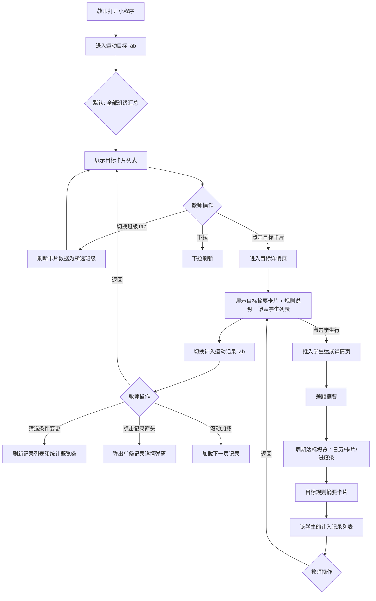

# 运动目标设置-教师小程序-运动目标-PRD

**文档版本**：v1.8.0
**创建日期**：2026-05-11
**负责人**：产品经理
**状态**：待评审
**关联全局业务 PRD**：运动目标设置-全局业务-PRD.md

---

## 版本更新记录

| 版本     | 时间       | 修改内容                                                                                                                                                                             | 修改人   |
| -------- | ---------- | ------------------------------------------------------------------------------------------------------------------------------------------------------------------------------------ | -------- |
| 初始版本 | 2026-05-11 | 初始版本                                                                                                                                                                             | 产品经理 |
| v1.3.0   | 2026-05-15 | 重构数据查看结构：参考后台计入运动记录Tab，精简为3模块；删除达标概览和变更记录模块                                                                                                   | 产品经理 |
| v1.4.0   | 2026-05-16 | 模块 C 学生达成详情新增「周期达标概览」模块：每日目标展示日历视图、每月目标展示月份卡片、学期/自定义目标按计入方式展示进度条/子条件表/阳光跑周月达标；概览时间范围对齐目标的生效周期 | 产品经理 |
| v1.5.0   | 2026-05-16 | 模块 B 记录列表 + 模块 C 学生记录列表新增「运动时长」列：阳光跑区分有效时长/总时长（取决于成绩状态配置），其他项目统一运动时长；全部项目模式下计入成绩展示时长                       | 产品经理 |
| v1.6.0   | 2026-05-16 | 模块 B 新增单条记录详情入口（5.8）：点击记录行右侧箭头弹出详情弹窗，补全列表省略的「运动时间」「业务类型」字段                                                                       | 产品经理 |
| v1.7.0   | 2026-05-16 | 教师小程序明确仅查看；目标详情改为目标完成概览+覆盖学生列表+计入记录；新增计算规则问号弹窗和全部班级去重规则                                                                    | 产品经理 |
| v1.8.0   | 2026-05-17 | 补充跨端展示口径：多个单项目标统一展示「已完成子条件数/总子条件数 项」且不得出现 0/0；历史目标按周期展示整体进度；学期/自定义普通总目标不展示保持达标/已失达标或天/月达标进度 | 产品经理 |

---

## 1. 需求背景

### 1.1 功能定位

为教师提供任教班级运动目标达成情况的移动端查看能力，方便教师在日常工作中快速了解班级目标完成进度，定位未达标学生。

### 1.2 目标用户

| 角色     | 权限说明                                                              |
| -------- | --------------------------------------------------------------------- |
| 主管老师 | 可查看任教班级的目标达成数据；不支持在教师小程序创建、编辑、停止、删除目标 |
| 协管老师 | 仅可查看任教班级的目标达成数据，不可创建或管理目标                    |

> **注意**：教师目标（管理员创建的针对教师群体的目标）不支持在教师小程序查看，仅后台支持。

### 1.3 核心场景

- 课间操结束后，体育老师打开教师小程序查看今天任教班级的运动目标达成率
- 放学前，班主任查看本班未达标学生名单，进行提醒

### 1.4 菜单位置

教师小程序（K12）→ 底部导航「运动目标」Tab（新增，或纳入现有「运动记录」模块）

---

## 2. 页面结构

```
教师小程序 - 运动目标
├── 顶部：班级筛选切换
├── 模块 A：班级目标列表（按目标分组）
│   └── 每个目标卡片：目标名称 + 计入运动项目标签 + 达标率 + 达标人数
│       └── 点击 → 进入模块 B（二级页面）
├── 模块 B：目标详情页
│   ├── 顶部：目标基本信息摘要卡片
│   ├── 计算规则问号入口
│   ├── 目标完成概览：整体达标率 / 覆盖学生数 / 整体已达标 / 整体未达标 / 周期进度
│   ├── 目标规则摘要卡片
│   ├── Tab1：覆盖学生列表（默认）：学生姓名、班级、当前周期达成率、达标进度、整体状态
│   │   └── 点击学生行 → 进入模块 C（推入页面）
│   └── Tab2：计入运动记录：筛选区 + 统计概览条 + 记录列表
│       └── 点击记录行右侧箭头 → 单条记录详情（弹窗/推入）
└── 模块 C：学生达成详情
    ├── 差距摘要（未达标时展示）
    ├── 周期达标概览（NEW）：每日→日历视图 / 每月→月份卡片 / 学期/自定义→进度条/子条件表/阳光跑周月达标
    ├── 目标规则摘要卡片
    └── 该学生的计入记录列表（含运动时长列）
```

> **设计说明**：本版本参考校端后台「目标详情→计入运动记录」Tab（后台 PRD 6.6）的展示方式，适配为移动端样式。教师小程序仅做查看，不支持新建、编辑、停止、删除等操作。

---

## 3. 全局筛选：班级切换

### 3.1 班级筛选

**原型描述**：
页面顶部横向滚动的班级 Tab 栏，首位固定「全部班级」，后面依次列出所有任教班级名称。选中的班级高亮显示。

**默认状态**：「全部班级」选中，展示所有任教班级的汇总数据。

| 筛选项 | 字段类型 | 选项                           | 默认值   |
| ------ | -------- | ------------------------------ | -------- |
| 班级   | Tab切换  | 全部班级 / 班级1 / 班级2 / ... | 全部班级 |

**选择「全部班级」时**：

- 达标率 = 所有任教班级达标学生总数 ÷ 所有任教班级覆盖学生总数
- 学生列表合并展示所有班级学生
- 目标卡片按目标 ID 去重；覆盖学生按 studentId 去重，避免全校目标、多班级目标在全部班级汇总时重复计数

**选择具体班级时**：

- 所有数据范围缩小至该班级

---

## 4. 模块 A：班级目标列表

### 4.1 用户故事

> 作为一个体育教师，我想要在手机上一眼看到任教班级所有生效中的运动目标及其达标率，以便于快速了解班级整体运动情况。

### 4.2 列表卡片

**原型描述**：
卡片式列表布局，每个生效中的目标规则一张卡片。卡片左侧为计入运动项目图标和名称，右侧为达标率环形图，底部显示达标/覆盖人数。

| 字段             | 类型 | 说明                                                                                                                                                                                             |
| ---------------- | ---- | ------------------------------------------------------------------------------------------------------------------------------------------------------------------------------------------------ |
| 计入运动项目图标 | 展示 | 根据计入运动项目展示不同图标（多个项目/单个项目/多个单项/阳光跑）                                                                                                                                |
| 目标名称         | 展示 | 目标规则名称                                                                                                                                                                                     |
| 计入运动项目标签 | 展示 | 小型标签，颜色区分：多个项目/单个项目/多个单项/阳光跑                                                                                                                                            |
| 目标类型         | 展示 | 每日/每月/学期/自定义周期                                                                                                                                                                        |
| 目标值摘要       | 展示 | 多个项目→"X分钟"；单个项目→"运动项目 X单位"；多个单项→"N个条件"；阳光跑→根据开关配置动态展示（开启周次数→"周X次"，开启月次数→"月X次"，开启每日最多计入→"日最多Xkm"，学期里程→"学期Xkm"） |
| 达标率           | 展示 | 环形进度图 + 百分比数字；达标学生数÷覆盖学生总数；格式：百分比，0位小数；无覆盖学生时"--"；有覆盖学生但无记录时"0%"                                                                             |
| 达标人数         | 展示 | "X/Y人达标"，X=已达标人数，Y=覆盖总人数                                                                                                                                                          |
| 卡片右侧箭头     | 展示 | → 点击进入该目标的计入运动记录                                                                                                                                                                  |

### 4.3 卡片排序规则

- 达标率最低的目标排在最前面（优先展示薄弱目标）
- 达标率相同时，按目标类型紧急程度排序（每日 > 每月 > 学期 > 自定义周期）

### 4.4 空状态

- 无生效中的目标：展示空状态插画 + "暂无生效中的运动目标"
- 教师无任教班级：展示空状态 + "暂无任教班级"

### 4.5 历史目标入口

页面底部提供「历史目标」入口，仅展示已过期和已停止的目标规则。点击后进入历史目标列表页，按时间倒序排列，可查看历史达成数据。历史目标卡片不固定展示「达标天数」，需按目标周期展示整体进度：每日目标展示「已达标 X/Y 天」，每月目标展示「已达标 X/Y 月」，学期/自定义普通总目标展示累计完成值/目标值或累计达成率，多个单项展示「已完成 X/Y 项」，阳光跑展示累计里程和已开启的周/月频次进度。

---

## 5. 模块 B：目标详情页

### 5.1 用户故事

> 作为一个体育教师，我想要查看某个目标的整体完成情况、规则说明和覆盖学生达成列表，以便于快速定位未达标学生，并进一步查看某个学生被计入的运动记录。

### 5.2 进入方式

点击模块 A 的目标卡片 → 推入「目标详情」页面（二级页面）。

### 5.3 页面顶部：目标基本信息摘要卡片

页面顶部展示当前目标的摘要信息（移动端卡片式，不可编辑）：

| 字段         | 类型 | 说明                                                                                             |
| ------------ | ---- | ------------------------------------------------------------------------------------------------ |
| 目标名称     | 展示 | 含目标类型标签（全校目标/班级目标）和周期类型标签（每日/每月/学期/自定义周期）                   |
| 计入运动项目 | 标签 | 多个项目/阳光跑/单个项目/多个单项，颜色区分                                                      |
| 目标值摘要   | 展示 | 多个项目→"X分钟"；单个项目→"运动项目 X单位"；多个单项→"N个条件"；阳光跑→根据开关配置动态展示 |
| 达标率       | 展示 | 环形进度图 + 百分比数字；无覆盖学生时"--"；有覆盖学生但无记录时"0%"                              |
| 已达标人数   | 展示 | "已达标 X 人"                                                                                    |
| 未达标人数   | 展示 | "未达标 X 人"，红色字体                                                                          |
| 周期进度     | 展示 | 每日目标："已统计 X/Y 天"；每月目标："已统计 X/Y 月"；学期/自定义普通总目标展示当前日期在目标周期内的位置，不展示"已达标 X/Y 天/月"                    |
| 计算规则     | 操作 | 右上角问号图标，点击后打开底部弹窗，展示当前目标类型的计算规则                                    |

**整体达标与当前周期展示规则**：

| 页面位置 | 展示口径 | 说明 |
| -------- | -------- | ---- |
| 目标列表卡片 | 整体达标率 | 教师需要先识别整体薄弱目标，因此列表达标率展示整体口径 |
| 目标详情顶部 | 整体达标率、整体已达标、整体未达标 | 与后台看板一致，每日/月度目标只统计已到达日期/月，未来日期/月不参与当前判断 |
| 覆盖学生列表 | 当前周期达成率 + 整体状态 | 当前周期达成率用于快速看今天/本月表现；整体状态用于判断是否仍保持整体达标 |
| 计入运动记录 Tab | 记录口径 | 展示已计入记录，不用于替代整体达标率 |
| 学生达成详情 | 整体进度 + 计入记录 | 可查看该学生每一天/每一月的达标情况，以及具体被计入的记录 |

**状态展示边界**：

- 每日/每月目标：整体状态可展示「保持达标 / 已失达标」，因为已到达日期/月中任一周期未达标后，整体已无法保持全周期都达标。
- 学期/自定义普通总目标：整体状态只展示「已达标 / 未达标」，不展示「保持达标 / 已失达标」，也不展示天/月达标进度。
- 学期/自定义阳光跑目标：如开启周/月最低次数，且已到达自然周/月未满足次数要求，可展示「已失达标」；仅配置里程目标时只展示「已达标 / 未达标」。
- 多个单项：顶部进度统一展示「已完成子条件数/总子条件数 项」，子条件明细展示每项完成值、目标值、达成率和状态；不得展示「0/0」。

### 5.4 目标规则摘要卡片

折叠卡片展示目标规则摘要，默认收起，可点击展开。

| 分组 | 展示字段 |
| ---- | -------- |
| 基础信息 | 目标名称、目标类型、周期类型、生效周期 |
| 目标值 | 多个项目→运动时长；单个项目→目标单位+目标值；多个单项→子条件列表；阳光跑→里程目标和已开启频次条件 |
| 计入规则 | 计入运动项目、业务类型、成绩状态、项目标签 |
| 阳光跑专配 | 里程目标、周最低次数、月最低次数、每日最多计入限制、单次最低里程、配速范围 |

### 5.5 覆盖学生列表（默认 Tab）

进入目标详情后默认展示覆盖学生列表，确保没有计入记录的未达标学生也能被查看。

| 字段 | 类型 | 说明 |
| ---- | ---- | ---- |
| 学生姓名 | 展示 | - |
| 班级 | 展示 | 学生所在班级 |
| 当前周期达成率 | 展示 | 每日目标展示今日达成率；每月目标展示本月达成率；学期/自定义普通总目标展示周期累计达成率；多个单项展示已完成子条件占比或各子条件最低达成率 |
| 达标进度 | 展示 | 每日目标："已达标 X/Y 天"；每月目标："已达标 X/Y 月"；学期/自定义普通总目标展示累计完成值/目标值或累计达成率；多个单项展示"已完成 X/Y 项"；学期/自定义阳光跑展示里程、周/月频次进度 |
| 整体状态 | 标签 | 每日/每月目标：保持达标 / 已失达标；学期/自定义普通总目标：已达标 / 未达标；学期/自定义阳光跑目标：已达标 / 未达标 / 已失达标（仅周/月频次已无法保持达标时出现） |
| 操作 | 点击行 | 进入模块 C 学生达成详情 |

**列表规则**：
- 默认按整体状态排序（已失达标/未达标优先），同状态下按当前周期达成率升序
- 支持筛选：整体状态、年级、班级、学生姓名/学籍号
- 每页 20 条，滚动加载更多

### 5.6 计入运动记录 Tab

#### 5.6.1 统计概览条

> 对齐后台 PRD 6.6 统计概览条设计。移动端以横向三栏卡片形式展示。

| 统计项     | 说明                                             |
| ---------- | ------------------------------------------------ |
| 总记录数   | 该目标下所有已计入的运动记录总数                 |
| 已计入数   | 全部计入的记录条数                               |
| 部分计入数 | 部分计入的记录条数（如阳光跑受每日最多计入限制） |

#### 5.6.2 筛选区

| 筛选项          | 字段类型 | 选项               | 默认值 |
| --------------- | -------- | ------------------ | ------ |
| 学生姓名/学籍号 | 搜索框   | 模糊搜索           | 空     |
| 年级            | 下拉选择 | 适用范围内年级列表 | 全部   |
| 班级            | 下拉选择 | 根据年级联动       | 全部   |
| 计入时间        | 日期范围 | -                  | 根据目标周期动态默认：每日目标默认当天；每月目标默认当月；学期/自定义周期默认目标生效周期 |

> **说明**：筛选条件变更后，记录列表和统计概览条同步刷新。

#### 5.6.3 记录列表

| 字段     | 类型 | 说明                                                                                                                                                                                                                                                                                                |
| -------- | ---- | --------------------------------------------------------------------------------------------------------------------------------------------------------------------------------------------------------------------------------------------------------------------------------------------------- |
| 学生姓名 | 展示 | -                                                                                                                                                                                                                                                                                                   |
| 性别     | 展示 | 男/女                                                                                                                                                                                                                                                                                               |
| 学籍号   | 展示 | 学生学籍号                                                                                                                                                                                                                                                                                          |
| 年级     | 展示 | 学生所在年级                                                                                                                                                                                                                                                                                        |
| 班级     | 展示 | 学生所在班级                                                                                                                                                                                                                                                                                        |
| 运动项目 | 展示 | 跳绳、阳光跑等，**单位按运动项目匹配**：跳绳→个、跑步→分钟、立定跳远→厘米、50米跑/800米跑→秒、游泳→米、实心球→米、阳光跑→公里（两位小数）、引体向上/仰卧起坐→个 等                                                                                                                    |
| 成绩     | 展示 | 具体成绩数值 + 单位                                                                                                                                                                                                                                                                                 |
| 成绩状态 | 标签 | 正常/异常，不同颜色区分                                                                                                                                                                                                                                                                             |
| 运动时长 | 展示 | 记录对应的运动时长。**阳光跑**：若目标计入规则选择仅「正常」→ 展示有效时长（配速正常区间累计）；若选择「正常+异常」→ 展示总时长（开始-结束）。**其他运动项目**：统一展示运动时长。当目标统计单位为「总时长」（全部项目模式）时，**计入成绩**列展示时长而非原始成绩              |
| 计入时间 | 展示 | YYYY-MM-DD HH:mm                                                                                                                                                                                                                                                                                    |
| 计入状态 | 标签 | 全部计入 / 部分计入。全部计入和部分计入用不同颜色区分                                                                                                                                                                                                                                               |
| 计入成绩 | 展示 | 实际计入的成绩值。**全部项目模式**：展示计入的时长（如 45 分钟）。**其他模式**：展示具体成绩，全部计入时计入成绩=实际成绩（如200厘米、100个）；部分计入时（如阳光跑受每日最多计入限制）：计入成绩 ≠ 实际成绩（如实际 3.50 公里，计入成绩 2.00 公里）。全部计入和部分计入用不同颜色区分 |

**计入说明**（对齐后台 PRD 6.6）：

- 如果计入运动项目选择「多个运动」，统计的是**运动时长**（含阳光跑记录的运动时长）。
- 阳光跑记录的计入逻辑：仅计入运动项目为「阳光跑」时受每日最多计入里程限制，超出部分产生部分计入（如实际3.50km，计入2.00km）。多个项目统计运动时长时，阳光跑不受每日最多计入限制影响。
- 运动时长列展示逻辑详见上表「运动时长」列说明；全部项目模式下计入成绩展示时长。

> **说明**：本列表仅展示已计入的运动记录。未计入的记录暂不展示（后续有需要时再设计开发）。

#### 5.6.4 记录列表规则

- 排序：按计入时间倒序（最近计入的记录在最上面）
- 分页：每页 20 条，滚动加载更多
- 点击记录行右侧箭头 → 弹出单条记录详情（底部弹窗 / 推入页，见 5.8）

### 5.8 单条记录详情

#### 5.8.1 用户故事

> 作为一个教师，我想要查看某一条运动记录的完整信息，以便于了解该条记录为什么被全部计入或部分计入。

#### 5.8.2 触发方式

在模块 B 记录列表中，点击某条记录行右侧的箭头图标 → 弹出底部弹窗（半屏）或推入详情页，展示该条运动记录的完整字段。

#### 5.8.3 展示字段

| 字段     | 说明                                                                                       |
| -------- | ------------------------------------------------------------------------------------------ |
| 学生姓名 | -                                                                                          |
| 性别     | 男/女                                                                                      |
| 学籍号   | 学生学籍号                                                                                  |
| 年级     | 学生所在年级                                                                                |
| 班级     | 学生所在班级                                                                                |
| 运动项目 | 跳绳、阳光跑等，带单位                                                                      |
| 运动时间 | 运动开始时间，格式 YYYY-MM-DD HH:mm                                                         |
| 业务类型 | 自由训练、随堂测试、串班训练、体质测试、阳光跑等                                            |
| 成绩     | 具体成绩数值 + 单位                                                                         |
| 成绩状态 | 正常/异常，不同颜色区分                                                                     |
| 运动时长 | 阳光跑区分有效时长/总时长（取决于成绩状态配置），其他项目统一运动时长                       |
| 计入时间 | YYYY-MM-DD HH:mm                                                                            |
| 计入状态 | 全部计入 / 部分计入，不同颜色区分                                                           |
| 计入成绩 | 实际计入的成绩值。全部项目模式展示时长                                                      |

> **说明**：列表中以精简字段展示（5.6），单条详情补全「运动时间」「业务类型」等在列表中因移动端空间限制省略的字段。

### 5.9 空状态

- 筛选后无匹配记录：展示空状态插画 + "暂无符合条件的运动记录"
- 目标下无任何计入记录：展示空状态 + "该目标暂无已计入的运动记录"

---

## 6. 模块 C：学生达成详情

### 6.1 用户故事

> 作为一个教师，我想要查看某个学生在当前目标下的达成情况和计入运动记录明细，以便于了解该学生的运动表现并进行针对性督促。

### 6.2 触发方式

在模块 B 的「覆盖学生列表」中点击某一行学生 → 推入学生达成详情页。

### 6.3 页面顶部：差距摘要

若学生未达标，展示差距摘要（醒目提示）：

- 多个项目：`"还差 XX 分钟达到目标"`
- 单个项目：`"[项目名] 还差 XX 个"`
- 多个单项：逐个子条件列出差距
- 阳光跑：`"还差 X.X 公里 / X 次"`

若学生已达标，展示："已达标 ✓"

顶部右上角展示问号图标，点击后打开「计算规则说明」底部弹窗。弹窗说明与目标详情页一致，根据每日/月度/阳光跑等目标类型动态展示。

**顶部进度展示规则**：

| 目标类型 | 顶部进度 |
| -------- | -------- |
| 每日目标 | 今日完成值/今日目标 + 已达标 X/Y 天 |
| 每月目标 | 本月完成值/月目标 + 已达标 X/Y 月 |
| 学期/自定义普通总目标 | 周期累计完成值/目标值或累计达成率 |
| 多个单项 | 已完成子条件数/总子条件数 项 |
| 阳光跑 | 累计里程/里程目标 + 已开启的周/月频次进度 |

多个单项不存在单一总目标值，接口目标值缺失或为 0 时不得展示「0/0」，应展示空值占位并记录数据异常。

### 6.3.5 周期达标概览（NEW）

根据目标的**周期类型**和**计入方式**，在差距摘要下方展示学生的周期达标概览。**概览的时间范围对齐目标的生效周期**（即目标开始~结束时间）。

#### 每日目标（cycleType = daily）

展示一个**迷你日历**，标注学生在周期内每天的达标情况：

- 达标日期：绿色背景 + "达标"文字
- 未达标日期：红色背景 + "未达标"文字
- 未到达日期：灰色背景 + "未开始"文字
- 未覆盖的日期：不显示标记
- 日历上方显示达标天数统计（如"达标 10/15 天"）

#### 每月目标（cycleType = monthly）

展示**月份卡片列表**，每张卡片包含：

| 字段     | 说明                                   |
| -------- | -------------------------------------- |
| 月份     | 如 3 月、4 月、5 月                    |
| 达标摘要 | 如"完成 310/500 个"                    |
| 达标状态 | 已达标（绿色卡片）/ 未达标（红色卡片） |

#### 学期/自定义目标

根据**计入方式**展示不同内容：

**多个项目（sportMode = all）**：

| 字段   | 说明                      |
| ------ | ------------------------- |
| 目标值 | 如"900 分钟/月"           |
| 当前值 | 如"720 分钟"              |
| 进度条 | 显示百分比，100% 为达标线 |

**单个项目（sportMode = single）**：

同上，展示该项目对应的目标值、当前完成值和进度条。

**多个单项（sportMode = multi）**：

顶部进度展示「已完成子条件数/总子条件数 项」，并展示子条件达标表，包含每个运动项目的目标值、完成值、达成率和达标状态（✅/❌）。多个单项不得展示「0/0」。

**阳光跑（sportMode = sunrun）**：

| 字段     | 说明                                                    |
| -------- | ------------------------------------------------------- |
| 累计里程 | 学期/自定义周期内累计阳光跑里程（公里），保留一位小数   |
| 每周达标 | Tag 列表，如 W1 达标（绿）、W2 未达标（红）、W3 达标... |
| 月度达标 | Tag 列表，如 3 月 达标（绿）、4 月 未达标（红）...      |

> **注意**：阳光跑的每周/每月达标以目标的 `sunrunConfig.weeklyMin` 和 `sunrunConfig.monthlyMin` 为判断依据。自然周按周一至周日；目标生效时段覆盖到的每个自然周/自然月都需要满足，覆盖不足一个自然周/自然月的也按一个周期判断。

### 6.5 目标规则摘要卡片

以折叠卡片形式展示当前目标的配置摘要（移动端节省空间，默认折叠，可展开）：

| 分组         | 展示字段                                                           |
| ------------ | ------------------------------------------------------------------ |
| 基础信息     | 目标名称、目标类型、周期类型                                       |
| 周期与目标值 | 生效周期、目标值摘要                                               |
| 计入规则     | 计入运动项目、计入业务类型、计入成绩状态、项目标签（如有）         |
| 阳光跑专配   | （仅阳光跑目标）里程目标、周最低次数、月最低次数、每日最多计入限制、单次最低里程、配速范围 |

### 6.6 该学生的计入记录列表

筛选条件默认锁定当前学生，展示其在当前目标下的所有已计入运动记录：

| 字段     | 说明                                                                                                  |
| -------- | ----------------------------------------------------------------------------------------------------- |
| 运动项目 | 跳绳/阳光跑等                                                                                         |
| 成绩     | 具体成绩数值 + 单位                                                                                   |
| 成绩状态 | 正常/异常 标签                                                                                        |
| 运动时长 | 阳光跑区分有效时长/总时长（取决于成绩状态配置），其他项目统一运动时长；全部项目模式下计入成绩展示时长 |
| 计入时间 | YYYY-MM-DD HH:mm                                                                                      |
| 计入状态 | 全部计入 / 部分计入（不同颜色区分）                                                                   |
| 计入成绩 | 实际计入的成绩值。全部项目模式展示时长                                                                |

- 排序：按计入时间倒序
- 分页：每页 20 条，滚动加载更多

### 6.7 空状态

- 该学生无计入记录：展示空状态 + "该学生暂无已计入的运动记录"

---

## 7. 边界场景与异常处理

| 场景                        | 处理方式                                                                                             | 提示文案                     |
| --------------------------- | ---------------------------------------------------------------------------------------------------- | ---------------------------- |
| 教师无任教班级              | 页面展示空状态                                                                                       | "暂无任教班级"               |
| 任教班级无生效目标          | 目标列表为空                                                                                         | "暂无生效中的运动目标"       |
| 该目标下无任何计入记录      | 模块 B 记录列表为空，统计概览条均为 0                                                                | "该目标暂无已计入的运动记录" |
| 覆盖学生无计入记录          | 仍在覆盖学生列表展示，可点击进入学生达成详情，详情内计入记录为空                                      | "该学生暂无已计入的运动记录" |
| 筛选后无匹配记录            | 记录列表展示空状态                                                                                   | "暂无符合条件的运动记录"     |
| 该学生无计入记录            | 模块 C 记录列表为空                                                                                  | "该学生暂无已计入的运动记录" |
| 网络异常                    | 页面展示错误提示 + 重试按钮                                                                          | "网络异常，请下拉刷新重试"   |
| 下拉刷新                    | 重新加载当前页面数据，统计概览条同步刷新                                                             | -                            |
| 目标重算中                  | 数据正常展示，顶部轻提示                                                                             | "数据更新中"                 |
| 部分计入记录                | 计入成绩列展示实际计入值（如实际3.50km，计入2.00km），计入状态标签为"部分计入"，与"全部计入"颜色区分 | -                            |
| 切换班级Tab后进入模块B      | 模块 B 数据范围跟随班级筛选变化，统计概览条和记录列表同步更新                                        | -                            |
| 周期达标概览-每日目标无记录 | 日历仅展示日期，无达标/未达标标记；每日目标达标进度显示"已达标 0/X 天"；该口径仅用于每日目标，不用于每月/学期/自定义普通总目标 | -                            |
| 周期达标概览-阳光跑无记录   | 累计里程显示"0.0 公里"，周达标和月达标 Tag 全部显示未达标（红色）                                    | -                            |
| 运动时长-全部项目模式       | 计入成绩列展示时长值，运动时长列展示原始运动时长                                                     | -                            |
| 多个单项目标接口目标值为0或缺失 | 前端不得展示"0/0"，展示"数据异常"或空值占位，并上报异常日志 | "目标数据异常，请联系管理员" |

---

## 8. 业务流程图：教师查看路径



---

## 9. 测试用例

### 正向路径

- 教师打开运动目标Tab，默认展示全部班级汇总目标卡片
- 切换具体班级Tab，目标卡片数据更新为该班级
- 点击目标卡片，进入目标详情页，展示目标摘要卡片、计算规则入口、目标规则摘要和覆盖学生列表
- 覆盖学生列表展示学生当前周期达成率、达标进度和整体状态
- 学生无计入记录但被目标覆盖时，仍展示在覆盖学生列表，可点击进入学生达成详情
- 切换至计入运动记录 Tab，统计概览条正确展示总记录数、已计入数、部分计入数
- 筛选「年级」和「班级」，记录列表和统计概览条同步刷新
- 筛选「计入时间」范围，记录列表按时间范围过滤
- 搜索学生姓名/学籍号，模糊匹配正确
- 在覆盖学生列表点击学生行，推入学生达成详情页，展示差距摘要（未达标时）
- 学生详情页展示周期达标概览：每日目标→日历视图、每月目标→月份卡片列表、学期/自定义目标→进度条/子条件表/阳光跑周月达标
- 多个单项目标详情顶部展示「已完成 X/Y 项」，页面内不得出现「0/0」
- 学期/自定义普通总目标只展示累计进度和已达标/未达标，不展示保持达标/已失达标或已达标天/月数
- 学生详情页展示目标规则摘要卡片（可折叠展开）
- 学生详情页展示该学生的计入记录列表，含运动时长、计入状态和计入成绩列
- 记录列表运动时长列：阳光跑根据成绩状态配置区分有效时长/总时长，其他项目统一展示运动时长
- 全部项目模式（多个项目）下，计入成绩列展示时长
- 下拉刷新，页面数据重新加载，统计概览条同步更新
- 点击记录行右侧箭头，弹出单条记录详情弹窗，展示完整字段（含运动时间、业务类型等列表未展示字段）
- 单条记录详情中运动时长列正确展示（阳光跑区分有效/总时长），计入状态和计入成绩列与列表一致
- 部分计入的记录，计入成绩列展示实际计入值（如3.50km → 计入2.00km），计入状态显示"部分计入"
- 滚动加载超过20条记录，分页正常

### 反向路径

- 教师无任教班级，展示空状态
- 任教班级无生效目标，目标列表为空
- 目标下无任何计入记录，统计概览条均为0，记录列表展示空状态
- 筛选条件无匹配结果，记录列表展示空状态
- 网络断开，下拉刷新显示错误提示+重试
- 学生无计入记录，进入学生详情后记录列表展示空状态

### 边界条件

- 教师任教10个班级，班级Tab横向可滚动
- 目标重算中，页面正常展示，顶部提示数据更新中
- 阳光跑目标部分计入场景：计入成绩 ≠ 实际成绩，计入状态标签正确区分
- 多个项目目标：运动项目列展示运动项目名称，单位按项目匹配
- 滚动加载超过100条记录，分页正常
- 统计概览条在筛选条件变更后数据正确更新
- 从模块 C 返回模块 B，筛选条件和滚动位置保留
- 每日目标周期达标概览：迷你日历正确标注达标/未达标日期，未覆盖日期无标记
- 每月目标周期达标概览：月份卡片列表正确展示每月达标状态（绿/红）
- 学期/自定义多项目目标：周期达标概览展示运动时长统计+进度条
- 学期/自定义阳光跑目标：周期达标概览展示累计里程+周达标Tag列表+月达标Tag列表
- 学期/自定义阳光跑未开启周/月频次时，不展示已失达标；开启周/月频次且已到达自然周/月未达标时，允许展示已失达标
- 运动时长列：阳光跑成绩状态仅「正常」→展示有效时长；「正常+异常」→展示总时长
- 单条记录详情弹窗：补全列表中省略的运动时间、业务类型字段

---

**文档完成**
