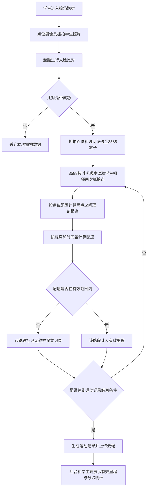
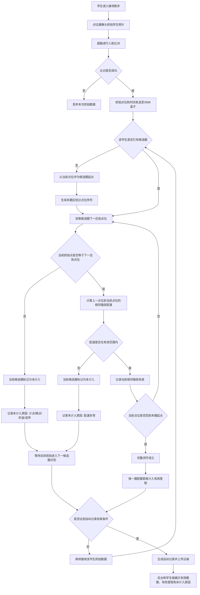

# 高校校园跑完整闭环计圈 - 需求分析

**创建日期：** 2026-06-04  
**需求来源：** 学校反馈学生利用跨点位补距规则刷跑步里程  
**关联版本：** 校体云高校 1.1.0  
**关联文档：**
- `/Users/mac/Documents/GitLab/pm/已发布/校体云高校1.1.0/校体云高校-1.1.0-硬件/高校校园跑方案-PRD.md`
- `/Users/mac/Documents/GitLab/pm/已发布/校体云高校1.1.0/校体云高校-1.1.0-校园跑/跑步成绩管理-PRD.md`
- `/Users/mac/Documents/GitLab/pm/已发布/校体云高校1.1.0/校体云高校-1.1.0-学生H5/校园跑学生端-PRD.md`

---

## 一、需求背景分析

### 1.1 当前业务现状

高校校园跑采用无感知跑步方案，学生无需携带手机或手环，操场点位摄像头抓拍学生人脸，超脑完成比对后将抓拍数据发送至 3588 智慧体育盒子，由 3588 盒子完成跑步成绩计算、有效里程判断、LED 展示推送和云端成绩上传。

校体云高校 1.1.0 已发布需求中，校园跑成绩计算规则如下：

| 现有规则 | 规则说明 |
|----------|----------|
| 点位间距配置 | 后台配置相邻点位距离，如 1→2、2→3、3→4、4→1 |
| 跨点位距离计算 | 若学生从点位 1 到点位 4 被识别，系统按 1→2 + 2→3 + 3→4 计算理论距离 |
| 配速校验 | 每两个被识别点位之间计算配速，配速在有效范围内则计入里程 |
| 方向判断 | 旧规则不主动判断方向，依赖相机安装方向规避逆向抓拍 |
| 成绩生成 | 持续一段时间无新抓拍数据后生成运动记录，记录有效里程、有效段数、无效段数和用时 |

### 1.2 当前业务痛点

学校反馈，学生已经掌握现有跨点位补距规则，并利用该规则进行作弊。

典型作弊方式如下：

| 场景 | 说明 |
|------|------|
| 标准路线 | 操场 4 个点位，学生应按 1→2→3→4→1 顺序完成一圈 |
| 现有识别 | 学生只在 1、4 两个点位之间往返跑，系统只识别到 1→4 或 4→1 |
| 现有计算 | 只要 1→4 的配速合理，系统按 1→2 + 2→3 + 3→4 累计里程 |
| 作弊结果 | 学生实际未经过 2、3 点位，却获得完整跨点路段的里程 |

该问题的根因是：系统用两个抓拍点之间的理论路线距离替代了学生真实经过的点位路径，没有强制校验学生是否连续经过中间点位。

### 1.3 受影响用户与角色

| 角色 | 影响 |
|------|------|
| 学生 | 正常跑步学生的成绩公平性受到影响 |
| 体育教师/管理员 | 后台成绩统计出现虚高数据，影响学期目标达成判断 |
| 学校管理者 | 校园跑考核结果失真，影响体育管理公信力 |
| 运维/实施人员 | 需要解释异常成绩并协助学校排查作弊反馈 |
| 产品/研发 | 需要调整 3588 盒子成绩计算规则及前后台展示口径 |

### 1.4 不做该需求的影响

| 影响项 | 具体影响 |
|--------|----------|
| 成绩真实性 | 学生可通过少数点位折返获得虚高里程 |
| 考核公平性 | 正常完成完整路线的学生与作弊学生使用同一达标口径 |
| 学校信任 | 学校对无感知校园跑的防作弊能力产生质疑 |
| 后续运营 | 学期目标、成绩导出、申诉审核均会受到错误里程影响 |

---

## 二、需求目标确认

### 2.1 核心目标

本次需求的核心目标是：将校园跑成绩计算从“跨点位补距”升级为“完整点位闭环计圈”，防止学生通过跳点、少点、折返刷跑步里程。

### 2.2 目标规则

| 规则项 | 目标规则 |
|--------|----------|
| 起点规则 | 学生本次运动首次被识别到的点位作为当前候选圈起点 |
| 完整一圈 | 必须按配置顺序连续经过所有点位，并回到本圈起点，才算完成 1 圈 |
| 起点不固定 | 从 1 开始需形成 1→2→3→4→1；从 2 开始需形成 2→3→4→1→2 |
| 少点处理 | 少任意一个点位，本圈不计入成绩 |
| 跳点处理 | 出现 1→3、1→4 等跳点，本圈不计入成绩 |
| 折返处理 | 出现 1→2→1、1→4→1 等折返，本圈不计入成绩 |
| 配速校验 | 完整圈内每个相邻点位路段仍需满足配速规则 |
| 里程计入 | 只有完整有效圈计入有效里程；未完成圈、少点圈、跳点圈、折返圈不计入有效里程 |

### 2.3 可衡量成果

| 成果 | 验收口径 |
|------|----------|
| 禁止跨点补距 | 系统识别到 1→4 时，不再补算 1→2→3→4 距离 |
| 完整闭环计圈 | 只有 1→2→3→4→1、2→3→4→1→2 等完整闭环序列计为 1 圈 |
| 异常路径不计入 | 少点、跳点、逆序、折返路径不计入有效里程 |
| 后台可追溯 | 跑步明细可展示本圈未计入原因，教师可核实抓拍路径 |
| 学生端可理解 | 学生端展示未计入原因，降低申诉沟通成本 |

---

## 三、业务流程分析

### 3.1 当前流程（现状）

**现状流程问题：**

| 问题 | 说明 |
|------|------|
| 跨点补距 | 两次抓拍点之间未经过的中间点位被系统补算为已完成 |
| 少点可计入 | 学生未被识别到 2、3 点位，仍可通过 1→4 获得里程 |
| 折返可刷量 | 学生在两个点位之间往返，只要配速合理即可累计里程 |
| 方向依赖硬件 | 旧规则不主动判断方向，真实场景中相机仍会拍到异常路径 |

### 3.2 目标流程（改善后）

### 3.3 目标流程关键说明

| 流程节点 | 输入 | 输出 |
|----------|------|------|
| 候选圈初始化 | 学生首次有效抓拍点位、抓拍时间 | 本圈起点、本圈应经过点位序列 |
| 点位顺序校验 | 当前抓拍点位、下一应到点位 | 顺序有效或本圈未计入 |
| 配速校验 | 相邻点位距离、相邻抓拍时间差、规则快照 | 路段有效或本圈未计入 |
| 完整闭环判断 | 已经过点位序列、本圈起点 | 完整圈成立或继续等待后续点位 |
| 里程计入 | 完整有效圈、一圈配置距离、每日上限规则 | 计入有效里程、生成明细 |
| 明细展示 | 有效圈、未计入圈、抓拍照片 | 后台/H5 可查看路径与原因 |

---

## 四、功能拆解清单

| 终端 | 模块 | 功能 | 功能描述 | 优先级 |
|------|------|------|----------|--------|
| 3588 智慧体育盒子 | 成绩计算 | 取消跨点位补距 | 不再支持 1→3、1→4 等跨点位理论距离补算；非相邻点位不直接计入里程 | P0 |
| 3588 智慧体育盒子 | 成绩计算 | 候选圈识别 | 按学生维度维护候选圈状态，以首次有效点位作为本圈起点，生成完整闭环序列 | P0 |
| 3588 智慧体育盒子 | 成绩计算 | 完整闭环计圈 | 学生按顺序经过所有点位并回到起点后，计为 1 个有效圈 | P0 |
| 3588 智慧体育盒子 | 成绩计算 | 点位顺序校验 | 校验当前点位是否等于下一应到点位；少点、跳点、折返、逆序均不计入本圈 | P0 |
| 3588 智慧体育盒子 | 成绩计算 | 相邻路段配速校验 | 完整圈内每个相邻路段继续按配速范围校验；任一路段配速异常，本圈不计入 | P0 |
| 3588 智慧体育盒子 | 成绩计算 | 未完成圈处理 | 运动记录结束时，未回到起点的候选圈不计入有效里程，并记录未完成原因 | P0 |
| 3588 智慧体育盒子 | 数据上传 | 明细字段扩展 | 上传有效圈数、未计入圈数、点位序列、未计入原因、圈内路段明细 | P0 |
| 校端后台（高校） | 阳光跑-跑步成绩管理 | 明细详情展示调整 | 跑步明细详情展示圈维度结果，支持查看每圈点位序列、有效状态、未计入原因、抓拍照片 | P0 |
| 校端后台（高校） | 阳光跑-跑步成绩管理 | 列表统计口径调整 | 跑步总里程、有效里程、跑步次数、目标完成情况仅基于完整有效圈及每日上限后的计入里程统计 | P0 |
| 校端后台（高校） | 阳光跑-规则设置 | 点位顺序规则展示 | 在规则设置中展示当前校区点位顺序和一圈距离，明确成绩按完整闭环计圈 | P1 |
| 校端后台（高校） | 阳光跑-申诉管理 | 未计入原因展示 | 申诉审批时展示未计入圈的点位序列、抓拍照片、配速和未计入原因，辅助教师判断 | P1 |
| H5学生端（高校） | 校园跑-首页 | 有效里程口径同步 | 学期进度、本周跑量、累计跑量、今日跑量统一按完整有效圈计算 | P0 |
| H5学生端（高校） | 校园跑-记录详情 | 路径明细展示 | 学生可查看本次运动的有效圈、未计入圈、点位序列和未计入原因 | P1 |
| H5学生端（高校） | 申诉 | 申诉对象调整 | 学生可针对未计入圈或异常路段发起申诉，申诉材料展示对应抓拍照片和路径 | P1 |
| LED大屏 | 实时展示 | 实时里程口径同步 | LED 展示的学生里程按完整有效圈累计，不展示跨点补算里程 | P0 |
| 云端服务 | 运动记录服务 | 规则快照扩展 | 运动记录保存本次使用的完整闭环计圈规则、点位顺序、配速范围和每日上限 | P0 |
| 云端服务 | 统计服务 | 历史与新记录区分 | 新规则上线后的记录按完整闭环计圈统计；历史记录保留原计算结果 | P0 |
| 云端服务 | 导入导出 | 导出字段同步 | 跑步成绩导出、明细导出增加有效圈数、未计入原因等字段 | P1 |

---

## 五、待确认事项

| 序号 | 待确认事项 | 状态 | 负责人 | 截止日期 |
|------|------------|------|--------|----------|
| 1 | 候选圈出现少点、跳点、折返、逆序后，下一候选圈从哪个点位重新开始识别 | 待确认 | 产品经理/研发 | PRD 评审前 |
| 2 | 未完成圈、少点圈、跳点圈是否允许学生发起申诉 | 待确认 | 学校/产品经理 | PRD 评审前 |
| 3 | 后台明细按“圈”展示还是同时保留原“段”展示 | 待确认 | 产品经理/研发 | PRD 评审前 |
| 4 | 已产生的历史校园跑记录是否保持原结果不变 | 待确认 | 学校/产品经理 | PRD 评审前 |
| 5 | 学校是否要求在规则设置页面配置“完整闭环计圈”开关，还是所有校区强制启用新规则 | 待确认 | 学校/产品经理 | PRD 评审前 |
| 6 | 点位数量是否固定为 4 个，还是需要支持 3 个、5 个及更多点位的环形路线 | 待确认 | 实施/研发 | PRD 评审前 |
| 7 | LED 实时展示是否只在完成一圈后刷新里程，未完成圈跑动过程中不增加实时里程 | 待确认 | 学校/产品经理 | PRD 评审前 |

---

## 六、已确认规则汇总

| 序号 | 已确认规则 | 确认来源 |
|------|------------|----------|
| 1 | 学生必须经过完整点位闭环，才能计入一圈成绩 | 用户确认 |
| 2 | 起点不固定，从哪个点位开始跑，最后必须回到同一个点位 | 用户确认 |
| 3 | 以 4 个点位为例，从 1 开始为 1→2→3→4→1，从 2 开始为 2→3→4→1→2 | 用户确认 |
| 4 | 少点时，本圈成绩不算 | 用户确认 |
| 5 | 原有跨点位补距规则存在被学生利用的作弊风险 | 用户反馈 |
