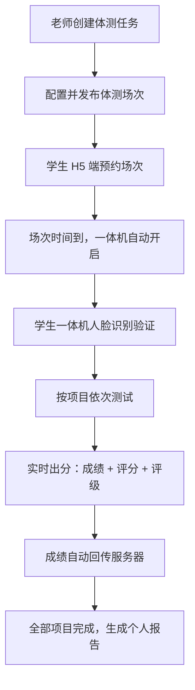
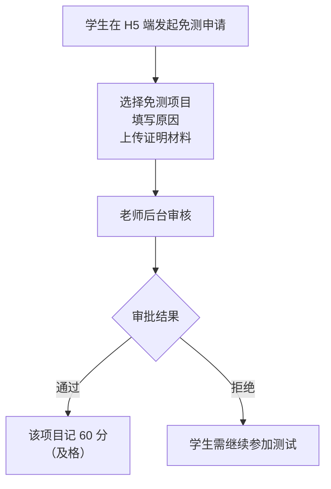
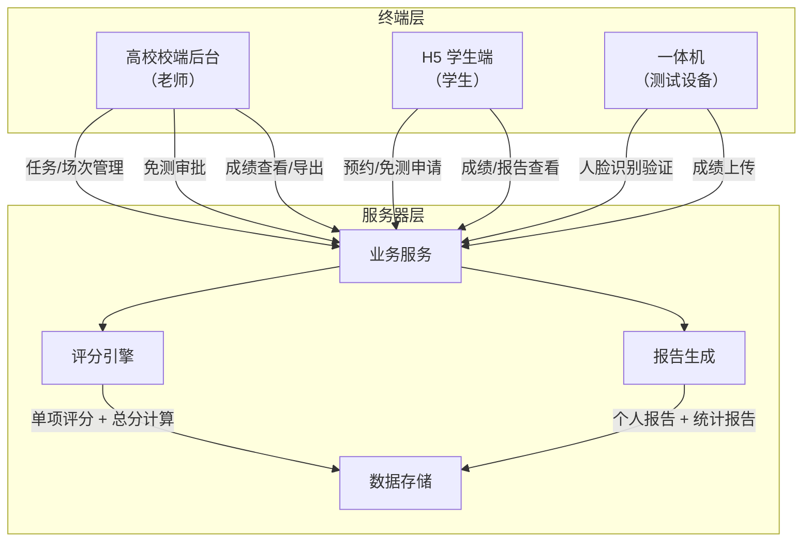
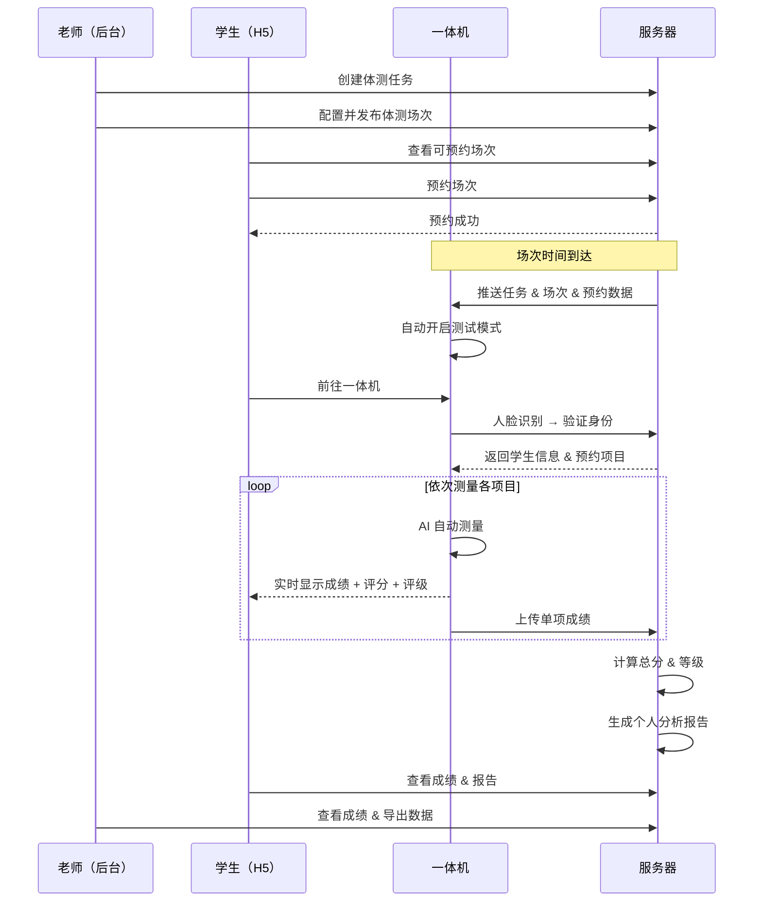

# 高校体测流程需求梳理 V2

> 产品：校体云 · 高校域 | 日期：2026-05-06 | 版本：V2

---

## 一、政策背景

依据教育部 **《国家学生体质健康标准（2014年修订）》**（教体艺〔2014〕5号），所有全日制在校本专科学生每年须参加一次体质健康测试。

### 关键政策红线

| 政策项 | 要求 |
|--------|------|
| **毕业要求** | 毕业总成绩 ≥ 50 分，< 50 分按结业或肄业处理 |
| **评优评奖** | 成绩达到良好（≥ 80 分）方可参加评优评奖 |
| **体育奖学分** | 成绩达到优秀（≥ 90 分）方可获得 |
| **毕业成绩计算** | 毕业成绩 = 毕业当年得分 × 50% + 其他学年平均分 × 50% |

---

## 二、测试项目与评分标准

### 2.1 测试项目（共 7 项）

| 序号 | 项目 | 男生 | 女生 | 类别 |
|------|------|:---:|:---:|------|
| 1 | 身高、体重 → BMI | ✅ | ✅ | 身体形态 |
| 2 | 肺活量 | ✅ | ✅ | 身体机能 |
| 3 | 50 米跑 | ✅ | ✅ | 速度 |
| 4 | 坐位体前屈 | ✅ | ✅ | 柔韧性 |
| 5 | 立定跳远 | ✅ | ✅ | 爆发力 |
| 6 | 引体向上 / 1 分钟仰卧起坐 | 引体向上 | 仰卧起坐 | 力量 |
| 7 | 1000 米跑 / 800 米跑 | 1000 米 | 800 米 | 耐力 |

### 2.2 单项权重

| 单项指标 | 权重 |
|----------|:----:|
| 体重指数（BMI） | 15% |
| 肺活量 | 15% |
| 50 米跑 | 20% |
| 坐位体前屈 | 10% |
| 立定跳远 | 10% |
| 引体向上（男）/ 1 分钟仰卧起坐（女） | 10% |
| 1000 米跑（男）/ 800 米跑（女） | 20% |

### 2.3 总分计算

```
学年总分 = 标准分（满分 100） + 附加分（满分 20） = 满分 120
标准分  = BMI得分×15% + 肺活量得分×15% + 50米跑得分×20%
        + 坐位体前屈得分×10% + 立定跳远得分×10%
        + 力量项目得分×10% + 耐力跑得分×20%
```

> 加分指标：男生引体向上 + 1000 米跑、女生仰卧起坐 + 800 米跑，每项最高加 10 分，共加 20 分。

### 2.4 等级评定

| 等级 | 分数区间 |
|------|----------|
| 优秀 | ≥ 90.0 分 |
| 良好 | 80.0 ~ 89.9 分 |
| 及格 | 60.0 ~ 79.9 分 |
| 不及格 | ≤ 59.9 分 |

### 2.5 大学男生单项评分表

| 等级 | 得分 | 肺活量(ml) | 50米跑(秒) | 坐位体前屈(cm) | 立定跳远(cm) | 引体向上(次) | 1000米跑 |
|:---:|:---:|:---:|:---:|:---:|:---:|:---:|:---:|
| | | 大一/大二 → 大三/大四 | 大一/大二 → 大三/大四 | 大一/大二 → 大三/大四 | 大一/大二 → 大三/大四 | 大一/大二 → 大三/大四 | 大一/大二 → 大三/大四 |
| 优秀 | 100 | 5040 → 5140 | 6.7 → 6.6 | 24.9 → 25.1 | 273 → 275 | 19 → 20 | 3'17" → 3'15" |
| | 95 | 4920 → 5020 | 6.8 → 6.7 | 23.1 → 23.3 | 268 → 270 | 18 → 19 | 3'22" → 3'20" |
| | 90 | 4800 → 4900 | 6.9 → 6.8 | 21.3 → 21.5 | 263 → 265 | 17 → 18 | 3'27" → 3'25" |
| 良好 | 85 | 4550 → 4650 | 7.0 → 6.9 | 19.5 → 19.9 | 256 → 258 | 16 → 17 | 3'34" → 3'32" |
| | 80 | 4300 → 4400 | 7.1 → 7.0 | 17.7 → 18.2 | 248 → 250 | 15 → 16 | 3'42" → 3'40" |
| 及格 | 78 | 4180 → 4280 | 7.3 → 7.2 | 16.3 → 16.8 | 244 → 246 | — | 3'47" → 3'45" |
| | 76 | 4060 → 4160 | 7.5 → 7.4 | 14.9 → 15.4 | 240 → 242 | 14 → 15 | 3'52" → 3'50" |
| | 74 | 3940 → 4040 | 7.7 → 7.6 | 13.5 → 14.0 | 236 → 238 | — | 3'57" → 3'55" |
| | 72 | 3820 → 3920 | 7.9 → 7.8 | 12.1 → 12.6 | 232 → 234 | 13 → 14 | 4'02" → 4'00" |
| | 70 | 3700 → 3800 | 8.1 → 8.0 | 10.7 → 11.2 | 228 → 230 | — | 4'07" → 4'05" |
| | 68 | 3580 → 3680 | 8.3 → 8.2 | 9.3 → 9.8 | 224 → 226 | 12 → 13 | 4'12" → 4'10" |
| | 66 | 3460 → 3560 | 8.5 → 8.4 | 7.9 → 8.4 | 220 → 222 | — | 4'17" → 4'15" |
| | 64 | 3340 → 3440 | 8.7 → 8.6 | 6.5 → 7.0 | 216 → 218 | 11 → 12 | 4'22" → 4'20" |
| | 62 | 3220 → 3320 | 8.9 → 8.8 | 5.1 → 5.6 | 212 → 214 | — | 4'27" → 4'25" |
| | **60** | **3100 → 3200** | **9.1 → 9.0** | **3.7 → 4.2** | **208 → 210** | **10 → 11** | **4'33" → 4'30"** |

### 2.6 大学女生单项评分表

| 等级 | 得分 | 肺活量(ml) | 50米跑(秒) | 坐位体前屈(cm) | 立定跳远(cm) | 仰卧起坐(次) | 800米跑 |
|:---:|:---:|:---:|:---:|:---:|:---:|:---:|:---:|
| | | 大一/大二 → 大三/大四 | 大一/大二 → 大三/大四 | 大一/大二 → 大三/大四 | 大一/大二 → 大三/大四 | 大一/大二 → 大三/大四 | 大一/大二 → 大三/大四 |
| 优秀 | 100 | 3400 → 3450 | 7.5 → 7.4 | 25.8 → 26.3 | 207 → 208 | 56 → 57 | 3'18" → 3'16" |
| | 95 | 3350 → 3400 | 7.6 → 7.5 | 24.0 → 24.4 | 201 → 202 | 54 → 55 | 3'24" → 3'22" |
| | 90 | 3300 → 3350 | 7.7 → 7.6 | 22.2 → 22.4 | 195 → 196 | 52 → 53 | 3'30" → 3'28" |
| 良好 | 85 | 3150 → 3200 | 8.0 → 7.9 | 20.6 → 21.0 | 188 → 189 | 49 → 50 | 3'37" → 3'35" |
| | 80 | 3000 → 3050 | 8.3 → 8.2 | 19.0 → 19.5 | 181 → 182 | 46 → 47 | 3'44" → 3'42" |
| 及格 | 78 | 2900 → 2950 | 8.5 → 8.4 | 17.7 → 18.2 | 178 → 179 | 44 → 45 | 3'49" → 3'47" |
| | 76 | 2800 → 2850 | 8.7 → 8.6 | 16.4 → 16.9 | 175 → 176 | 42 → 43 | 3'54" → 3'52" |
| | 74 | 2700 → 2750 | 8.9 → 8.8 | 15.1 → 15.6 | 172 → 173 | 40 → 41 | 3'59" → 3'57" |
| | 72 | 2600 → 2650 | 9.1 → 9.0 | 13.8 → 14.3 | 169 → 170 | 38 → 39 | 4'04" → 4'02" |
| | 70 | 2500 → 2550 | 9.3 → 9.2 | 12.5 → 13.0 | 166 → 167 | 36 → 37 | 4'09" → 4'07" |
| | 68 | 2400 → 2450 | 9.5 → 9.4 | 11.2 → 11.7 | 163 → 164 | 34 → 35 | 4'14" → 4'12" |
| | 66 | 2300 → 2350 | 9.7 → 9.6 | 9.9 → 10.4 | 160 → 161 | 32 → 33 | 4'19" → 4'17" |
| | 64 | 2200 → 2250 | 9.9 → 9.8 | 8.6 → 9.1 | 157 → 158 | 30 → 31 | 4'24" → 4'22" |
| | 62 | 2100 → 2150 | 10.1 → 10.0 | 7.3 → 7.8 | 154 → 155 | 28 → 29 | 4'29" → 4'27" |
| | **60** | **2000 → 2050** | **10.3 → 10.2** | **6.0 → 6.5** | **151 → 152** | **26 → 27** | **4'34" → 4'32"** |

### 2.7 BMI 评分表

| 等级 | 单项得分 | 男生 BMI | 女生 BMI |
|:---:|:---:|:---:|:---:|
| 正常 | 100 | 17.9 ~ 23.9 | 17.2 ~ 23.9 |
| 低体重 | 80 | ≤ 17.8 | ≤ 17.1 |
| 超重 | 80 | 24.0 ~ 27.9 | 24.0 ~ 27.9 |
| 肥胖 | 60 | ≥ 28.0 | ≥ 28.0 |

### 2.8 附加分指标

#### 男生加分表

| 加分 | 引体向上(次) | 1000 米跑 |
|:---:|:---:|:---:|
| +10 | 29 | -35" |
| +9 | 28 | -32" |
| +8 | 27 | -29" |
| +7 | 26 | -26" |
| +6 | 25 | -23" |
| +5 | 24 | -20" |
| +4 | 23 | -16" |
| +3 | 22 | -12" |
| +2 | 21 | -8" |
| +1 | 20 | -4" |

#### 女生加分表

| 加分 | 仰卧起坐(次) | 800 米跑 |
|:---:|:---:|:---:|
| +10 | 66 | -50" |
| +9 | 65 | -45" |
| +8 | 64 | -40" |
| +7 | 63 | -35" |
| +6 | 62 | -30" |
| +5 | 61 | -25" |
| +4 | 60 | -20" |
| +3 | 59 | -15" |
| +2 | 58 | -10" |
| +1 | 57 | -5" |

> 注：加分以满分 100 分为基准，超过 100 分的部分按加分表累加，单项上限 +10 分。

---

## 三、体测业务流程

### 3.1 流程总览



### 3.2 详细步骤

#### 步骤 1：任务创建（老师 · 高校校端后台）

老师登录后台，创建体测任务：

- 填写任务名称（如：2026 学年第一学期全校体测）
- 选择学期/学年
- 选择适用对象：年级（如 2025 级）、学院（如信息工程学院）
- 选择测试项目：从 7 项中勾选（可全选或部分选）
- 设定任务有效期

#### 步骤 2：场次配置（老师 · 高校校端后台）

在已创建的体测任务下，创建并配置体测场次：

| 配置项 | 说明 |
|--------|------|
| 场次时间 | 开始时间 ~ 结束时间（精确到分钟） |
| 测试项目 | 从任务中已选项目中勾选本场次测量的项目 |
| 人数上限 | 本场次最大可参与学生数 |
| 参与条件 | 年级筛选、性别筛选、学院筛选等 |
| 可测量次数 | 同一项目允许测量的次数（取最后一次成绩） |
| 场次状态 | 保存（草稿）/ 发布（学生可见） |

一个体测任务可包含多个体测场次，不同场次可安排不同时间、不同项目。

#### 步骤 3：学生预约（学生 · H5 端）

学生登录 H5 端进行预约：

1. 查看**可预约场次列表**（已发布 + 未开始 + 符合条件 + 有名额）
2. 按**时间**、**项目**筛选
3. 查看场次详情：时间、地点、测试项目、已预约/总名额
4. 点击**预约**，占用名额
5. 在「我的预约」中查看预约状态（待测试 / 已完成 / 已过期）
6. 支持**取消预约**（场次开始前）

#### 步骤 4：现场测试（一体机）

场次开始时间到达后，一体机自动执行：

1. **自动开启**：根据预约数据，一体机启动对应任务和场次
2. **身份验证**：学生在一体机前进行**人脸识别**，验证通过后自动匹配预约信息
3. **项目引导**：屏幕显示当前需测试的项目列表，引导学生依次完成
4. **AI 自动测量**：
   - 身高体重：自动测量，计算 BMI
   - 肺活量：配合外接设备，自动读数
   - 坐位体前屈：AI 视觉识别，自动测距
   - 立定跳远：AI 视觉测距，误差 ≤ 1cm
   - 引体向上 / 仰卧起坐：AI 动作识别，自动计数 + 违规识别
   - 50 米跑 / 800 米 / 1000 米：AI 视觉计时，误差 ≤ 0.1 秒
5. **防作弊机制**：人脸比对、违规动作识别、测试过程录像可回放追溯
6. **实时出分**：每项测试完成后，屏幕即时显示：**成绩数值 + 单项得分 + 等级**

#### 步骤 5：成绩回收

- 每项测试成绩自动回传服务器
- 老师后台可**实时查看**测试进度（已完成人数 / 未完成人数 / 各项成绩）
- 计算总分 = 各单项加权求和 + 附加分
- 成绩数据按国标格式存储

#### 步骤 6：报告生成

当学生完成全部 7 项测试后，系统自动生成个人体测分析报告：

**个人报告内容：**

| 内容模块 | 说明 |
|----------|------|
| 基本信息 | 姓名、学号、性别、年级、学院 |
| 各项目成绩 | 实测值 + 单项得分 + 等级 |
| 总分与等级 | 加权总分 + 等级（优秀/良好/及格/不及格） |
| 六维体质情况 | 身体形态、身体机能、速度、柔韧性、爆发力、力量/耐力 六维度雷达图分析 |
| 运动改善建议 | 针对薄弱项目给出针对性训练方案和饮食建议 |

**统计报告：**
- 支持按**年级**、**学院**维度生成统计分析报告
- 支持按照国家体测平台的 **Excel 模板一键导出数据**，格式与国家平台上传要求一致

---

## 四、免测申请流程

### 4.1 流程总览



### 4.2 免测分级建议

参考多所高校现行做法，建议校体云平台支持免测分级：

| 级别 | 适用条件 | 成绩 | 影响 |
|:---:|------|:---:|------|
| **A 类** | 持残疾证 | 60 分 | 可评优评奖 |
| **B 类** | 三甲医院证明的重大疾病，丧失运动能力 | 50 分 | 可评优评奖 |
| **C 类** | 其他符合免测条件（如手术后恢复期） | 50 分 | 不可评优评奖 |

### 4.3 免测类型

| 类型 | 说明 |
|------|------|
| **单项免测** | 仅对某一个项目申请免测，其他项目仍需正常测试 |
| **全部免测** | 对所有项目申请免测 |
| **缓测** | 暂缓测试，后续补测时间到场测试（需安排补测场次） |

### 4.4 详细步骤

#### 学生端（H5）

1. 进入免测申请页面
2. 选择免测类型：单项免测 / 全部免测 / 缓测
3. 若为单项免测，选择具体项目（如：1000 米跑）
4. 填写申请原因
5. 上传证明材料（三甲医院诊断证明、病历、残疾证等图片）
6. 提交申请，查看审批状态（待审核 / 已通过 / 已拒绝）

#### 老师端（后台）

1. 查看免测申请列表，支持按状态/年级/学院筛选
2. 查看申请详情：学生信息、免测项目、原因、证明材料
3. 审核操作：通过 / 拒绝（可填写拒绝原因）
4. 审批通过后，系统自动为该生对应项目记入免测成绩

---

## 五、补充发现

以下是调研中发现的、用户原始描述未覆盖的内容：

### 5.1 补测/缓测机制

- 因临时伤病、生理期等原因无法参加，可申请缓测
- 学校每学年统一安排**补测场次**
- 补测流程与正常测试一致：预约 → 测试 → 出分
- 不及格者每学年可补测一次，补测仍不及格则该学年成绩记为不及格

### 5.2 数据导出

- 支持按国家体测平台的 **Excel 模板一键导出**
- 导出的数据格式与国家平台上传时要求一致
- **暂不直接对接**国家学生体质健康标准数据管理系统，需手动上传

### 5.3 成绩申诉

- 学生可在 H5 端对某项成绩提出异议（如：AI 误判）
- 老师后台查看申诉，可复核测试录像
- 申诉结果：维持原成绩 / 修改成绩 / 安排重测

### 5.4 历年成绩对比

- 学生可查看历年体测成绩趋势
- 展示各项目成绩变化曲线（逐年对比）
- 展示总分和等级变化
- 毕业条件达标预测（基于当前趋势预判是否能 ≥ 50 分）

---

## 六、系统架构



### 各模块职责

| 模块 | 所属层 | 功能职责 |
|------|:---:|------|
| **高校校端后台** | 终端 | 任务创建与管理、场次配置与发布、成绩查询与导出、免测审批、统计分析 |
| **H5 学生端** | 终端 | 体测预约与取消、免测申请与进度查看、成绩查询、个人报告查看、成绩申诉 |
| **一体机** | 终端 | 人脸识别身份验证、AI 自动测量、成绩实时展示、数据自动回传 |
| **业务服务** | 服务器 | 预约逻辑、免测流程、申诉处理、用户权限、场次调度 |
| **评分引擎** | 服务器 | 根据《国家学生体质健康标准（2014年修订）》计算单项得分、加权总分、等级评定 |
| **报告生成** | 服务器 | 个人分析报告（六维体质 + 运动改善建议）、年级/学院统计报告 |
| **数据存储** | 服务器 | 学生信息、成绩数据、预约记录、免测记录、操作日志 |

---

## 七、系统交互流程



---

## 附录：参考资料

- 《国家学生体质健康标准（2014年修订）》（教体艺〔2014〕5号）
- 多所高校 2025 年体测通知：嘉应学院、上海工程技术大学、陕西科技大学、西南交通大学、江苏师范大学等
- 山东理工大学、中南财经政法大学、同济大学等体测预约与免测管理实践
- 赛康精益、格灵深瞳等 AI 智慧体测设备方案
