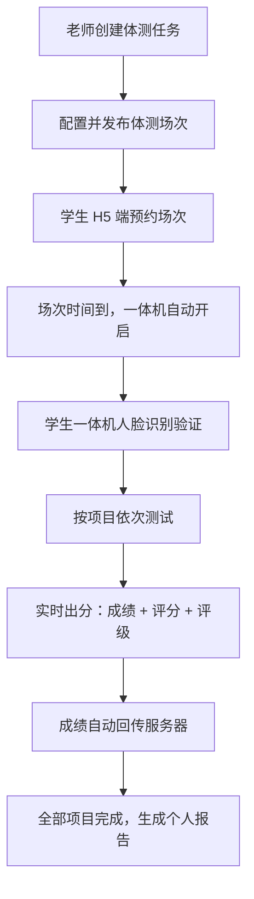
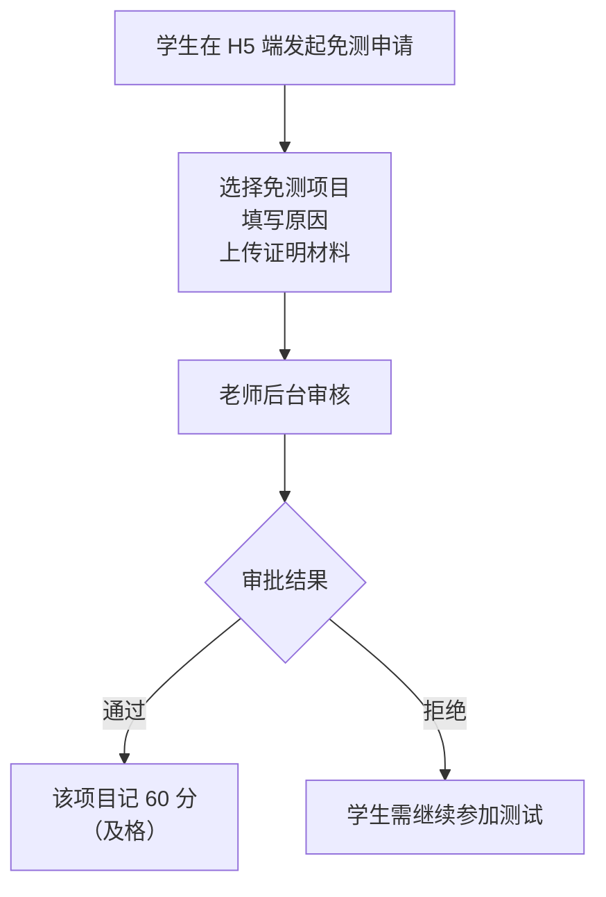
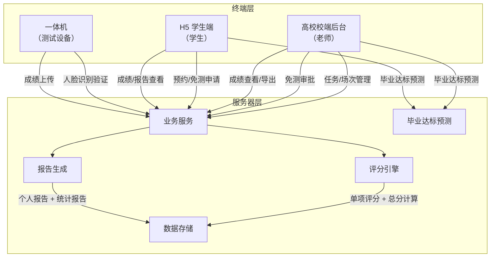
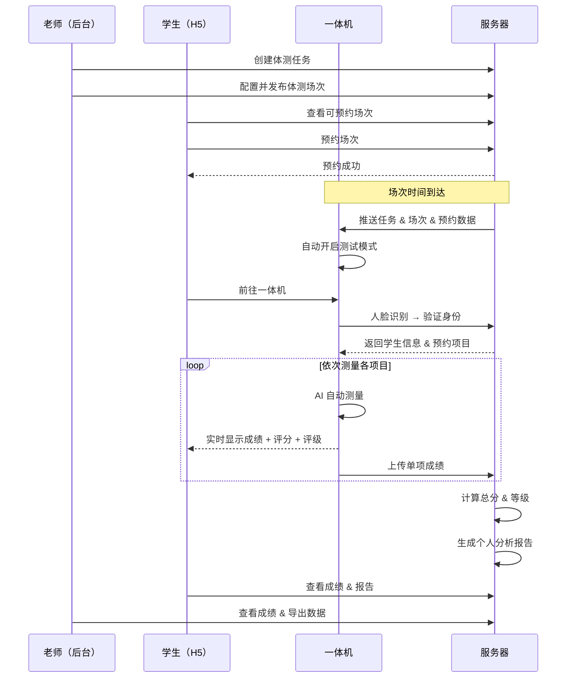

# 高校体测流程需求梳理 V3

> 产品：校体云 · 高校域 | 日期：2026-05-06 | 版本：V3

---

## 一、体测业务流程

### 1.1 流程总览

### 1.2 详细步骤

#### 步骤 1：任务创建（老师 · 高校校端后台）

老师登录后台，创建体测任务：

- 填写任务名称（如：2026 学年第一学期全校体测）
- 选择学期/学年
- 选择适用对象：年级（如 2025 级）、学院（如信息工程学院）
- 选择测试项目：从 7 项中勾选（可全选或部分选）
- 设定任务有效期

#### 步骤 2：场次配置（老师 · 高校校端后台）

在已创建的体测任务下，创建并配置体测场次：

| 配置项 | 说明 |
|--------|------|
| 场次时间 | 开始时间 ~ 结束时间（精确到分钟） |
| 测试项目 | 从任务中已选项目中勾选本场次测量的项目 |
| 人数上限 | 本场次最大可参与学生数 |
| 参与条件 | 年级筛选、性别筛选、学院筛选等 |
| 可测量次数 | 同一项目允许测量的次数（取最后一次成绩） |
| 场次状态 | 保存（草稿）/ 发布（学生可见） |

一个体测任务可包含多个体测场次，不同场次可安排不同时间、不同项目。

#### 步骤 3：学生预约（学生 · H5 端）

学生登录 H5 端进行预约：

1. 查看**可预约场次列表**（已发布 + 未开始 + 符合条件 + 有名额）
2. 按**时间**、**项目**筛选
3. 查看场次详情：时间、地点、测试项目、已预约/总名额
4. 点击**预约**，占用名额
5. 在「我的预约」中查看预约状态（待测试 / 已完成 / 已过期）
6. 支持**取消预约**（场次开始前）

#### 步骤 4：现场测试（一体机）

场次开始时间到达后，一体机自动开启对应的任务/场次，以及对应的运动项目（如这台设备在那个时间只用来测试仰卧起坐）。

1. **身份验证**：学生在一体机前进行**人脸识别**，验证通过后自动匹配预约信息
2. **AI 自动测量**：引导学生进行测量，实时显示成绩、评分、评级
3. **防作弊机制**：人脸比对、违规动作识别、测试过程录像可回放追溯

#### 步骤 5：成绩回收

- 每项测试成绩自动回传服务器
- 老师后台可**实时查看**测试进度（已完成人数 / 未完成人数 / 各项成绩）
- 计算总分 = 各单项加权求和 + 附加分
- 成绩数据按照国家平台要求格式存储

#### 步骤 6：成绩申诉

- 学生可在 H5 端对某项成绩提出异议（如：AI 误判）
- 老师后台查看申诉，可复核测试录像
- 申诉结果：维持原成绩 / 修改成绩 / 安排重测

#### 步骤 7：报告生成

当学生完成全部 7 项测试后，系统自动生成个人体测分析报告：

**个人报告内容：**

| 内容模块 | 说明 |
|----------|------|
| 基本信息 | 姓名、学号、性别、年级、学院 |
| 各项目成绩 | 实测值 + 单项得分 + 等级 |
| 总分与等级 | 加权总分 + 等级（优秀/良好/及格/不及格） |
| 六维体质情况 | 肌肉力量与耐力、心肺功能与耐力、身体成分与营养、协调性、柔韧性、速度与灵敏性 六维度雷达图分析 |
| 运动改善建议 | 针对薄弱项目给出针对性训练方案和饮食建议 |

**统计报告：**

- 支持按**年级**、**学院**维度生成统计分析报告
- 支持按**年级**、**学院**维度的历年成绩对比（如某学院近三年体测成绩趋势、某年级历届体测成绩对比）
- 支持按照国家体测平台的 **Excel 模板一键导出数据**，格式与国家平台上传要求一致

**历年成绩对比：**

- 学生可查看历年体测成绩趋势
- 展示各项目成绩变化曲线（逐年对比）
- 展示总分和等级变化

#### 步骤 8：毕业达标预测

- 后台老师和学生端均可查看
- 基于历年体测成绩趋势，预判毕业时体测总分是否达标
- 显示当前达标状态：达标 / 预警 / 不达标

---

## 二、免测申请流程

### 2.1 流程总览

### 2.2 免测类型

| 类型 | 说明 |
|------|------|
| **单项免测** | 仅对某一个项目申请免测，其他项目仍需正常测试 |
| **全部免测** | 对所有项目申请免测 |
| **缓测** | 暂缓测试，后续补测时间到场测试（需安排补测场次） |

### 2.3 详细步骤

#### 学生端（H5）

1. 进入免测申请页面
2. 选择免测类型：单项免测 / 全部免测 / 缓测
3. 若为单项免测，选择具体项目（如：1000 米跑）
4. 填写申请原因
5. 上传证明材料（三甲医院诊断证明、病历、残疾证等图片）
6. 提交申请，查看审批状态（待审核 / 已通过 / 已拒绝）

#### 老师端（后台）

1. 查看免测申请列表，支持按状态/年级/学院筛选
2. 查看申请详情：学生信息、免测项目、原因、证明材料
3. 审核操作：通过 / 拒绝（可填写拒绝原因）
4. 审批通过后，系统自动为该生对应项目记入免测成绩

### 2.4 补测/缓测机制

- 因临时伤病、生理期等原因无法参加，可申请缓测
- 补测方式：老师创建新的体测任务（含场次），学生按正常流程预约和测试
- 本学年最终成绩设定：取**最佳值**或**最新成绩**（由老师在后台配置）

---

## 三、系统架构

### 各模块职责

| 模块 | 所属层 | 功能职责 |
|------|:---:|------|
| **高校校端后台** | 终端 | 任务创建与管理、场次配置与发布、成绩查询与导出、免测审批、申诉处理、统计分析 |
| **H5 学生端** | 终端 | 体测预约与取消、免测申请与进度查看、成绩查询与申诉、个人报告查看、历年成绩对比、毕业达标预测 |
| **一体机** | 终端 | 人脸识别身份验证、AI 自动测量、成绩实时展示、数据自动回传 |
| **业务服务** | 服务器 | 预约逻辑、免测流程、申诉处理、用户权限、场次调度 |
| **评分引擎** | 服务器 | 根据《国家学生体质健康标准（2014年修订）》计算单项得分、加权总分、等级评定 |
| **报告生成** | 服务器 | 个人分析报告（六维体质 + 运动改善建议）、年级/学院统计报告 |
| **毕业达标预测** | 服务器 | 基于历年成绩趋势预判毕业时体测总分是否能达标，展示达标状态（达标/预警/不达标） |
| **数据存储** | 服务器 | 学生信息、成绩数据、预约记录、免测记录、操作日志 |

---

## 四、系统交互流程

